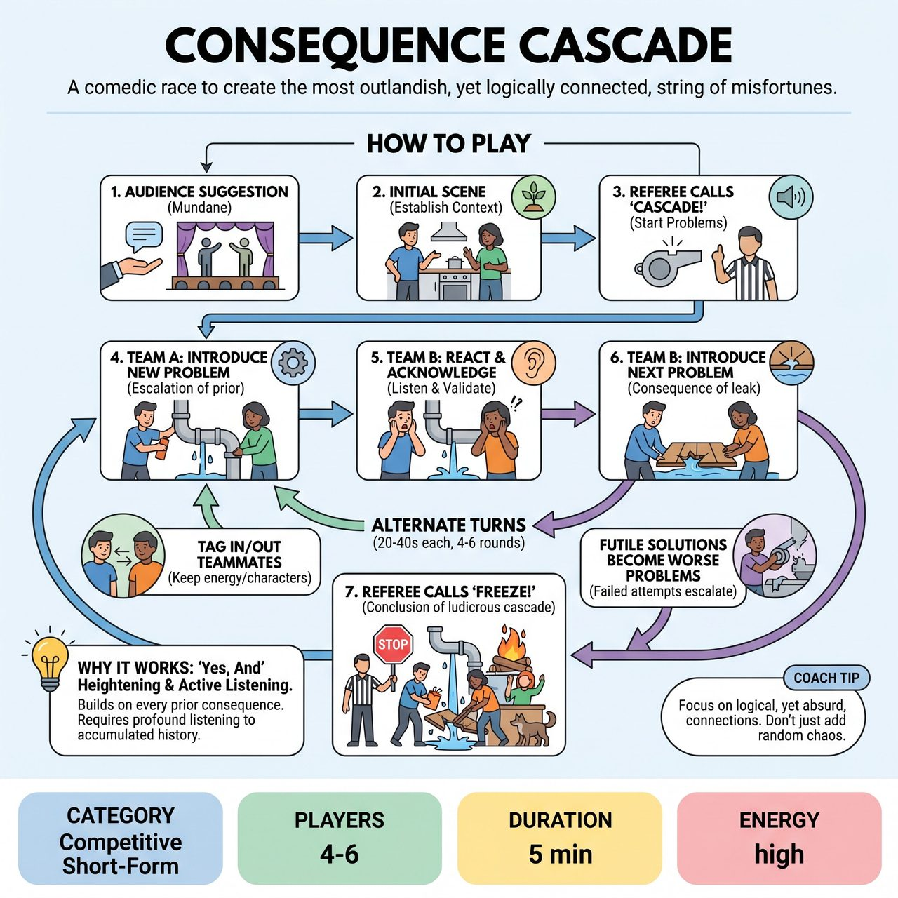

# Consequence Cascade

{ .game-hero }

> A comedic race to create the most outlandish, yet logically connected, string of misfortunes for the characters.

## Overview
Consequence Cascade is a high-energy game where two teams collaboratively build a shared scene. Each turn, a team introduces a new, escalating problem that acts as a humorous, if absurd, consequence of previous events. It's a comedic race to create the most outlandish, yet logically connected, string of misfortunes for the characters, testing rapid 'Yes, And' problem creation and agile character engagement with an ever-worsening situation.

## Setup
4-6 players total (2-3 per team, typically Red and Blue). The Referee is central to the game, acting as a key driver of pace and escalation. Props are entirely mimed; the stage should be clear to allow for dynamic physical action and object work. The audience provides an initial scene suggestion (e.g., a location, relationship, or mundane activity).

## How to Play
1. The Referee solicits an initial suggestion from the audience, typically a mundane location or scenario.
2. Two players (often one from each team, or two from the starting team) begin a simple, two-person scene based on the suggestion, establishing basic characters, a clear relationship, and a physical setting for about 20-30 seconds.
3. The Referee calls out 'Cascade!' to signal the start of the problem-introduction turns, shifting the game into high gear.
4. The active player(s) from Team A must introduce a brand new problem into the scene that is a consequence or escalation of something already established.
5. Team B then takes over. They must first demonstrate active listening by clearly reacting to the immediately preceding problem and acknowledging the overall accumulated chaos, then introduce their own new, escalating problem.
6. Teams continue to alternate turns (lasting 20-40 seconds each), layering on consequences and building a hilariously complex narrative.
7. Players can make futile or comically ineffective attempts at solving a problem, but these attempts must fail or paradoxically become the next worse problem.
8. Players can tag in teammates during their team's turn to bring in a new character or energy. Existing players may tag out to keep the number of active characters manageable (typically 2-3 active on stage).
9. The game concludes when the Referee calls 'Freeze!' or 'Scene!' after a sufficiently ludicrous and complex cascade has been built, typically after 4-6 rounds.

## Coaching Notes
- Scoring: Award +2 points for a Novel Problem, +1 point for an Adept Reaction, and +1 to +3 points for an Audience Delight Bonus.
- Call a 'No Cascade!' Foul (-3 points) if a team fails to introduce a new problem, introduces an unconnected problem, or prematurely solves a major accumulated problem.
- Call a 'De-escalation' Foul (-2 points) if a team's turn significantly reduces the comedic tension or magnitude of the problems.
- Call a 'Groaner Foul' (-1 point) for a cheap pun or overly obvious comedic choice.
- For minor slips or stuck players, the Referee may offer a non-leading verbal cue (e.g., 'And the polka band?') or a quick physical gesture before calling a full foul.
- The Referee must maintain a swift pace to keep the energy high and the players on their toes.
- Players should maintain character until they tag out or the scene ends, ensuring character endowments are strong and consistent amidst the chaos.

## Why It Works
It is built entirely on 'Yes, And', requiring players to accept and heighten every previous consequence before adding their own. Teams must demonstrate profound active listening to the entire accumulated history of the scene's problems. The game implicitly demands strong object work and physical choices as players mime increasingly bizarre props and environments, all while challenging performers to maintain established characters as their reality descends into utter madness.

## Safety & Inclusion
Content Foul (-5 points, possible player removal): Standard competitive short-form penalty for any inappropriate language, blue humor, or suggestive content. Upholds the family-friendly nature of the show.

