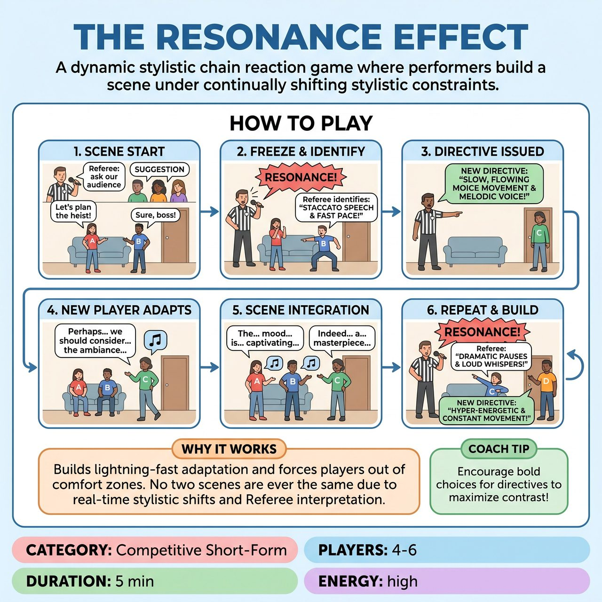

# The Resonance Effect

{ .game-hero }

> A dynamic stylistic chain reaction game where performers build a scene under continually shifting stylistic constraints.

## Overview
In 'The Resonance Effect,' performers build a scene under continually shifting stylistic constraints dictated by a Referee. The Referee identifies a distinct performance trait from one player, then issues a 'Resonance Directive'—a drastically contrasting or exaggerated stylistic challenge—to the next player entering. This creates a real-time chain reaction where players must instantly adopt new, often clashing, styles while maintaining the narrative.

## Setup
Requires 4-6 players from both teams (typically 2-3 per team), with 2-3 on stage at any given time. Standard competitive short-form stage setup with no props; all objects and environments must be mimed with precision. The audience provides an initial one-word scene suggestion (e.g., a location or relationship).

## How to Play
1. The Referee calls for a one-word suggestion for a scene location or relationship from the audience. Two players (typically one from each team) step forward to begin the scene.
2. After a short exchange of 1-3 lines of dialogue or significant physical actions, the Referee loudly shouts, 'RESONANCE!' and all players freeze in place.
3. The Referee swiftly identifies and articulates a prominent, distinctive performance characteristic from the last player's action or dialogue before the freeze (focusing on how they performed, not what they performed).
4. The Referee issues a 'Resonance Directive' to the next player entering the scene (or an existing player), forcing them to embody a drastically contrasting or significantly exaggerated/escalated version of the observed characteristic.
5. The directed player immediately steps into the scene and adopts the new Resonance Directive, seamlessly integrating and justifying their new physical, vocal, or emotional state within the ongoing narrative.
6. The Referee continues to call 'RESONANCE!' periodically, bringing in new players with new directives based on the preceding player's style. Existing players maintain their previously assigned directives, allowing multiple clashing styles to coexist.

## Coaching Notes
- The Referee acts as the 'Resonance Dictator' and judge; their interpretation of 'resonance' is absolute and fuels the game's unpredictability.
- Players must create instant comedic 'whys' to justify their bizarre new personas (e.g., 'Oh, the pollen is terrible today!').
- Excellent mimed object work is essential to make stylistic changes clear and comedic (e.g., miming a glass very slowly vs. very quickly).
- Enforce standard competitive improv fouls: a clean-content foul for blue humor, a pun foul for cheap puns, and a clarity penalty for mumbling or lack of clarity.
- Enforce the 'Lack of Resonance Foul': Deduct points if a player completely fails to embody their assigned directive, reverts to their old style, or breaks character without justification.
- Award points based on stellar resonance integration (5 pts), good effort (3 pts), active listening/yes-and (2 pts), and bonus points for exceptional physicality or clever justification.

## Why It Works
Because the stylistic constraints are generated on the fly by prior interaction and Referee interpretation, no two scenes will ever have the same combination of effects. It demands lightning-fast adaptation, forces players out of their comfort zones into exaggerated physical/vocal choices, and requires them to 'Yes, And' both the narrative and the bizarre juxtaposition of multiple clashing styles.

## Safety & Inclusion
The game inherently focuses on performance style rather than content, naturally steering away from 'blue' humor. A clean-content foul serves as a strict deterrent against swearing, inappropriate innuendo, or unsafe content.

