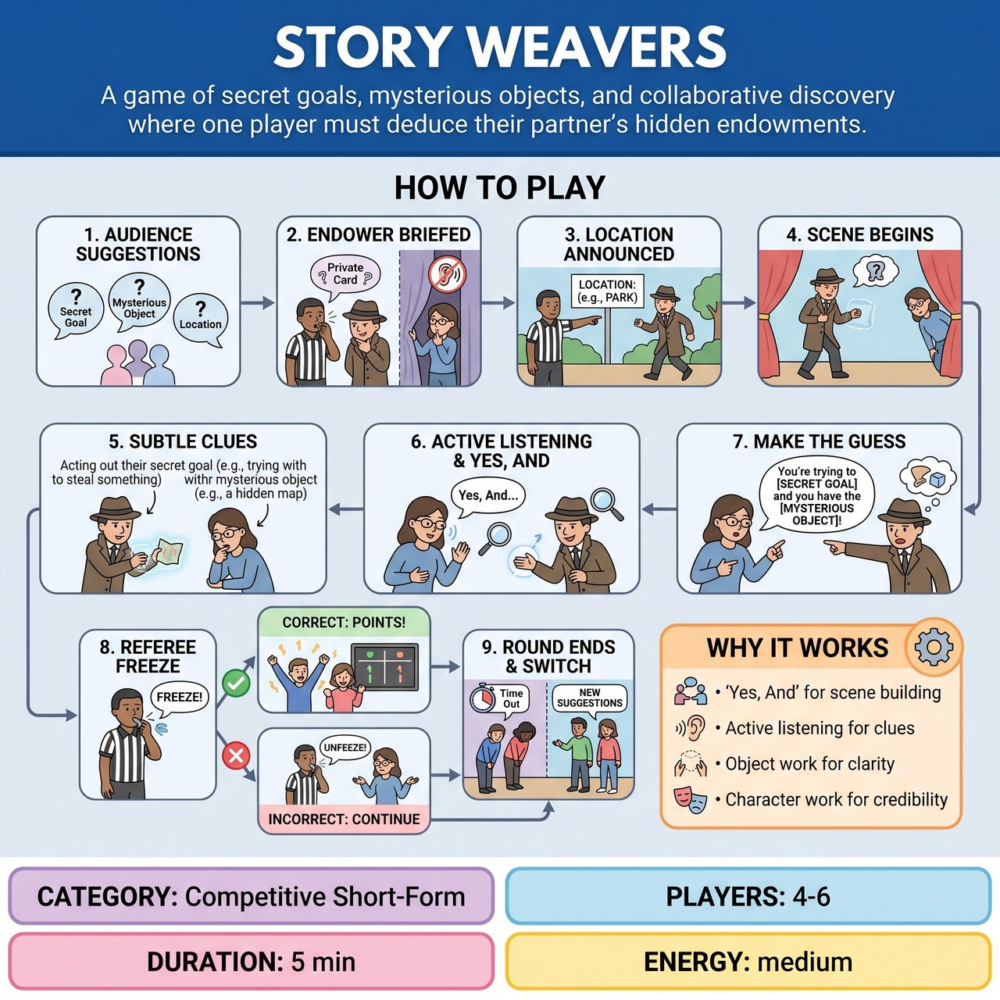

# Story Weavers

{ .game-hero }

> A game of secret goals, mysterious objects, and collaborative discovery where one player must deduce their partner's hidden endowments.

## Overview
"Story Weavers" is an improvisational game where two teams compete in rounds. One player, the "Endower," is secretly given a "Secret Goal/Problem" and a "Mysterious Object" for a scene set in an audience-suggested "Location." Their partner, the "Discoverer," must actively listen, 'Yes, And,' and deduce both of these hidden elements through the Endower's subtle actions and dialogue.

## Setup
The game features two teams (Red vs. Blue), each with 2-3 players. The Referee has several slips of paper or index cards ready for audience suggestions. For each round, one player from a team will be the 'Endower' and one will be the 'Discoverer'.

## How to Play
1. The Referee asks the audience for three specific categories of suggestions: A 'Main Character's Secret Goal/Problem', a 'Mysterious Object', and a 'Location'.
2. The 'Endower' steps forward and the Referee privately shows them the selected Secret Goal/Problem and Mysterious Object. The 'Discoverer' waits offstage and does not know these endowments.
3. The Referee announces the Location to the audience and players, instructing the Endower to begin the scene.
4. The Endower enters the scene using mime and object work. The Discoverer joins shortly thereafter to initiate interaction.
5. The Endower carefully incorporates their Secret Goal/Problem and interacts with their Mysterious Object, starting subtly and gradually making their endowments clearer without stating them outright.
6. The Discoverer actively listens, 'Yes, Ands' to everything, and attempts to discover both the secret goal/problem and the mysterious object through their partner's play.
7. Once the Discoverer believes they have correctly identified both elements, they must verbally state the Secret Goal/Problem to their partner in character AND physically point to or clearly reference the Mysterious Object.
8. The Referee immediately freezes the scene. If the guess is correct, points are awarded and the scene ends. If incorrect, the scene unfreezes and the Discoverer must continue playing and guessing.
9. After a successful discovery or if the Referee calls time due to pacing, the round ends and the other team plays their round with fresh suggestions.

## Coaching Notes
- The Endower's goal is to set up their partner for discovery, not to confuse them endlessly. They must use clear object work and character choices.
- The Discoverer must pay close attention to unusual behaviors, repeated phrases, and object interaction.
- The Referee acts as Suggestion Maestro, Endowment Keeper, Location Announcer, Discovery Verifier, Pacing & Timekeeper, and Foul Caller.
- Watch for the 'Blunt Disclosure Foul': Called if the Endower makes their secret too obvious too quickly, stripping away the discovery element.
- Watch for the 'Willful Ignorance Foul': Called if the Discoverer consistently ignores clear clues or makes no effort to discover the endowments.
- Watch for the 'Invisible Object Foul': Called if the Endower introduces the mysterious object but performs no clear object work, making it impossible for the partner to point to it.
- Scoring: +3 points for a completely successful discovery, +1 point for the Endower expertly integrating endowments, and Bonus points at the Referee's discretion for exceptional creativity or hilarious guesses.

## Why It Works
It tests fundamental improv skills including 'Yes, And' to build the scene, active listening to pick up clues, object work to establish the Mysterious Object, and character work to embody the Secret Goal/Problem credibly and comically.

## Safety & Inclusion
The game is inherently family-friendly, as all audience suggestions are pre-vetted by the Referee. The 'content foul' is always on standby to maintain appropriate content, ensuring the focus remains on cleverness and imagination rather than suggestive themes.

