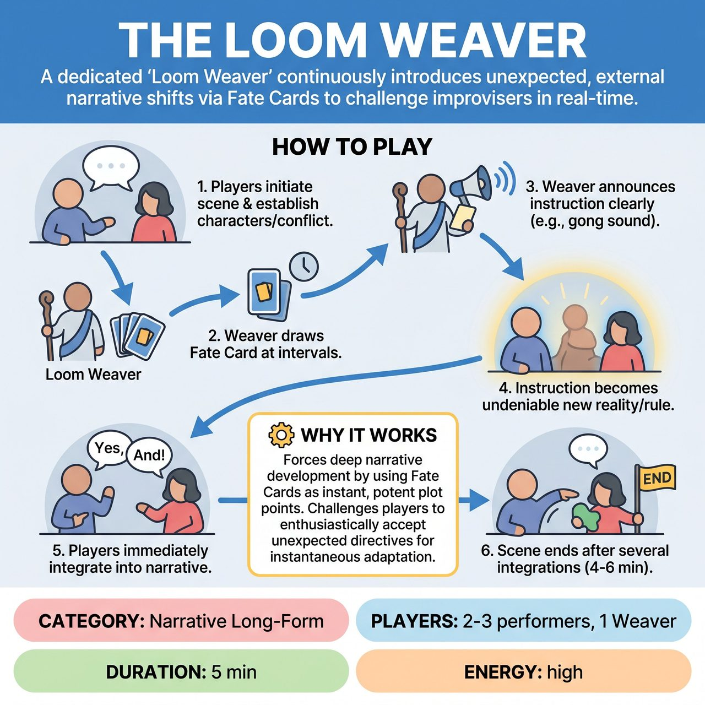

# The Loom Weaver

{ .game-hero }

> A dedicated 'Loom Weaver' continuously introduces unexpected, external narrative shifts via Fate Cards to challenge improvisers in real-time.

## Overview
Improvisers build a scene based on an initial suggestion while a dedicated 'Loom Weaver' continuously introduces unexpected, external narrative shifts. At strategic moments, the Weaver draws 'Fate Cards' that instantly alter character objectives, scene reality, or impose performance constraints. Performers must immediately 'Yes, And' and creatively integrate these new conditions into the ongoing story.

## Setup
You need 2-3 performers on stage and 1 non-performing 'Loom Weaver' off-stage with clear visibility and audibility. The Weaver needs a pre-prepared, shuffled deck of 15-20 'Fate Cards', each with a distinct, concise instruction (e.g., objective shifts, reality alterations, performance constraints). Get a standard audience suggestion like a location, relationship, or opening line to begin.

## How to Play
1. The onstage improvisers initiate and develop a scene based on the initial suggestion, establishing characters, relationship, environment, and conflict.
2. At strategic intervals (e.g., every 30-60 seconds), the Loom Weaver draws the top Fate Card from the deck.
3. The Loom Weaver clearly reads the instruction aloud to both the performers and the audience, optionally signaled by a gong or sound effect.
4. The instruction immediately becomes an undeniable part of the scene's reality or a new, mandatory rule for the performers.
5. The onstage improvisers must immediately 'Yes, And' this new condition, creatively integrating it into the ongoing narrative and justifying it within the existing story framework.
6. The scene continues for 4-6 minutes, or until the Loom Weaver signals the end, often after a final, impactful Fate Card has been integrated.

## Coaching Notes
- The Loom Weaver should time the cards strategically: to deepen the narrative, raise stakes, introduce a challenge, or when a previous card's impact has been fully explored.
- Performers must bend the narrative to accommodate the new 'fate' rather than abandoning previous plot points or pretending the new information doesn't exist.
- Failure to integrate the card promptly, or acknowledging it and then ignoring its implications, should be penalized.
- Encourage performers to cheerfully embrace these 'failures' of prediction and transform them into ingenious narrative opportunities.
- Ensure players justify why a sudden change occurred and how it fits into the established world, no matter how absurd the initial prompt.

## Why It Works
It forces profound narrative development by using Fate Cards as instant, potent plot points. It challenges players to enthusiastically accept unexpected directives, demanding instantaneous adaptation of emotional states, physicality, and intention while maintaining collaborative scene-building.

## Safety & Inclusion
Ensure Fate Cards are curated to avoid forcing unsafe physical actions, inappropriate content, or crossing personal boundaries. Players should prioritize physical and emotional safety when adapting to sudden constraints.

