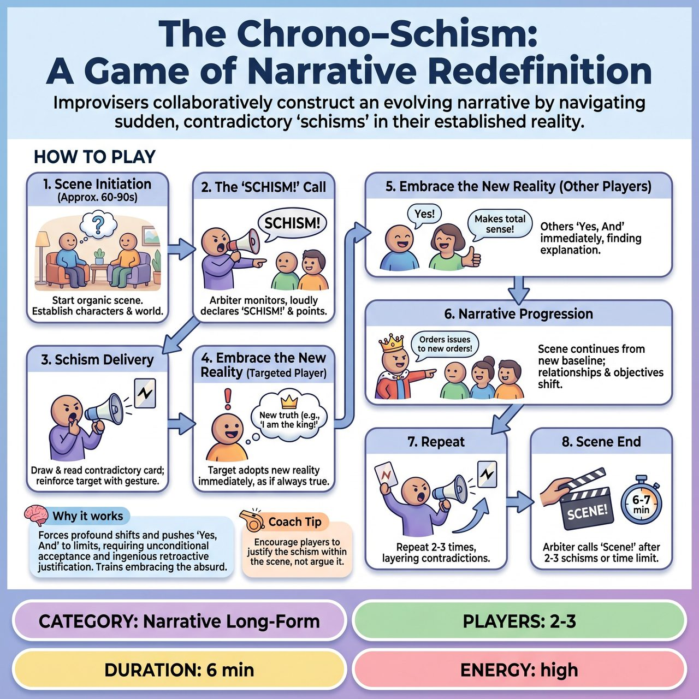

# The Chrono-Schism: A Game of Narrative Redefinition

{ .game-hero }

> Improvisers collaboratively construct an evolving narrative by navigating sudden, contradictory 'schisms' in their established reality.

## Overview
The Chrono-Schism is a novel competitive short-form game designed to push improvisers beyond conventional scene-building by systematically disrupting their established narrative reality. A Narrative Arbiter introduces disruptions via Schism Cards, forcing players to instantly and completely adopt new, often absurd, truths about their characters, relationships, or environment. This forces improvisers to integrate logical impossibilities into their current narrative and retroactively justify them, effectively performing a live, collaborative retcon on their own unfolding story.

## Setup
Requires a Narrative Arbiter (host/judge) and a deck of 20-30 pre-prepared 'Schism Cards' face down. Each card contains a short, declarative statement that directly contradicts a plausible established truth, relationship, or expectation within a scene (e.g., 'You are not a human, but an advanced artificial intelligence'). Get a standard audience suggestion (location, relationship, object, etc.) to initiate the scene.

## How to Play
1. Scene Initiation (Approx. 60-90 seconds): Players begin an organic scene based on the audience suggestion, establishing characters, relationship, environment, and initial narrative arc.
2. The 'SCHISM!' Call: The Arbiter monitors the scene and loudly declares 'SCHISM!' while making a clear, pointed gesture towards the specific player(s), object, or area of the stage to whom/which the card applies.
3. Schism Delivery: The Arbiter draws the top card from the deck and reads the contradictory statement aloud, clearly and audibly, reinforcing the target by gesturing again.
4. Embrace the New Reality (Targeted Player): The targeted player(s) must immediately and completely adopt this new reality as if it has always been true, with no debate or denial, embodying the change through physical adjustments, vocal inflections, and emotional responses.
5. Embrace the New Reality (Other Players): Any other players must immediately and completely 'Yes, And' this new reality, finding an explanation or context that makes the new reality seamlessly fit into the current moment and retroactively reinterpreting past actions.
6. Narrative Progression: The scene continues from this new, contradictory baseline, with relationships, objectives, and status shifting dramatically.
7. Repeat: The Arbiter repeats the Schism call 2-3 times during a single scene, layering contradicting realities.
8. Scene End: The Arbiter calls 'Scene!' after 2-3 schisms or a set total time (typically 5-7 minutes).

## Coaching Notes
- The Arbiter should possess excellent stage presence, strong command of timing, impartiality, a keen eye for established scene reality, and a deep understanding of narrative dynamics.
- Schism Cards must be contradictory, specific, high stakes, and have a clear target. Avoid gags as the sole purpose; the primary function is narrative disruption and escalation (supporting Sub-Hypothesis B.2).
- Targeted players must not merely react; they must actively become their new reality without attempting to justify the previous reality, serving as the mandatory pre-defined narrative consequence (Hypothesis B).
- Non-targeted players cannot question or deny the new reality; their task is to make their partner look good by collaboratively navigating the new obstacle (fulfilling Sub-Hypothesis B.4).
- For initial plays or less experienced teams, the Narrative Arbiter might use slightly longer intervals between 'SCHISM!' calls.
- Judges evaluate based on Schism Embrace & Commitment, Narrative Integration & 'Yes, And', Cohesion & Evolving Arc, and Audience Engagement & Transparency.

## Why It Works
This game forces profound narrative shifts and pushes 'Yes, And' to its ultimate limits, requiring instantaneous and unconditional acceptance followed by ingenious retroactive justification. It directly addresses the philosophy of 'embracing mistakes' by transforming previously established truths into unstable, mutable elements, demanding rapid cognitive restructuring, active listening, and collaborative scene-building under duress.

## Safety & Inclusion
Ensure that Schism Cards do not introduce themes that violate the group's safety boundaries or trigger trauma. Players should maintain physical safety during sudden character or environmental shifts, and the Arbiter should be mindful not to target players with schisms that could be genuinely distressing or inappropriate for the performers.

