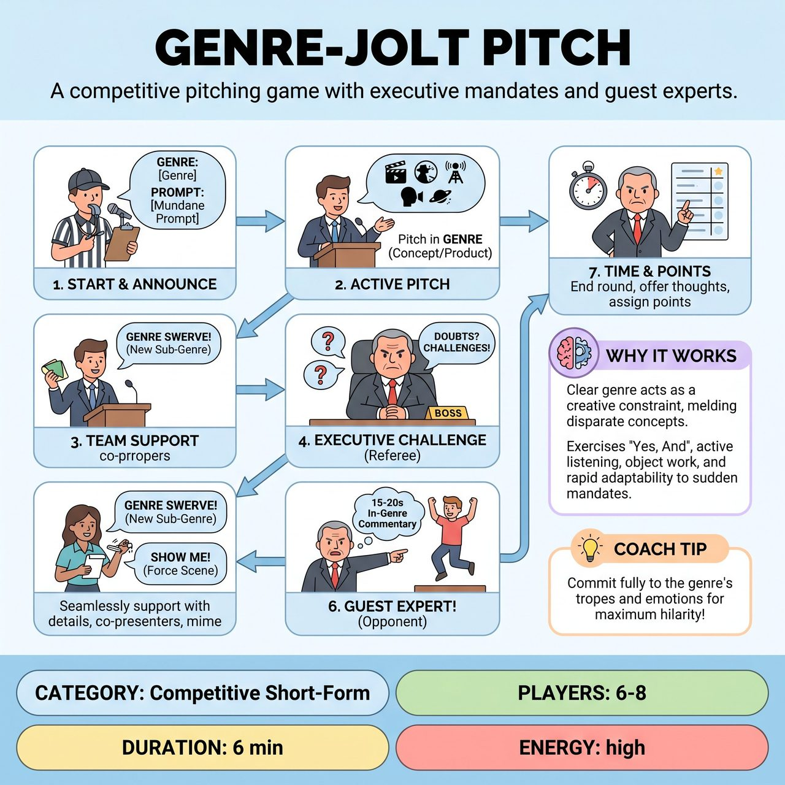

# Genre-Jolt Pitch

{ .game-hero }

> A competitive pitching game with executive mandates and guest experts.

## Overview
Two teams compete to deliver hilarious, innovative, and perfectly genre-specific 'pitches' to a demanding 'Executive' (the Referee). Players must take a mundane suggestion and interpret it through the lens of an audience-chosen genre, adapting to spontaneous 'Executive Mandates' and 'Guest Experts' from the opposing team.

## Setup
Two teams of 3-4 players each. Use a standard open stage with a mimed 'pitching podium' and a referee table acting as an executive's desk. Get two suggestions from the audience: a broad genre/style (e.g., 'Dystopian Sci-Fi') and a mundane problem or object (e.g., 'making a sandwich').

## How to Play
1. The Referee kicks off the game by announcing the audience's genre and mundane prompt.
2. Teams alternate turns. One player from the active team steps forward to pitch a concept, solution, or product that addresses the mundane prompt entirely within the chosen genre.
3. Teammates seamlessly jump in to support the pitch by adding details, playing co-presenters or customers, and providing mimed visual aids.
4. The Referee, playing a tough and demanding 'Executive', frequently interjects with questions, doubts, and challenges.
5. The Executive issues spontaneous 'Mandates' to force adaptation, such as 'Genre Swerve!' (adding a new sub-genre) or 'Show Me, Don't Tell Me!' (forcing a transition into a brief active scene).
6. The Executive can also call 'Guest Expert!', pointing to an opponent who must jump on stage for 15-20 seconds to offer in-genre commentary that the pitching team must 'Yes, And'.
7. After 90 seconds to 2 minutes, the Executive calls time, offers final thoughts, and assigns points before the next team pitches.

## Coaching Notes
- Award points for Genre Fidelity (+1 to +3), Creativity & Wit (+1 to +2), Executive's Delight (+1), and Strong 'Yes, And' (+1).
- Call a 'Genre Misfire' (-2 points) if a team fails to integrate the genre or explicitly breaks its rules.
- Call an 'Anachronism Alert!' (-1 point) if players introduce elements that break the established world (e.g., a smartphone in a historical scene).
- Call 'Pitch Stagnation' (-1 point) for excessive hemming, hawing, or lack of progression.
- Penalize with 'Refusal to Incorporate' (-2 points) if a team ignores a Guest Expert or Executive Mandate.
- Guest Experts should subtly challenge or derail the pitch while remaining strictly within the ongoing genre and without breaking flow.
- Call a 'Groaner Foul' for obvious, cheap puns.

## Why It Works
The clear genre backdrop acts as a primary creative constraint, challenging improvisers to meld disparate concepts into a cohesive whole. It heavily exercises 'Yes, And', active listening, object work, and rapid adaptability to sudden mandates.

## Safety & Inclusion
Enforce a standard content foul for any inappropriate, blue, or offensive content to maintain a family-friendly environment. Ensure Guest Experts challenge the pitch cleanly without steamrolling the active team.

