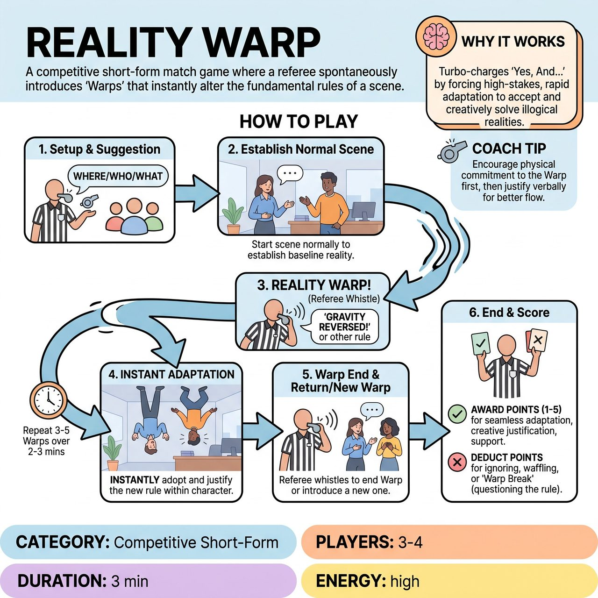

# Reality Warp

{ .game-hero }

> A competitive short-form match game where a referee spontaneously introduces 'Warps' that instantly alter the fundamental rules of a scene.

## Overview
"Reality Warp" throws improvisers into a scene where the fundamental rules of their world can spontaneously change at the referee's command. Players must instantly adapt to these bizarre "Warps"—whether they alter gravity, speech patterns, physical laws, or character endowments—justifying the absurdity within their scene's newfound reality. It challenges improvisers to rapidly integrate unpredictable constraints, pushing their comedic and adaptive skills to generate hilarious and coherent scenes.

## Setup
Requires 3-4 players per team (one team plays at a time) on a standard competitive improv stage. No physical props are used; everything is entirely mimed. The Referee needs a distinct whistle and a secret list of various 'Reality Warps' (Physical, Verbal/Communicative, and Character/Emotional). The audience provides an initial scene suggestion (location, relationship, activity).

## How to Play
1. The Referee solicits a basic scene suggestion from the audience (e.g., 'Where are we? Who are you? What are you doing?').
2. The team begins improvising a scene based on the suggestion, starting normally to establish a baseline reality.
3. At any point, the Referee blows a loud whistle (or shouts 'REALITY WARP!') and declares a specific new rule from their list (e.g., 'Gravity has reversed!', 'Everyone can only speak in questions!', 'You are all secretly plotting against each other!').
4. All players on stage must instantly and collectively adopt this new rule, integrating it into their characters' experience and justifying why it is happening within the scene's evolving context.
5. After 2-5 lines of dialogue or 10-30 seconds of action, the Referee blows the whistle again to either end the current Warp (returning to normal) or introduce a new, different Warp.
6. The scene continues with 3-5 Warps over the course of 2-3 minutes before the Referee blows a final whistle to end the game.
7. The Referee awards 1-5 points per successful Warp integration based on seamless adaptation, creative justification, commitment, humor, and team support.
8. The Referee deducts points or calls fouls for ignoring the Warp, breaking character to question the Warp meta-theatrically ('Warp Break'), waffling/denial, or making stale comedic choices ('Groaner Foul').

## Coaching Notes
- Players must immediately and collectively integrate the Warp into the scene. Do not just adhere to the rule; justify *why* it's happening within the scene's logic.
- The humor comes from the characters' bewildered or absurd attempts to explain the sudden shift, not from breaking character.
- Maintain your initial character relationships and objectives while reacting authentically to the warping reality.
- Commit fully to the physicality of the Warps. If gravity reverses, struggle to stay grounded; if in slow motion, execute every action and word slowly.
- Listen actively to both the Referee's calls and your teammates' justifications so you can support their reality.
- Avoid 'Warp Breaks'—do not step out of character to acknowledge or question the Warp meta-theatrically (e.g., 'Wait, what's happening to gravity?!').

## Variations
- Audience Challenge: A designated audience member or row provides a 'Warp Suggestion' for the referee to consider, fostering greater audience interaction.
- Layered Warps: Instead of returning to normal, the Referee introduces a new Warp that stacks on top of the previous one, compounding the challenge.

## Why It Works
The unpredictable and rapid introduction of Warps forces players into constant, high-stakes adaptation. It turbo-charges the 'Yes, And...' principle by forcing players to accept outrageous realities on the spot, creatively solving illogical scenarios while maintaining dynamic pacing.

## Safety & Inclusion
The Referee ensures all Warps are appropriate for all ages, keeping the content strictly G-rated. A clean-content foul (Change of Possession) is immediately called for any non-family-friendly Warp suggestion, player reaction, or justification.

