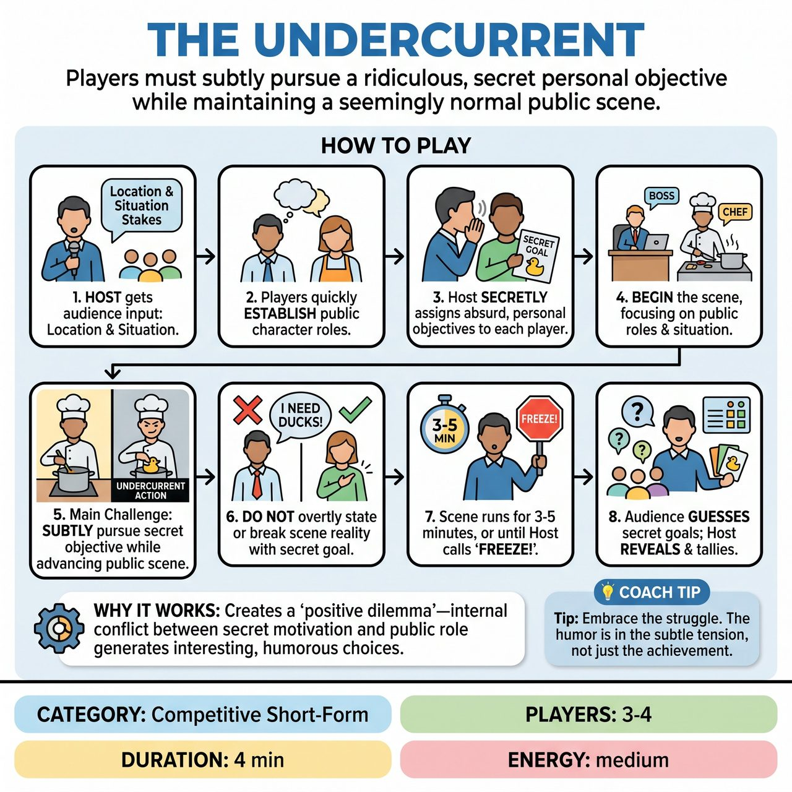

# The Undercurrent

{ .game-hero }

> Players must subtly pursue a ridiculous, secret personal objective while maintaining a seemingly normal public scene.

## Overview
The Undercurrent is an improv game designed to create 'positive dilemmas' by giving players secret, absurd personal objectives that inherently conflict with their public roles in a scene. Players must subtly pursue these 'undercurrent' goals without breaking character or overtly disrupting the main scene, generating humor from their internal struggle and the clever ways they attempt to achieve their hidden missions.

## Setup
3-4 improvisers. No props required; a clear stage is ideal. Active participation from the host/referee and the audience for suggestions and potential scoring.

## How to Play
1. The host asks the audience for a specific location and a public situation or stakes.
2. Based on the location and situation, players quickly establish basic character roles.
3. The host or referee secretly assigns a unique, absurd, and challenging personal objective to each player via whisper or private card. This objective must inherently contradict, complicate, or seem irrelevant to the public role.
4. Players begin the scene, focusing on the public situation and their established roles.
5. Throughout the scene, each player's main challenge is to subtly pursue their secret objective while still performing their public role convincingly and advancing the overall scene.
6. Players cannot overtly state their secret objective or perform it in a way that breaks the scene's reality or the logic of their public character.
7. The scene runs for 3-5 minutes, or until the host calls 'Freeze!'.
8. At the end of the scene, the host asks the audience to guess the players' secret objectives, then reveals the true objectives and tallies the score.

## Coaching Notes
- Award points for subtle achievement when a player makes a clear but subtle attempt at their secret objective that some audience members might notice.
- Award points for integrated play when a player successfully integrates their secret objective into the public scene without disrupting the flow or character integrity.
- Award points for public scene contribution (strong character work, advancing the scene, making partners look good) to ensure players don't only focus on their secret goal.
- Deduct points for overtness if a player is too obvious about their secret objective, breaks character, or derails the scene. The undercurrent must remain an undercurrent, not a tidal wave.
- Provide objectives like: 'Convince the candidate that squirrels are alien spies', 'Untie and retie shoelaces every time someone says opportunity', or 'Switch plates with your date without them noticing'.

## Why It Works
It forces players into a state of 'positive dilemma' where every available choice is simultaneously interesting, challenging, and offers potential for humor. The internal, character-based conflict between a secret motivation and apparent behavior makes every decision a rich, comedic negotiation.

## Safety & Inclusion
Ensure secret objectives assigned by the host are absurd and challenging, but do not force players into inappropriate physical contact or cross personal boundaries. Players should respect standard improv safety and consent guidelines while pursuing their hidden goals.

