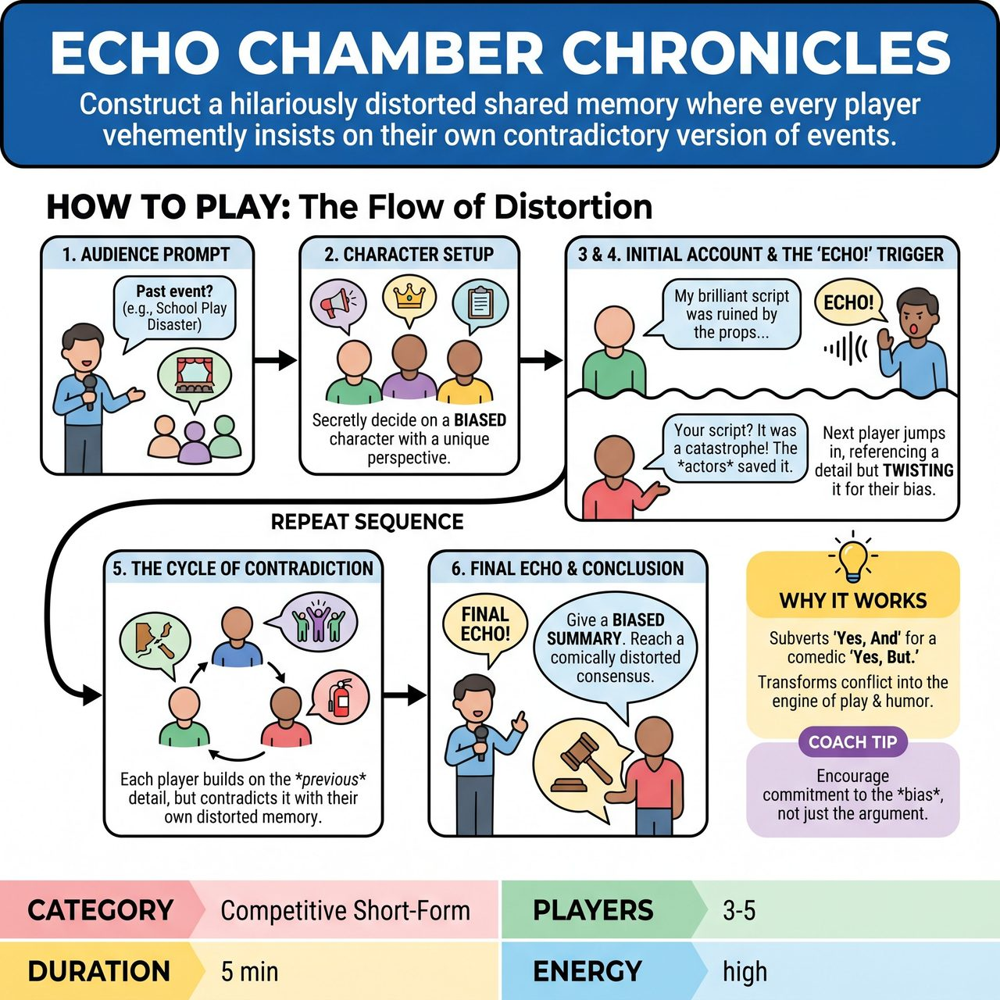

# Echo Chamber Chronicles

{ .game-hero }

> Construct a hilariously distorted shared memory where every player vehemently insists on their own contradictory version of events.

## Overview
Echo Chamber Chronicles is an improvisational game where 3-5 players collaboratively construct a hilariously distorted collective memory of a single past event, suggested by the audience. Each player embodies a character with a unique, biased perspective and takes turns recounting fragments of the event. The core mechanic is that every new contribution must intentionally contradict or significantly alter a detail from the immediately preceding player's account, justifying their 'truth' through their character's personality.

## Setup
Requires 3-5 players (4 is ideal for dynamic interaction without too much chaos) and a Host/Referee to introduce the game, facilitate audience suggestions, manage turns, and award points. Minimal stage/props are needed; an open playing space is sufficient, though a few chairs might be used to differentiate characters or imagined locations.

## How to Play
1. The Host asks the audience for a single, significant past event that multiple people would have experienced (e.g., 'The day of the big school play disaster').
2. Each player quickly and silently decides on a distinct character who was present at the event, possessing a reason to remember things differently. Players do not share their character details or biased version before the game begins.
3. The Host designates one player to begin. This player steps forward and starts recounting the event from their character's unique, biased perspective, establishing an initial detail, emotion, or tone.
4. After approximately 15-30 seconds, the Host says 'Echo!' (or 'Distortion!').
5. The next player immediately jumps in, taking over the narration. They must reference a specific detail, emotion, or premise just established by the previous player and then contradict, warp, or significantly alter it, justifying this change from their character's perspective.
6. Play continues in sequence. Each player picks up a prominent detail from the immediately preceding player and twists it into their own character's biased memory, physically embodying their character's memory, emotions, and personal stakes.
7. After each player has had 2-3 turns, the Host calls 'Final Echo!'
8. The last player to speak attempts to provide a summary or ultimate takeaway of the event, leaning fully into their character's particular bias and reaching a comically grand or nonsensical conclusion.
9. The Host (or designated judges) awards competitive short-form match points based on Originality of Contradiction (5 points), Character Justification (5 points), Listening & Integration (5 points), Overall Humor & Energy (5 points), and Bold Choice (Bonus points).

## Coaching Notes
- Players must justify why they remember it differently, even if the justification is absurd.
- The goal is not to reach a 'truth' but to create a hilariously fragmented and increasingly absurd mosaic of conflicting recollections, all while listening keenly for new details to exploit.
- While players still must 'Yes' the existence of the event and the previous player's statement, they then immediately 'And, but my character vehemently believes X instead!'
- Players must not only create their own memory but also be hyper-attuned to the ever-shifting details provided by others, adapting their next contradiction on the fly.

## Why It Works
This game consciously subverts one of the core tenets of traditional improv by replacing 'Yes, And' with a comedic 'Yes, But.' It transforms potential conflict and disagreement into the very engine of play and humor. It fosters dynamic disagreement, encourages complex character work, builds narrative tension, and challenges adaptability by demanding active listening under pressure.

## Safety & Inclusion
Ensure contradictions remain focused on the narrative and character perspectives, avoiding personal attacks on the performers. Maintain physical safety if players choose to physically embody chaotic or intense memories.

