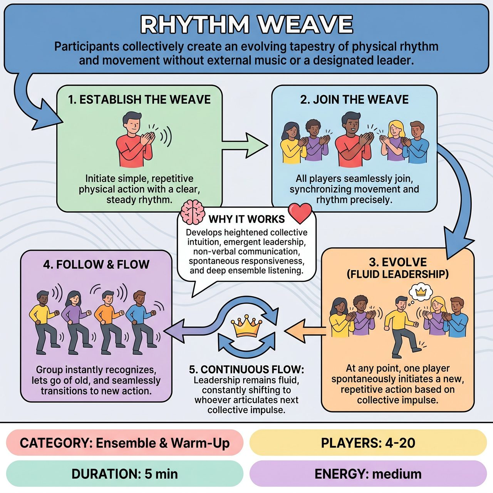

# Rhythm Weave

{ .game-hero }

> Participants collectively create an evolving tapestry of physical rhythm and movement without external music or a designated leader.

## Overview
Rhythm Weave is a collaborative game conceptually adapted from Freeze Dance or Simon Says, where the traditional external music or leader is internalized. Players synchronize with a simple rhythmic action initiated by one person, then continuously evolve it as any participant spontaneously initiates a new, repetitive action based on a collective impulse.

## Setup
Players stand in an open space, forming a loose circle or scattered formation, allowing clear sightlines to everyone. No external music, props, or designated leader are used.

## How to Play
1. Phase 1: Establishing the Weave. One player begins a simple, repetitive physical action with a clear, steady rhythm (e.g., a gentle hand clap, a foot tap, a torso sway, a soft vocalization).
2. Phase 2: Joining the Weave. All other players actively observe and listen, then seamlessly join this action, synchronizing their movement and rhythm as precisely as possible to create a unified body music.
3. Phase 3: Evolving the Weave (Fluid Leadership). As the group settles into a collective rhythm, players become intensely aware of the group's overall energy. At any moment, any player who feels a strong, spontaneous, collective impulse to shift the rhythm can initiate a new, clear, repetitive physical action.
4. Phase 4: Following the New Impulse. The rest of the group instantly recognizes this new emergent command, lets go of the old rhythm, and seamlessly transitions to mimic the new action and rhythm initiated by the spontaneous leader.
5. Phase 5: Continuous Flow. Leadership remains fluid, constantly shifting to whoever next senses and articulates a new, resonant collective impulse. The game continues as long as the group desires, with all communication remaining physical and energetic.

## Coaching Notes
- Point of Concentration (POC): To simultaneously maintain perfect synchronous response to the group's current physical rhythm and to deeply sense and articulate the next collective impulse.
- The new action should feel like a natural, albeit transformative, evolution from the current group state, not an arbitrary individual move.
- There are no spoken commands; all communication is physical and energetic.
- There is no right or wrong move, only the collective effort to stay attuned and responsive.
- Encourage players to move beyond individual ego and intellectual planning to foster collective responsibility and an emergent group mind.

## Why It Works
It develops heightened collective intuition, emergent leadership, non-verbal communication, spontaneous responsiveness, and deep ensemble listening. It supports a profound sense of connection and trust within the ensemble, celebrating collective authorship and fluid presence over individual performance.

## Safety & Inclusion
Ensure the physical space is clear of obstacles. Encourage players to choose movements that are physically safe and accessible for all participants to mimic without strain or injury.

