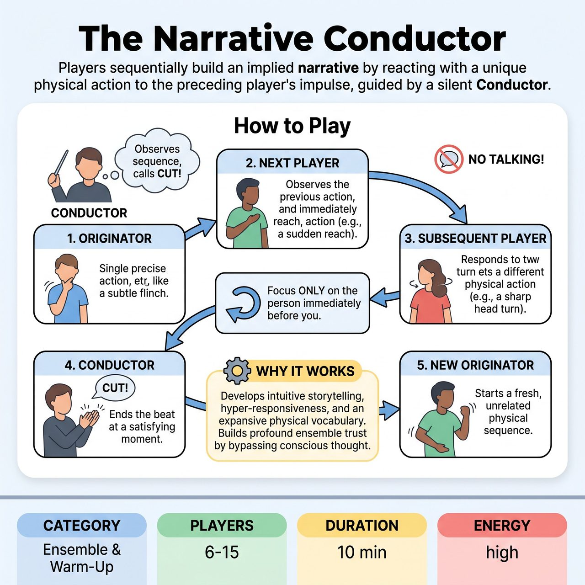

# The Narrative Conductor

{ .game-hero }

> Players sequentially build an implied narrative by reacting with a unique physical action to the preceding player's impulse, guided by a silent Conductor.

## Overview
The Narrative Conductor is an improv exercise designed to cultivate intuitive, non-verbal storytelling within an ensemble. Players sequentially build an implied narrative by responding with a unique physical action that is an intuitive continuation of the immediately preceding player's impulse. A designated Conductor observes and punctuates these emerging story beats, fostering hyper-responsiveness and ensemble sensitivity.

## Setup
Participants stand in a loose circle or horseshoe formation, ensuring everyone has a clear line of sight to the person immediately next to them. One player is designated the 'Originator' to begin the sequence. A 'Conductor' (initially the facilitator, later a rotating player) stands where they can observe the entire sequence. No pre-set theme, character, or story is established.

## How to Play
1. The Originator initiates a single, clear, and precise physical action or gesture (e.g., a subtle flinch, an exaggerated reach, a sharp turn of the head).
2. The adjacent player observes this action and immediately responds with their own unique physical action that implies a natural continuation or consequence of the Originator's action.
3. This process continues sequentially around the circle. Each subsequent player focuses only on the action performed by the person immediately before them and responds with a new, unique physical action.
4. Players must not look back at earlier actions or try to remember the story; their focus is solely on the most recent physical impulse.
5. Absolutely no verbal communication, explanation, or interpretation of actions is allowed.
6. The Conductor observes the sequence. When they perceive a satisfying implied narrative beat or natural transition, they firmly clap their hands or say 'Cut!'.
7. When 'Cut!' is called, the sequence ends. The player who performed the last action becomes the new Originator for the next round, starting a fresh, unrelated physical impulse.

## Coaching Notes
- Point of Concentration for Players: Receive the preceding physical impulse, and without thought, express the instantaneous, unique physical consequence or continuation it demands from your body.
- Point of Concentration for the Conductor: Identify and punctuate the precise moment when a chain of physical responses resolves into a complete, compelling, or thought-provoking implied narrative beat.
- Remind players not to copy the action, nor to consciously create a story. The response must be intuitive.
- Encourage actions to be contained and precise, rather than sweeping or overly broad.
- Keep the pace fast to force players to bypass conscious thought and intellectual planning.

## Why It Works
The game develops intuitive storytelling, hyper-responsiveness, and an expansive physical vocabulary. By bypassing conscious thought and relying entirely on physical impulses, players build profound ensemble trust, eradicate self-censorship, and anchor themselves firmly in the present moment.

## Safety & Inclusion
Ensure players have enough physical space to move safely without striking others. Encourage players to respect physical boundaries and avoid actions that require non-consensual physical contact.

