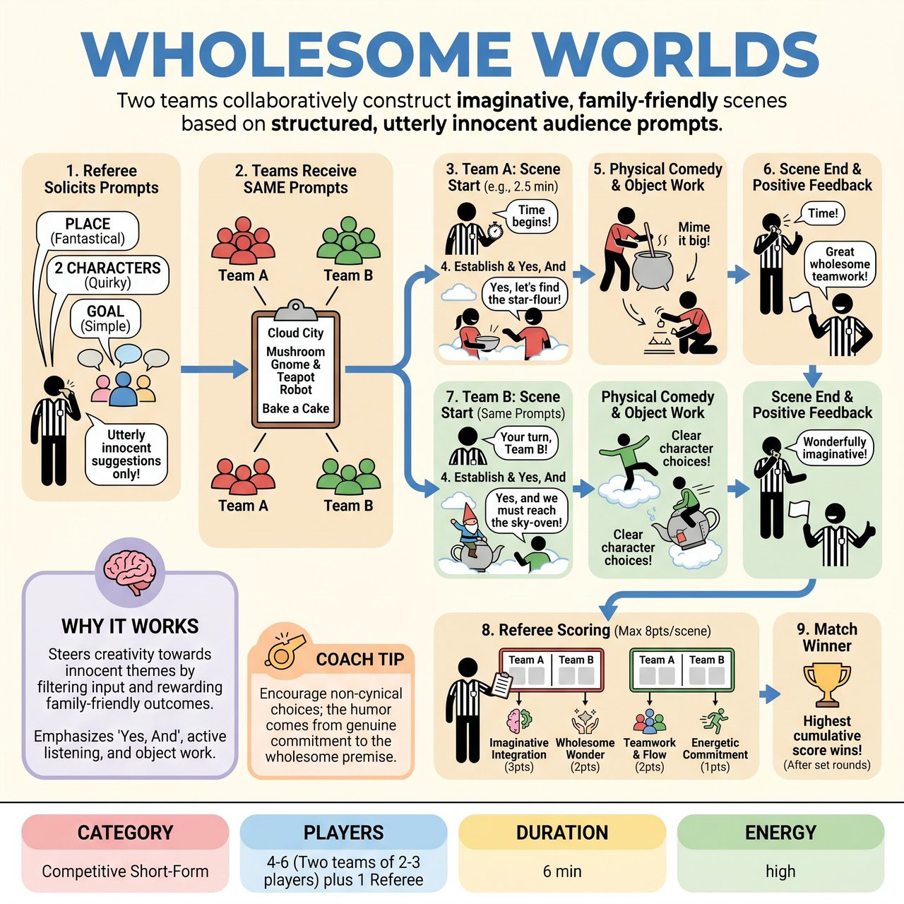

# Wholesome Worlds

{ .game-hero }

> Two teams collaboratively construct imaginative, family-friendly scenes based on structured, utterly innocent audience prompts.

## Overview
Wholesome Worlds is a competitive improv game where two teams collaboratively construct imaginative, family-friendly scenes based on audience-provided prompts. A referee guides the action, soliciting 'utterly innocent' suggestions for a fantastical place, two quirky characters, and a simple goal. Both teams then use the exact same prompts to create their unique scene interpretations, showcasing quick wit, 'Yes, And' improvisation, and physical comedy.

## Setup
Two teams (Red and Blue) of 2-3 players each stand ready on stage. The Referee stands center, ready to guide the action, collect prompts, and manage scoring.

## How to Play
1. The Referee asks the audience for three distinct, wholesome suggestions: an unusual, fantastical, and completely innocent PLACE; two imaginative, quirky, and utterly harmless CHARACTERS; and one simple, lighthearted, and achievable GOAL or PROBLEM.
2. Both teams receive the exact same three collected prompts for their respective scenes.
3. The Referee announces the starting team and gives them a set time limit (e.g., 2.5 minutes).
4. The chosen team immediately launches into a scene, using 'Yes, And' to establish the place, introduce the characters with their unique quirks, and actively work towards the goal.
5. Players use strong object work, physical comedy, and clear character choices to bring their world to life at a fast pace.
6. After the allotted time, the Referee calls time, ends the scene, and offers brief positive feedback.
7. The second team then gets their turn with the same three prompts to create their unique interpretation.
8. The Referee assigns points (up to 8 per scene) based on Imaginative Integration (3 points), Wholesome Wonder (2 points), Teamwork & Flow (2 points), and Energetic Execution (1 point).
9. The team with the highest cumulative score after a predetermined number of rounds wins the match.

## Coaching Notes
- Referee as Prompt Master: Gently guide audience suggestions if they veer off-course to ensure they remain fantastically innocent.
- Clean-Content Foul (-3 points): Call this for any blue humor, swearing, or innuendo to reinforce the family-friendly commitment.
- Groaner Foul (-1 point): Call this for excessively bad, uncreative, or overly forced puns/jokes that halt momentum.
- Forgotten Foundation Foul (-2 points): Call this if a team noticeably ignores or completely drops one of the three core audience prompts (Place, Characters, Goal).
- Energy Driver: The Referee should keep the energy high with playful banter, commentary, and rapid transitions.
- Encourage players to use strong object work and physical comedy to vividly bring the fantastical world to life without props.

## Why It Works
It steers player and audience creativity towards innocent themes by meticulously filtering audience input and rewarding genuinely family-friendly outcomes. It emphasizes fundamental improv skills like 'Yes, And', active listening, object work, character development, and crafting a clear narrative arc towards a simple goal.

## Safety & Inclusion
Strict adherence to a wholesome, family-friendly narrative is required. The Referee actively filters audience prompts for innocence and penalizes any inappropriate content, blue humor, swearing, or innuendo with a clean-content foul to maintain a safe, wonder-filled environment.

