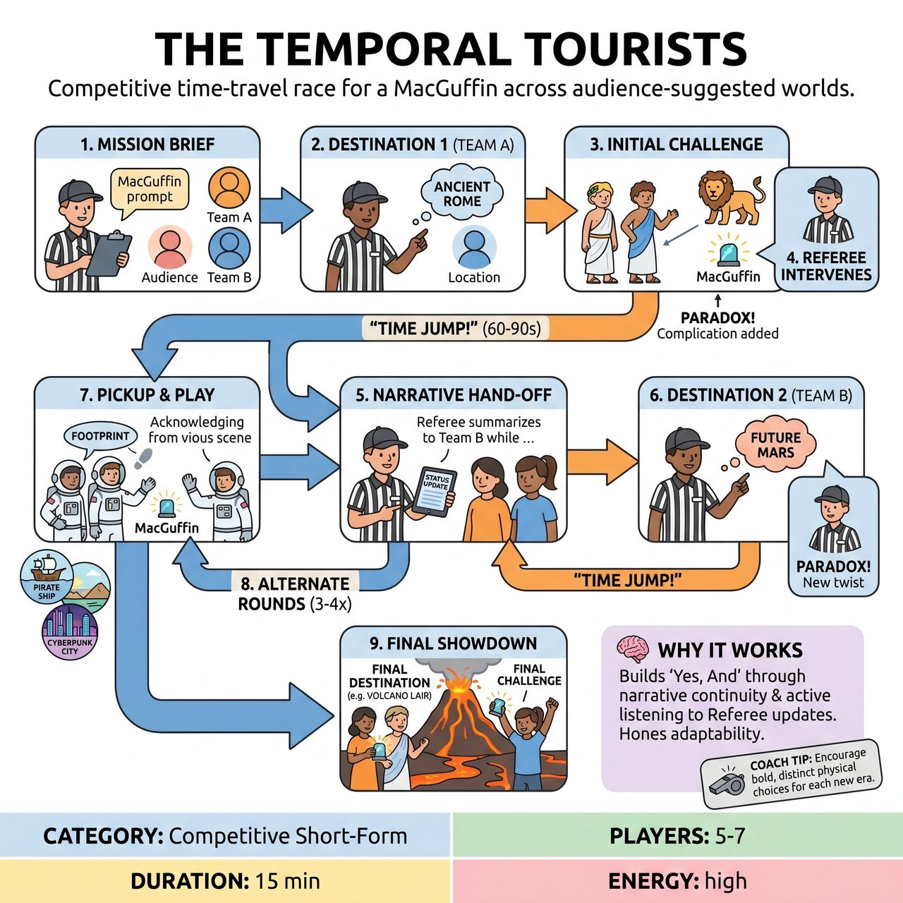

# The Temporal Tourists

{ .game-hero }

> Two teams of time-traveling characters race across audience-suggested historical periods, future scenarios, and fantastical worlds to retrieve a ridiculously valuable MacGuffin.

## Overview
The Temporal Tourists is a competitive improv game where two teams of time-traveling characters race across audience-suggested historical periods, future scenarios, and fantastical worlds to retrieve a ridiculously valuable, audience-named MacGuffin. Guided by a referee who provides challenges, introduces complications, and calls unique 'temporal paradox' fouls, teams must 'Yes, And' their way through absurd situations, building upon the narrative left by the previous team. Points are awarded for creativity, character consistency, and comedic success in this hilarious, collaborative, and fast-paced interdimensional quest.

## Setup
Form two teams (Red and Blue), each consisting of 2-3 players, plus one Referee. Each team portrays a pair or trio of 'Temporal Tourists'—characters who have a consistent relationship (e.g., bickering siblings, clumsy partners) that ensues across all time-jumps. Get an audience suggestion for a ridiculously valuable 'MacGuffin' (e.g., 'The Whimsical Waffle Iron of Wisdom') that the teams are on a mission to retrieve.

## How to Play
1. Mission Briefing: The Referee introduces the game, establishes the legendary MacGuffin based on an audience suggestion, and announces the overarching mission to retrieve it.
2. First Destination & Challenge (Team 1): The Referee asks the audience for the first 'Destination' (a historical period, future scenario, or fantastical world). Team 1 enters the stage, immediately establishing the environment and their characters' reaction to it.
3. The Referee introduces an immediate 'Initial Challenge' or obstacle related to the destination and the MacGuffin. Team 1 must 'Yes, And' the environment and challenge, attempting to overcome the obstacle or advance the mission.
4. Referee Intervention & Escalation: During the scene, the Referee actively participates by introducing new characters or complications, adding endowments, or calling fouls.
5. Temporal Jump! (Scene End): After 60-90 seconds, or when the scene reaches a satisfying point, the Referee calls out, 'TIME JUMP!' This signals the end of Team 1's scene and their current destination.
6. Next Destination & Narrative Hand-off (Team 2): The Referee quickly summarizes Team 1's progress and the current status of the MacGuffin, then asks the audience for a new Destination for Team 2.
7. Team 2 enters the new destination, picking up the narrative thread. They must acknowledge the previous team's actions and the MacGuffin's new location/status, and face a new challenge in their environment.
8. Alternating Play: Teams alternate in this fashion for 3-4 rounds each. Each time a team enters, they are in a new, audience-suggested destination, and the Referee updates them on the MacGuffin's current situation.
9. Final Destination & Resolution: For the final round, the Referee announces the 'Final Destination' and the ultimate challenge to finally retrieve the MacGuffin. Both teams might play out the final scene together, or alternate one last time for a grand comedic climax.

## Coaching Notes
- The Referee is central to guiding the narrative, setting the mission, introducing challenges, and providing narrative continuity between teams.
- Call standard competitive short-form match fouls: 'Clean-Content Foul' (for blue humor, swearing, innuendo), 'Bad Pun Foul' (for excessively bad puns), and 'Non-Commitment Foul' (for not committing).
- Call Game-Specific Fouls: 'Temporal Paradox Foul' (for intentionally or accidentally creating a time paradox that breaks the internal logic) and 'Anachronism Foul' (for introducing a wildly out-of-place item without justifying it as part of the time travel).
- Award points for Narrative Progression, Destination Embodiment, Character Consistency, Creative Problem Solving, Audience Engagement, and Object Work. Deduct points for any fouls called.
- Encourage players to maintain their 'Temporal Tourist' relationship and character choices across wildly different scenarios.

## Why It Works
It tests 'Yes, And' by forcing players to build upon the narrative established by the previous team's scene. It demands active listening to understand the Referee's updates on the MacGuffin's location. It also hones object work, character consistency through extreme setting changes, and the adaptability to rapidly shift mental gears to embody new destinations.

## Safety & Inclusion
This game is inherently family-friendly. The 'Clean-Content Foul' acts as a strict deterrent against any inappropriate language or innuendo. The competitive aspect should remain playful, fostering mutual support and celebration of each other's comedic genius rather than cutthroat rivalry.

