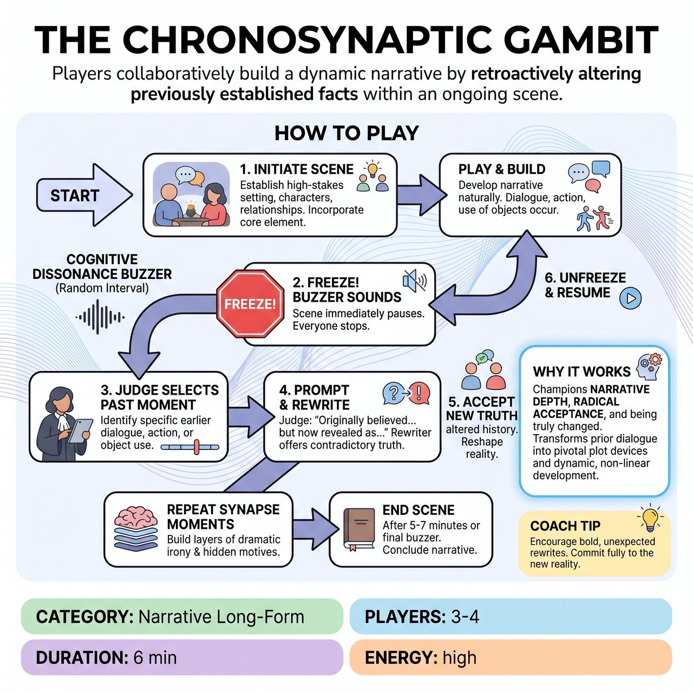

# The Chronosynaptic Gambit

{ .game-hero }

> Players collaboratively build a dynamic narrative by retroactively altering previously established facts within an ongoing scene.

## Overview
The Chronosynaptic Gambit is a competitive improv game where players construct an increasingly complex narrative by retroactively reinterpreting critical past events. Triggered by a Cognitive Dissonance buzzer, a judge selects a past line or action, and a Rewriter provides a profoundly contradictory truth for that moment. The in-scene players must then immediately accept this new history, incorporating it into their characters' motivations and reshaping the narrative's foundations.

## Setup
Requires a 'Cognitive Dissonance' buzzer or bell controlled by a judge, and a cue card or screen to quickly display a previously spoken line or action. Get an audience suggestion for a high-stakes location and a core object or phrase that must appear in the opening moments. Designate a 'Rewriter' (host, judge, or off-stage player) who will provide the new truths.

## How to Play
1. Players initiate a high-stakes scene in the suggested location, incorporating the core object or phrase and establishing clear characters, relationships, and an immediate goal.
2. At random intervals (e.g., every 60-90 seconds), the judge sounds the 'Cognitive Dissonance' buzzer, freezing the scene.
3. The judge selects and displays or verbally cues a specific line of dialogue, action, or use of an object that occurred earlier in the scene.
4. The judge prompts: 'Originally, [Player X's] line/action was believed to be about [original meaning]. But now, in light of a new truth, we reveal it was actually because...'
5. The designated Rewriter immediately offers a brand new, utterly contradictory or profoundly re-contextualizing truth for that past event.
6. The buzzer sounds again to unfreeze the scene.
7. Players must immediately and wholeheartedly accept this new truth, actively reshaping the reality of everything that has transpired since that original moment to make sense under the new context.
8. The scene continues from the exact point it was frozen, operating under this altered historical premise.
9. Continue through several 'Synapse' moments, building layers of dramatic irony and hidden motives, until the scene ends after 5-7 minutes or upon a final buzzer.

## Coaching Notes
- Embrace the shifts: Every Synapse moment alters the timeline. Performers must enthusiastically embrace these shifts, justifying them as inherent to the scene's new reality.
- Make your partner look good: Listen and watch intently for details in your partner's performance. When a new truth drops, justify both your own and your partner's past actions.
- Be changed: Allow the new information to fundamentally change your character's understanding of themselves, their relationships, and their objectives in an instant.
- Status play: As underlying motives are re-contextualized, character status and power dynamics will shift dramatically; be ready for subtle and overt adjustments.
- Active listening is crucial to identify the synapses and integrate the new information into the rewritten scene fabric.

## Why It Works
It champions narrative depth, radical acceptance, and the improviser's ability to be truly changed. It acts as a masterclass in dynamic, non-linear narrative development, transforming unplanned prior dialogue into pivotal plot devices and demanding an extreme application of 'Yes, And'.

## Safety & Inclusion
Ensure players respect physical and emotional boundaries during high-stakes or intense status shifts. The 'Rewriter' should avoid introducing truths that force players into non-consensual, offensive, or unsafe subject matter.

