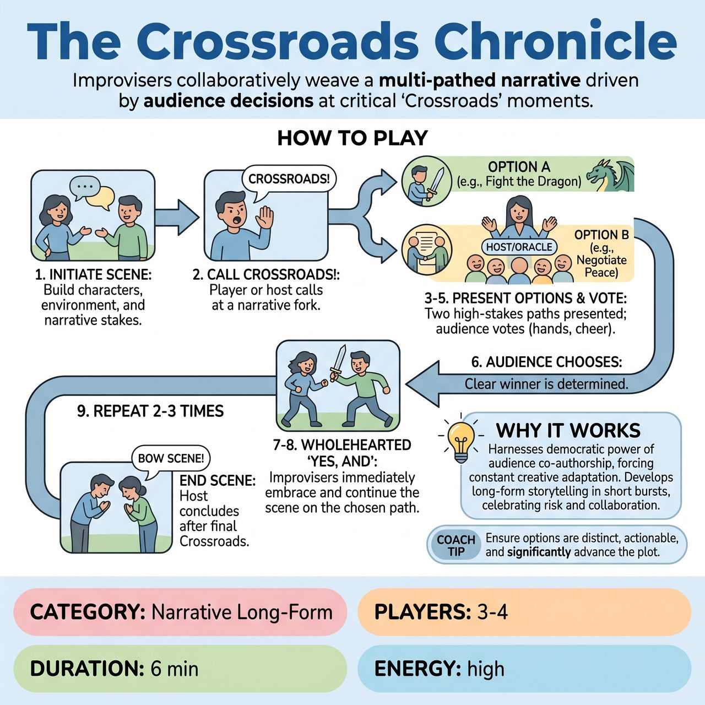

# The Crossroads Chronicle

{ .game-hero }

> Improvisers collaboratively weave a multi-pathed narrative driven by audience decisions at critical 'Crossroads' moments.

## Overview
The Crossroads Chronicle is a ground-breaking improv game where improvisers collaboratively weave a multi-pathed narrative, driven by audience decisions at critical 'Crossroads' moments. Performers must immediately and wholeheartedly 'Yes, And' the audience's chosen path, demonstrating profound adaptability, collaborative courage, and a deep commitment to narrative development within an unpredictable, unscripted framework.

## Setup
Designate an 'Oracle Host' or MC to oversee the 'Crossroads' moments. Establish a distinct audio cue (e.g., a specific bell, gong, or host verbal cue like 'Crossroads!') and visual cue (e.g., a spotlight change, a 'Decision Point' graphic) to indicate a 'Crossroads Moment.' Get an audience suggestion for a compelling 'Inciting Incident' (e.g., 'Finding a cryptic message left by a secret society').

## How to Play
1. Performers initiate a scene based on the Inciting Incident, building character, environment, and establishing initial narrative stakes.
2. At a point where the narrative is at a clear 'fork in the road', any player in the scene (or the host, at a natural pause) calls 'Crossroads!'
3. The two primary improvisers involved in the immediate narrative choice briefly break character if necessary and quickly present one distinct, high-stakes narrative option each for the immediate next beat of the story (Option A and Option B).
4. Ensure options are actionable, advance the plot significantly, and ideally offer contrasting emotional or physical journeys.
5. The Oracle Host clearly articulates Option A and Option B to the audience.
6. The audience votes immediately via raise of hands, cheer-o-meter (loudest cheer wins), or provided colored voting cards.
7. The improvisers must immediately and wholeheartedly 'Yes, And' the audience's chosen path, seamlessly re-entering the scene as if that was the narrative direction they intended all along.
8. Continue the scene, fully embracing the chosen path and incorporating its implications with no hesitation or sign of disappointment for the unchosen option.
9. Repeat for 2-3 Crossroads Moments per scene. The host calls 'End Scene' after the final Crossroads and its immediate aftermath.

## Coaching Notes
- Narrative Development: Think multiple steps ahead, anticipating potential forks, and swiftly integrate a chosen path into a cohesive story arc.
- Embracing Mistakes: View the audience's vote as a thrilling new constraint. Demonstrate joyful embodiment of the audience's decision.
- Collaborative Scene-Building: Listen to the scene and your partner to offer relevant and impactful choices that complement the current situation and overall dramatic arc.
- Accepting the Vote: Whichever option is chosen, all players must instantly commit, building upon the new reality and making every choice (including your partner's or the audience's) look like genius.
- 'Yes, And': The voted choice is the new 'offer.' Justify it within the story and build upon it. There is no room for 'Yes, But' or blocking.
- Being Changed: Immediately integrate new realities (circumstances, motivations, physical environment) into your character's behavior, status, and emotional state.
- Clarity & Presence: Clearly present the two options to the audience and immediately switch back into the scene, fully embodying the chosen path.

## Variations
- Tech Enhancement: Use digital polling with results displayed live on a screen for the audience vote.

## Why It Works
It harnesses the democratic power of the audience to co-author narrative, forcing improvisers to exist in a constant state of creative adaptation. It develops long-form storytelling within short bursts, celebrating risk, collaboration, and the inherent magic of an unpredictable, unscripted story.

## Safety & Inclusion
Ensure physical safety during rapid scene transitions and maintain enthusiastic consent when adopting high-stakes narrative choices imposed by the audience.

