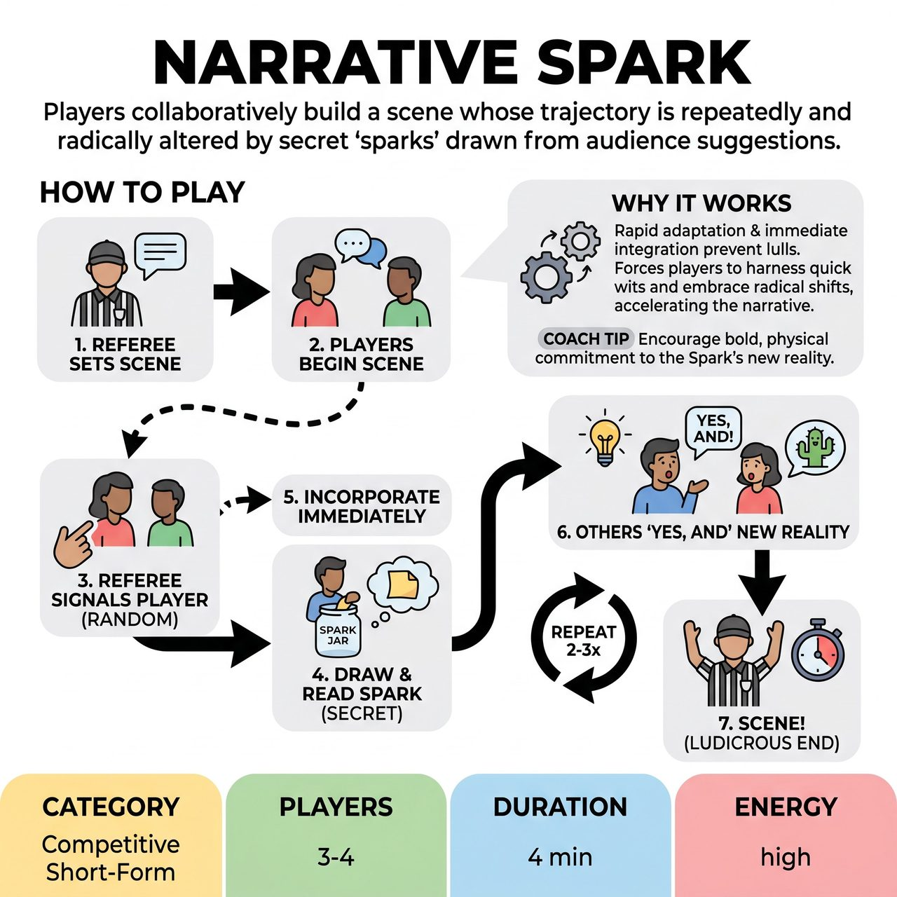

# Narrative Spark

{ .game-hero }

> Players collaboratively build a scene whose trajectory is repeatedly and radically altered by secret 'sparks' drawn from audience suggestions.

## Overview
Narrative Spark is a fast-paced, unpredictable improv game where players collaboratively build a scene, only to have its trajectory radically and repeatedly altered by sudden, secret 'sparks' drawn from audience suggestions. These sparks force improvisers to instantly adapt, integrate absurd new realities, and rapidly accelerate the scene towards an unexpected, often hilarious, conclusion or significant shift.

## Setup
Requires 3-4 improvisers (e.g., 2 competing team members plus 1-2 players from the opposing team or guest players) on a standard competitive short-form stage. Props are entirely mimed. Before the scene begins, the audience writes down surprising, outrageous, or dramatically shifting elements (the 'Narrative Sparks'). These are collected, folded, and placed into a visibly accessible container on stage or just off-stage (e.g., a 'Spark Jar' or 'Twist Urn'). The audience also provides a basic suggestion for the scene, such as a common location or relationship.

## How to Play
1. The Referee takes the initial audience suggestion (location/relationship) and sets the scene for the improvisers.
2. Players begin the scene.
3. At random, undisclosed intervals (usually 30-60 seconds into the scene, and 1-2 more times after that), the Referee silently points to one of the active players in the scene.
4. The indicated player must immediately physically go to the 'Spark Jar,' quickly draw one folded slip, read it to themselves briefly, and then return to the scene.
5. The player must incorporate that 'Spark' immediately and organically into the ongoing narrative through dialogue, actions, character endowment, or an environmental change, without 'thinking out loud' or delaying.
6. All other players must accept and 'Yes, And' this new information, building upon the sudden shift.
7. This process typically repeats 2-3 times during a single game, ensuring multiple, rapid directional changes.
8. The Referee calls 'Scene!' when the scene reaches a suitable (often ludicrous) end, or when time for the game expires.

## Coaching Notes
- Award points for seamless and creative integration of a Spark, quick and inventive 'Yes, And-ing' by other players, maximal comedic impact, strong object work, character endowment, and physical choices.
- Call the 'Mulligan Mire' Foul if a player draws a Spark but fails to integrate it into the scene within 5-10 seconds, or if they struggle visibly and prevent the scene from moving forward. Deduct points and signal the next player to draw.
- Call the 'Spark Snuff-Out' Foul if a player attempts to ignore, minimize, or immediately negate the impact of a drawn Spark. Deduct points.
- Apply the clean-content foul for any non-family-friendly humor, and the 'Groaner Foul' for bad puns or obvious, weak jokes.
- Encourage strong, clear physical choices when drawing, reacting to, and embodying the impact of a Spark.
- Remind players that active listening is crucial for understanding partners' reactions and quickly integrating the new information from the Spark into the scene's evolving reality.

## Why It Works
The mandatory 'Spark' draws, immediate integration, and subsequent scene shifts ensure there is absolutely no time for lulls, wandering dialogue, or stagnation. It forces players to harness their quick wits, embrace radical shifts, and practice essential improv skills like 'Yes, And...', active listening, object work, and character endowments under pressure.

## Safety & Inclusion
The 'Sparks' generated by the audience should be screened by the Referee to ensure appropriate content. Standard application of the clean-content foul ensures non-family-friendly humor is penalized, maintaining a safe, family-friendly environment.

