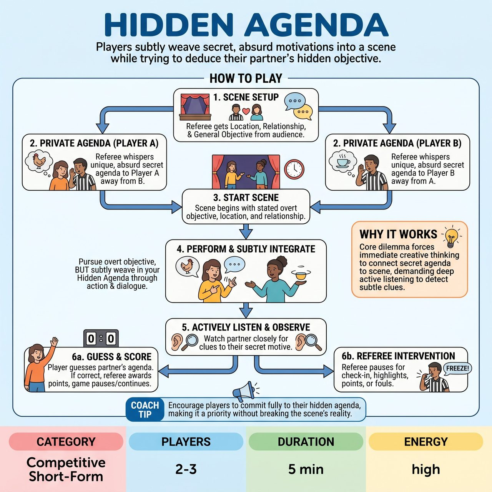

# Hidden Agenda

{ .game-hero }

> Players subtly weave secret, absurd motivations into a scene while trying to deduce their partner's hidden objective.

## Overview
In Hidden Agenda, two players start a scene with a clear objective, relationship, and location. Unbeknownst to their scene partner, each player receives a distinct, often absurd secret motivation from the referee. Their challenge is to subtly weave this Hidden Agenda into their performance while simultaneously trying to deduce their partner's secret motive.

## Setup
Requires a standard open stage and no props (all mimed object work). The referee asks the audience for a Location, Relationship, and General Objective. The audience will also watch the referee privately give the Hidden Agendas to each player, ensuring the audience is in on the secret.

## How to Play
1. The referee gets the initial scene suggestions (Location, Relationship, General Objective) from the audience.
2. One at a time, each player is sent offstage or to a confidential zone.
3. The referee announces a unique, bizarre Hidden Agenda for that player to the audience and the opposing team's bench.
4. The referee privately whispers this agenda to the returning player.
5. The scene begins with the stated location, relationship, and objective.
6. Each player actively pursues the scene's overt objective while subtly integrating their Hidden Agenda into their actions and dialogue.
7. Players actively listen and observe to deduce their partner's Hidden Agenda.
8. A player may, at any point, guess their partner's Hidden Agenda. If correct, the referee pauses the game, awards points, and the scene continues or ends.
9. The referee can call 'Freeze!' at any point to check in, highlight a move, award points, or call fouls.

## Coaching Notes
- Scoring: Award +3 Points ('Agenda Unveiled!') for correctly guessing the partner's agenda; +2 Points ('Subtle Swagger!') for brilliantly and subtly incorporating the agenda; +1 Point ('Motivated Move!') for a clear, funny action inspired by the agenda; +1 Point ('Sharp Spotter!') for clearly reacting to the other player's emerging agenda.
- Fouls: Call a 'Groaner Foul' (-1 point) for terrible puns; 'Exposition Dump Foul' (-2 points) for overtly stating or over-explaining the agenda; 'Agenda Abandonment Foul' (-1 point) for ignoring the agenda or scene objective; 'Guessing Game Foul' (-1 point per guess) for multiple wild, incorrect guesses.
- Players must 'yes, and' both the overt scene information and their secret agenda, integrating both seamlessly.
- Encourage strong physical choices and object work to portray the agenda visually without stating it.
- Players can make eye contact or play to the audience when making a clever agenda move, knowing the audience is in on the secret.

## Variations
- Three-Player Chaos: Play with three players instead of two, giving everyone a unique hidden agenda for added chaos and interaction.

## Why It Works
The core mechanic forces players into inherently humorous dilemmas, demanding immediate creative thinking to connect their secret agenda to their dialogue and actions. It heavily relies on active listening to detect subtle clues and uses character endowments to reshape the performance.

## Safety & Inclusion
Ensure family-friendly play through the referee's careful selection of appropriate Hidden Agendas and strict adherence to a clean-content foul, which penalizes or removes players for any blue humor, swearing, or inappropriate content.

