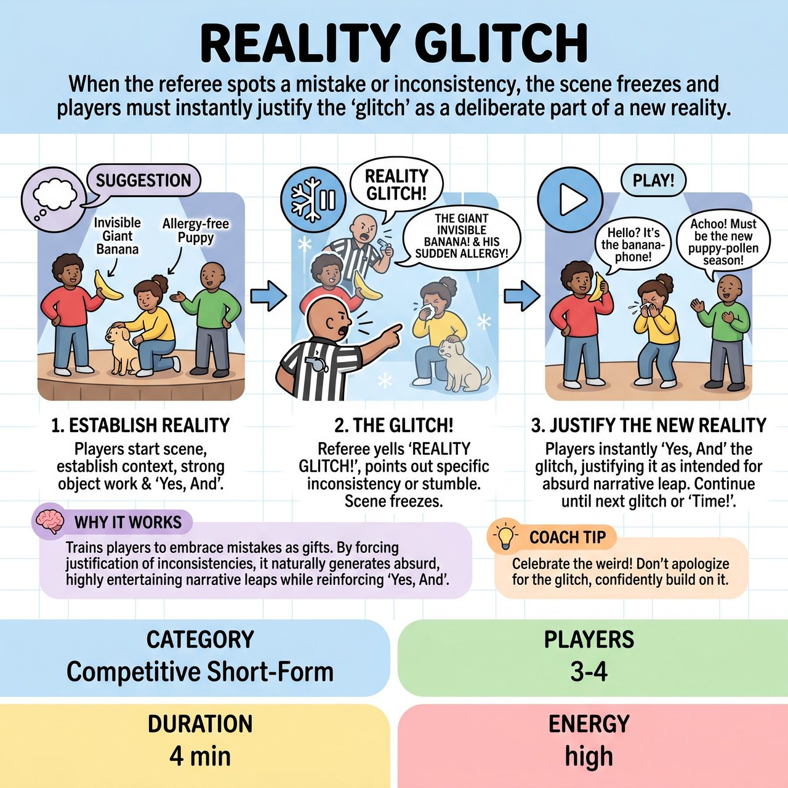

# Reality Glitch

{ .game-hero }

> When the referee spots a mistake or inconsistency, the scene freezes and players must instantly justify the 'glitch' as a deliberate part of a new reality.

## Overview
Reality Glitch is a fast-paced competitive improv game where players establish a scene until a referee identifies a 'Glitch'—a minor inconsistency in object work, logic, or an awkward moment. The scene freezes, the referee points out the glitch, and players must swiftly 'Yes, And' this unexpected element into the scene's evolving reality, turning a potential misstep into comedic gold.

## Setup
3-4 players per team on a standard open stage. All props are mimed to highlight any discrepancies in object work. Get an initial suggestion from the audience (e.g., location, relationship, activity, or unusual object).

## How to Play
1. The Referee solicits an initial suggestion from the audience to serve as the starting point for the scene.
2. Players begin the scene based on the suggestion, establishing characters, context, and a potential conflict with strong 'Yes, And' and clear object work.
3. As the scene progresses, the Referee watches for a 'Glitch'—an object inconsistency, logical contradiction, awkward stumble, or audience disconnect.
4. When a glitch occurs, the Referee yells 'REALITY GLITCH!' and the scene immediately freezes.
5. The Referee quickly and playfully points out the specific glitched element (e.g., 'The giant invisible banana!' or 'His sudden allergy to puppies!').
6. Starting immediately, players must use 'Yes, And' to creatively integrate the glitch into the scene as if it was always intended, justifying its existence within the scene's new logic.
7. The scene continues from this updated context until the Referee calls another 'REALITY GLITCH!' or eventually calls 'Time!' to end the game.

## Coaching Notes
- The tone of the referee's call must always be lighthearted and inquisitive, never accusatory.
- The goal is not to fix or undo the mistake, but to justify its existence within the scene's evolving logic, often leading to hilarious, absurd explanations.
- Recoveries should be swift and seamless; taking too long breaks the scene's pace and energy.
- Award a 'Glitch Recovery Bonus' (+3 points) for exceptionally clever, witty, and rapid recoveries that elevate the humor and advance the narrative.
- Call a 'Glitch Gag' foul (-2 points) if a team ignores the glitch, argues with the referee, makes a weak/uninspired recovery, or takes too long.
- Standard competitive improv fouls (clean-content call, groaner) still apply.

## Why It Works
It trains players to embrace mistakes as gifts. By forcing improvisers to instantly justify inconsistencies instead of ignoring or fixing them, the game naturally generates absurd, highly entertaining narrative leaps while reinforcing the core principle of 'Yes, And'.

## Safety & Inclusion
The referee must maintain a supportive, playful environment so players do not feel attacked for making mistakes. Standard competitive improv safety rules apply, including the 'clean-content call' for blue humor, swearing, or inappropriate content.

