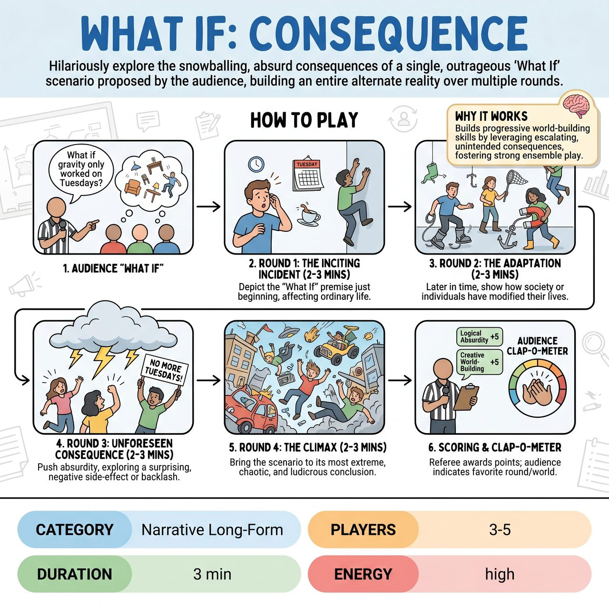

# What If: Consequence

{ .game-hero }

> Hilariously explore the snowballing, absurd consequences of a single, outrageous 'What If' scenario proposed by the audience, building an entire alternate reality over multiple rounds.

## Overview
'What If: Consequence' integrates the competitive spirit and clear structure of a competitive short-form match with the imaginative demands of structured improv exercises. It leverages audience participation for the central premise, uses a referee for objective scoring, and demands strong ensemble play and character work within escalating constraints. The multi-round structure pushes performers to engage in progressive world-building.

## Setup
Requires 3-5 improvisers (4 is ideal for dynamic scene work), a standard open improv stage, and optionally a versatile chair or two for set dressing. A visible scoreboard, common in competitive short-form matches, can be used to track points.

## How to Play
1. The MC/Referee steps forward and solicits a single, extreme, and imaginative 'What If' scenario from the audience (e.g., 'What if gravity only worked on Tuesdays?'). The MC selects and clearly states the premise.
2. Round 1: The Inciting Incident (2-3 minutes). 2-3 players improvise a scene depicting the 'What If' premise just as it begins or is discovered, affecting ordinary people in an ordinary situation. Focus on the initial shock, confusion, or slight disruption.
3. Round 2: The Adaptation (2-3 minutes). 3-4 players set a scene later in time (e.g., a week, month, or year later). Show how society or individuals have modified their lives, jobs, or social norms to cope, and what new problems or opportunities have arisen.
4. Round 3: The Unforeseen Consequence / The Backlash (2-3 minutes). 3-4 players push the absurdity further, exploring a surprising, absurd, or negative side-effect or societal backlash that arises because of the adaptations.
5. Round 4: The Climax / The Extreme Outcome (2-3 minutes). All players bring the scenario to its most extreme, chaotic, or ludicrous conclusion. Show the world fundamentally and ridiculously different.
6. Scoring: After each round or at the end of the game, the Referee awards points for Logical Absurdity, Character Commitment, Creative World-Building, and Collaborative Storytelling.
7. At the end of the game, use an audience 'Clap-o-meter' to indicate which round or overall world-building they enjoyed most.

## Coaching Notes
- Logical Absurdity: Ensure the team commits to the 'What If' and explores its increasingly ridiculous, yet internally consistent, consequences.
- Character Commitment: Encourage players to embody characters reacting authentically and comically to the bizarre situation.
- Creative World-Building: Push players to be inventive with their adaptations, solutions, and the details they add to the evolving alternate reality.
- Collaborative Storytelling: Ensure the narrative progresses smoothly across rounds, with each scene building effectively upon the last.
- Keep the focus on imagination by using minimal props; let the scene work establish the bizarre new reality.

## Variations
- Competitive Play: Use the scoreboard to track points for separate, competing teams instead of a single team earning general 'Awesome Points'.

## Why It Works
The multi-round structure pushes performers to engage in progressive world-building, a hallmark of advanced improv scene work. It leverages the law of unintended consequences taken to comedic extremes, fostering strong ensemble play.

## Safety & Inclusion
Ensure physical escalations during the chaotic climax remain safe for all performers. If the audience's 'What If' suggestion touches on sensitive real-world issues, ensure the resulting societal backlash scenes avoid punching down or crossing established ensemble boundaries.

