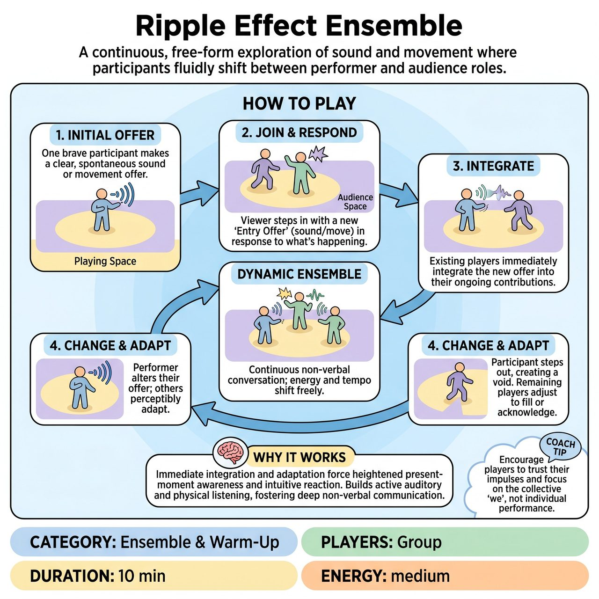

# Ripple Effect Ensemble

{ .game-hero }

> A continuous, free-form exploration of sound and movement where participants fluidly shift between performer and audience roles.

## Overview
Ripple Effect Ensemble is a dynamic, free-form theater game where participants fluidly shift between performer and audience roles, creating a continuously evolving sound and movement ensemble. It begins with an initial sound or movement offer, to which others respond by intuitively joining the playing space with their own distinct entry offers. The collective soundscape and bodyscape constantly transforms, demanding spontaneous responsiveness, active listening, and deep ensemble awareness.

## Setup
Designate a clear 'Playing Space' (e.g., a central circle, an open stage area) and a surrounding 'Audience Space.' There are no pre-assigned roles; all participants begin in the Audience Space as potential players.

## How to Play
1. One brave participant (or the facilitator) steps into the Playing Space and makes a simple, clear, spontaneous 'Initial Offer'—a sustained sound or a distinct, repeating movement.
2. Any person in the Audience Space who feels a strong, intuitive impulse to respond to any ongoing sounds or movements may step into the Playing Space.
3. As they step in, they must immediately make their own distinct 'Entry Offer' (a new sound, movement, or combination) that is a clear, visceral response to at least one existing element.
4. Once someone new joins, all participants already within the Playing Space must immediately and intuitively integrate this new offer into their own ongoing sound or movement.
5. If any existing performer significantly alters their sound or movement, others in the Playing Space must perceptibly adapt their own contributions to maintain the ensemble's coherence and flow.
6. Any participant in the Playing Space can choose to step out and return to the Audience Space at any time, stopping their sound/movement to create a void.
7. Those remaining in the Playing Space must subtly or overtly adjust their own sounds/movements to acknowledge the change, filling the newly created space or allowing the ensemble's texture to shift naturally.
8. Continue the game as a dynamic, non-verbal conversation, allowing the energy, tempo, and texture of the ensemble to constantly shift as individuals make offers, respond, join, and depart.

## Coaching Notes
- Point of Concentration (POC): Continuously sense, embody, and respond to the most compelling sound or movement being offered in the playing space at any given moment.
- Focus on the relationship between your action and others' actions, and on the constant evolution of the collective 'soundscape' and 'bodyscape'.
- The connection to existing offers should be felt, not thought. Bypass intellectualization.
- Integration isn't about copying; it's about finding a spontaneous physical or vocal relationship to the new element.
- Remind players there is no 'right' or 'wrong' sound or movement, only continuous offers and responses.

## Why It Works
The immediate demand to integrate new offers or adapt to departures forces players into heightened present-moment awareness and intuitive reaction. It builds active auditory and physical listening, fosters deep non-verbal communication, and cultivates adaptability through the constant shifting between performer and audience roles.

## Safety & Inclusion
Ensure the playing space is clear of obstacles so participants can move freely and safely. Encourage players to respect physical boundaries and maintain spatial awareness during dynamic movement.

