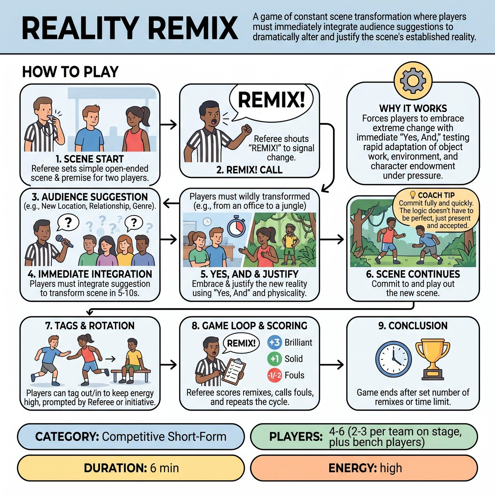

# Reality Remix

{ .game-hero }

> A game of constant scene transformation where players must immediately integrate audience suggestions to dramatically alter and justify the scene's established reality.

## Overview
Reality Remix is an improvisational game where two teams compete to create the most imaginative and hilarious transformations of an evolving scene. Guided by a Referee who calls 'REMIX!', players must immediately integrate audience suggestions—such as a new location, relationship, or genre—by using 'Yes, And' to dramatically alter and justify the scene's established reality. Teams earn points for clever, cohesive, and committed remixes, while fouls are incurred for denying the new reality or lacking imagination, ultimately building layers of absurd yet strangely logical scenarios under the Referee's comedic arbitration.

## Setup
Two teams (Red vs. Blue), typically 2-3 players per team on stage at a time, with other teammates on the bench ready to tag in. The Referee stands centrally, equipped with their whistle, scorepad, and a strong sense of comedic authority. No props are required beyond the standard competitive short-form stage elements.

## How to Play
1. 1. The Referee begins by establishing a very simple, open-ended scene setting and an initial premise for the first two players from one team. The scene starts immediately.
2. 2. At any point, the Referee will dramatically shout 'REMIX!' This is the signal that the scene's core reality must dramatically change.
3. 3. Immediately following 'REMIX!', the Referee quickly solicits a specific type of audience suggestion (e.g., a brand new location, new relationship, new objective, different genre, new physical characteristic, or new sound).
4. 4. The team whose players are currently in the scene must then, within 5-10 seconds, integrate the chosen audience suggestion to completely transform the established reality of the scene.
5. 5. Players must 'Yes, And' the new suggestion, justifying how the previous reality became the new reality, with both verbal explanations and physical embodiment.
6. 6. Once the remix is established and accepted by the Referee, the players continue the scene, fully committed to the new reality.
7. 7. After each remix attempt, the Referee may prompt a player to tag in a teammate from their bench, or players can initiate a tag to keep the energy high. The newly tagged-in player must immediately understand and commit to the current (remixed) reality.
8. 8. The game continues with the Referee calling 'REMIX!' and soliciting new suggestions, alternating between teams or allowing a strong team to continue a streak.
9. 9. The Referee assigns points: +3 Points for a Brilliant Remix (fast, creative, coherent, hilarious, fully committed) and +1 Point for a Solid Remix (functional and clear). The team with the most points at the end of the game wins.
10. 10. The Referee also calls fouls: Content Foul (-1 point) for blue humor/swearing; Groaner Foul (-1 point) for bad puns; 'Reality Rift' Foul (-2 points) for failing to integrate, denying, or arguing about the suggestion; and 'Mundane Metamorphosis' Foul (-1 point) if the justification is too boring or unimaginative.
11. 11. The game concludes after a predetermined number of remixes (e.g., 5-7 per team), or after a set time limit (e.g., 5-7 minutes).

## Coaching Notes
- 'Yes, And' is paramount: Players must accept the previous reality and immediately accept and build upon the new, audience-suggested reality.
- Active Listening is crucial for quickly grasping the Referee's prompt, the chosen audience suggestion, and teammates' contributions to the remix.
- Object Work & Environment: Players must rapidly adapt their physical surroundings and interactions to the constantly changing settings.
- Character & Endowment: Characters must swiftly adapt their motivations, relationships, and behaviors to suit the new, remixed reality, endowing it with instant credibility.
- Fast Pacing & Transitions: The 'REMIX!' trigger demands immediate, high-energy shifts and rapid justification.
- Audience Management: The Referee must engage the audience to provide suggestions and use their vocal reactions (cheers, laughter, applause) to evaluate the comedic impact of each remix.

## Variations
- Super Remix!: For the final remix, the last team has to bring all the accumulated absurdities to a climactic, hilarious, or dramatically abrupt conclusion.

## Why It Works
The game forces players to embrace extreme change with immediate 'Yes, And,' testing their ability to rapidly adapt object work, environment, and character endowment under the pressure of fast pacing. It builds layers of increasingly absurd yet strangely cohesive realities, rewarding creative justification over simple denial.

## Safety & Inclusion
The Referee will explicitly ask for family-friendly ideas and immediately reject or re-solicit any inappropriate suggestions. The 'Content' foul is actively enforced, ensuring players maintain appropriate language and themes. The game's inherent humor comes from the joy of creative absurdity and clever justification, not from edgy or inappropriate content.

