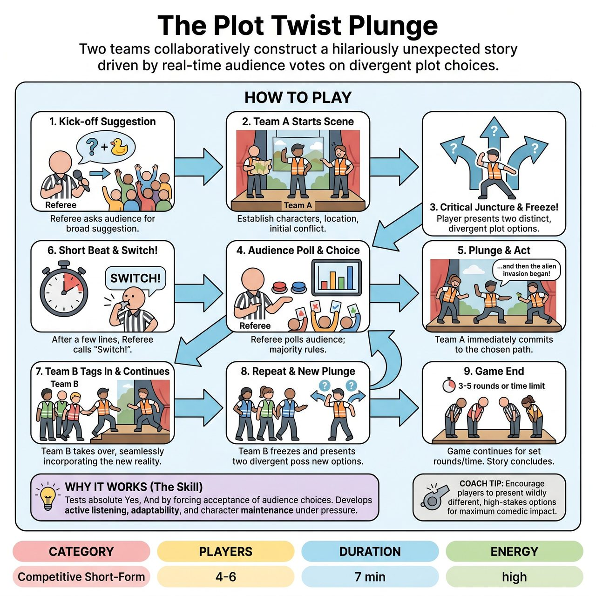

# The Plot Twist Plunge

{ .game-hero }

> Two teams collaboratively construct a hilariously unexpected story driven by real-time audience votes on divergent plot choices.

## Overview
The Plot Twist Plunge redefines audience interaction by giving them direct, real-time control over the story's direction at critical junctures. Unlike typical games where suggestions are given at the start, here the audience actively votes on immediate, divergent plot choices presented by the players during the scene. This creates a truly unpredictable, shared storytelling experience where the audience acts as a co-writer.

## Setup
Two teams (Red and Blue), with 2-3 players per team. The stage is set as usual. The Referee stands ready to facilitate, score, and call fouls.

## How to Play
1. The Referee asks the audience for a single, broad suggestion to kick off the story.
2. Team A sends 2-3 players onto the stage and begins a scene based on the audience's suggestion, establishing characters, location, and an initial conflict or situation.
3. At a critical narrative juncture, one of the players from the active team freezes the action, steps slightly forward, and clearly presents two distinct, divergent options for what happens next in the story.
4. The Referee immediately takes over, repeating the two options and quickly polling the audience to determine the majority choice.
5. The players on stage must immediately plunge into the chosen narrative path, incorporating it as if it was their original intention.
6. After a few lines or a significant beat following the plunge (typically 10-20 seconds), the Referee calls Switch!
7. The other team immediately tags in and continues the scene from that exact point and plot development, seamlessly incorporating the new reality.
8. The new team continues the scene until they reach another natural Plunge Point, where one of their players will freeze the action and present two new divergent options to the audience.
9. The game continues with alternating teams and audience-driven plunges for a set number of rounds (e.g., 3-5 plunges per team) or a specified time limit. The Referee calls Scene! to end the game.

## Coaching Notes
- Ensure options presented at the Plunge Point are genuinely different, advance the plot, and remain family-friendly.
- Call a Fork in the Road Foul if a player presents options that are not distinct, are confusing, or do not genuinely advance the plot.
- Call a U-Turn Foul if a team fails to immediately and convincingly plunge into the audience's chosen path, tries to negate it, or struggles significantly to adapt.
- The Referee must manage the rapid audience voting process clearly and quickly to maintain pacing.
- Call Switch! at appropriate moments to maintain dynamism and ensure both teams contribute equally.
- Award points for Seamless Plunges, Narrative Momentum, Character Consistency, and Audience Delight, while deducting 5 points for any standard competitive short-form fouls like a clean-content call or groaner foul.

## Why It Works
It tests absolute Yes, And by forcing players to accept and build upon the audience's direct narrative choices, no matter how outlandish. It develops active listening, instant adaptability, and the ability to maintain character and narrative arc through unpredictable plot developments.

## Safety & Inclusion
The game is inherently family-friendly. The requirement for players to present clear, concise options under pressure naturally steers content away from ambiguity or inappropriate humor. Any attempt at blue humor or innuendo results in a clean-content foul.

