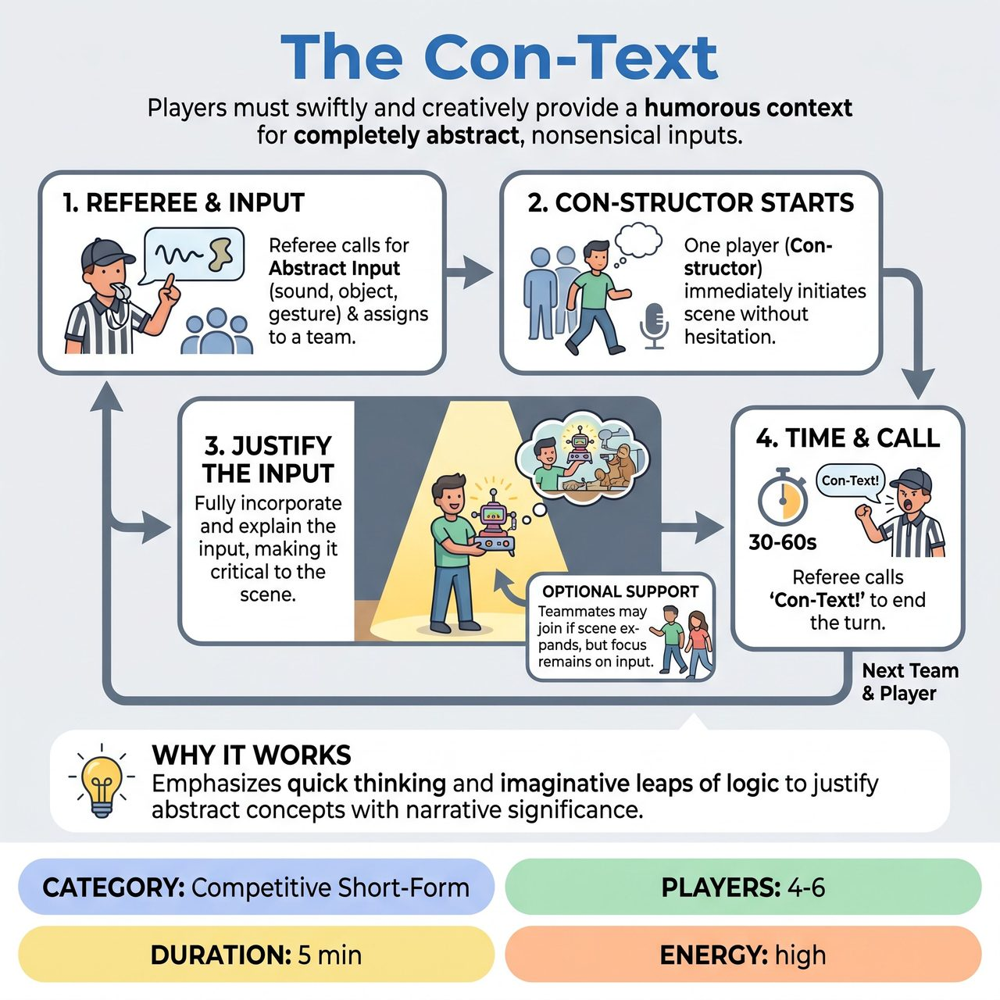

# The Con-Text

{ .game-hero }

> Players must swiftly and creatively provide a humorous context for completely abstract, nonsensical inputs.

## Overview
In 'The Con-Text,' two teams compete in an improvisational game where they must swiftly and creatively provide a humorous context for completely abstract inputs, such as bizarre sounds, impossible object pairings, or obscure gestures. A player from the assigned team immediately launches into a short scene or monologue, improvising a logical and often absurd justification for the input. The game emphasizes quick thinking and imaginative leaps of logic to imbue abstract concepts with meaning.

## Setup
Requires 4-6 players divided into two teams of 2-3. No props are used; everything is mimed as per competitive short-form tradition. Use a standard open stage where players can step forward to initiate scenes. A Referee manages the game, solicits 'Abstract Inputs' from the audience (e.g., unusual sounds, abstract word pairs, non-specific gestures), assigns them, calls 'Con-Text!' to end scenes, and manages scoring and fouls.

## How to Play
1. The Referee calls for an 'Abstract Input' from the audience, such as an unusual sound, a pairing of disparate objects, or a non-descript physical gesture.
2. The Referee assigns the chosen input to one of the teams.
3. Immediately, one player from that team (the 'Con-structor') steps forward and initiates a scene or monologue without hesitation.
4. The Con-structor must fully incorporate and explain the meaning and significance of the abstract input, bringing it to life as a critical element of their world.
5. Other players from the team may enter if the scene naturally expands, but the core focus must remain on justifying the input.
6. After approximately 30-60 seconds, the Referee calls 'Con-Text!' to signal the end of the turn.
7. The next team receives a new 'Abstract Input' and a different player becomes the Con-structor.
8. Teams alternate until each player has had at least one chance to be the Con-structor, typically lasting 3-4 rounds per team.

## Coaching Notes
- Focus on justifying and endowing the abstract input with meaning within the created narrative, rather than just stating it.
- Award points based on Contextual Clarity (3 points), Creative Construction (2 points), and Audience Amusement (1 point).
- Call the 'De-Context' Foul (-3 points) if a player fails to connect the input meaningfully, simply states it without exploring its significance, or creates a weak, illogical connection.
- Call the 'Pondering Pause' Foul (-1 point) if a player hesitates excessively (more than 5 seconds of blank stare or stammering) before starting their scene.
- Enforce standard competitive short-form fouls: Clean-Content Foul (-5 points) for inappropriate humor/language, and Groaner Foul (-3 points) for obvious, uninspired jokes.

## Why It Works
The game emphasizes quick thinking and imaginative leaps of logic, training improvisers to rapidly justify and endow abstract concepts with concrete meaning and narrative significance.

## Safety & Inclusion
Enforce the clean-content foul to strictly penalize inappropriate humor, language, or innuendo, ensuring the content remains family-friendly and safe for all participants and audience members.

