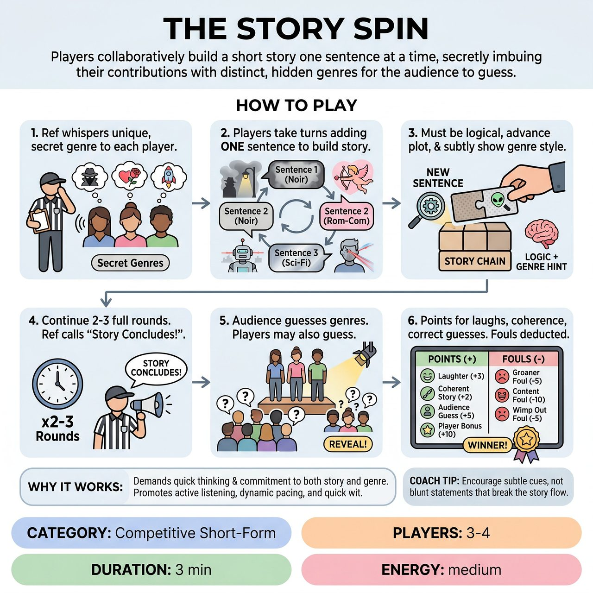

# The Story Spin

{ .game-hero }

> Players collaboratively build a short story one sentence at a time, secretly imbuing their contributions with distinct, hidden genres for the audience to guess.

## Overview
The Story Spin is an improvisational game where 3-4 players collaboratively build a short, coherent story, one sentence at a time. Each player is secretly assigned a distinct genre and must subtly imbue their contributions with its stylistic elements. The core challenge is to create a funny and logical narrative while integrating their genre clearly enough for the audience to guess it at the end, yet subtly enough to avoid disrupting the story's flow.

## Setup
3-4 improvisers (known as Story Weavers) stand in a line or semicircle facing the audience on a standard competitive short-form stage. No props are used. The Referee elicits a very simple, open-ended starting premise from the audience (e.g., A character wakes up or Two strangers meet on a park bench).

## How to Play
1. The Referee secretly whispers a unique, distinct genre to each player (e.g., Film Noir, Romantic Comedy, Epic Fantasy, Sci-Fi). Players do not know each other's assigned genres.
2. Players take turns, in order, adding exactly one sentence to the developing story.
3. Each sentence must build logically on the previous one, advancing the plot, while subtly incorporating characteristics of the player's secret genre (vocabulary, tone, typical plot devices, character archetypes).
4. Play continues for 2-3 full rounds, meaning each player contributes 2-3 sentences.
5. The Referee calls 'Story Concludes!' at the appropriate time.
6. The Referee asks the audience to guess each player's genre. The Referee may also ask the other players if they have guesses, and finally, each player reveals their secret genre.
7. Points are awarded: +3 for strong laughter, +2 for coherent story building, +5 if the audience guesses the genre, and a +10 bonus if another player guesses it.
8. Fouls are deducted: Groaner Foul (-5) for cliche or unfunny lines, Content Foul (-10) for inappropriate content, Wimp Out Foul (-5) for struggling or generic lines, and Genre Glare Foul (-3) for making the genre too overt or breaking the narrative reality.

## Coaching Notes
- Subtlety is Key: Players must avoid overtly stating their genre or breaking the reality of the scene. The goal is to nudge the story towards their genre, not to derail it.
- Enforce the Genre Glare Foul: Penalize players who make their genre choice too obvious prematurely, such as a Musical player breaking into a full song without any scene setup, or a Sci-Fi player introducing a time machine out of nowhere.
- Yes, And: Remind players to constantly affirm and build upon the previous line, even as they attempt to spin it towards their own genre.
- Active Listening: Players must listen fiercely to understand the developing narrative, identify opportunities for their genre integration, and attempt to guess opponents' genres.
- Character Endowments: While not playing a specific character, players should adopt the tone, vocabulary, and perspective inherent to their assigned genre.

## Why It Works
The game demands quick thinking and immediate commitment to both the story and the secret genre. It promotes active listening, dynamic pacing, and quick wit, as crafting a genre-specific, coherent, and funny sentence on the spot requires considerable mental agility. The audience is actively engaged as detectives, trying to piece together the hidden genres.

## Safety & Inclusion
The game is Family-Friendly, with humor coming from clever wordplay and the clash of genres rather than inappropriate content. The Referee must ensure all genre choices and story elements remain suitable for all ages, strictly enforcing the Content Foul (-10 points) for any inappropriate content, language, or innuendo.

