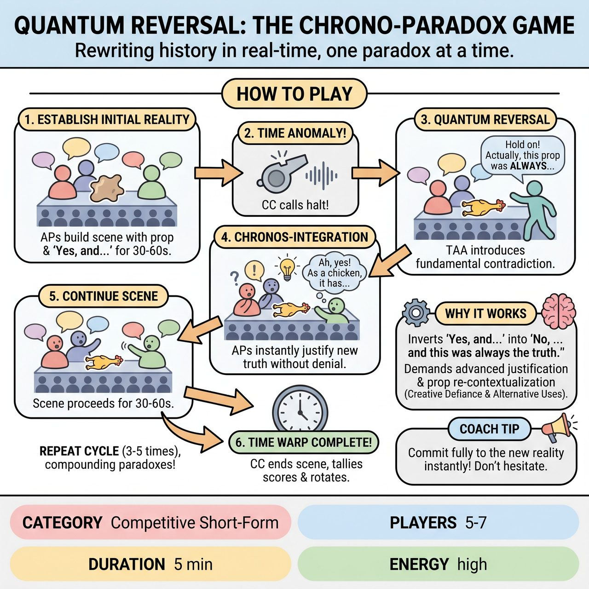

# Quantum Reversal: The Chrono-Paradox Game

{ .game-hero }

> Rewriting history in real-time, one paradox at a time.

## Overview
An advanced improvisational game where players rewrite history in real-time. Anchoring Players (APs) build a scene using a central, mutable prop, establishing a coherent reality. Periodically, a Time Anomaly Agent (TAA) interrupts, declaring a 'Quantum Reversal' – a fundamental contradiction that states a previously established fact or the prop's identity 'was always' something different.

## Setup
Requires a facilitator/judge called the 'Chrono-Controller' (CC), one neutral versatile physical prop (e.g., wooden box, fabric, frisbee), a clear stage with an optional 'Anomaly Zone' for waiting players, and a visible scoreboard. The CC gets two audience suggestions: a specific location and a mundane object for the prop to initially represent.

## How to Play
1. The Chrono-Controller (CC) places the prop center stage, declares its initial identity based on the audience suggestion, and assigns 2-3 Anchoring Players (APs) and 1 Time Anomaly Agent (TAA).
2. The APs begin the scene, establishing characters, relationships, and the prop's initial identity using standard 'Yes, and...' improv for 30-60 seconds.
3. The CC shouts 'TIME ANOMALY!' or blows a whistle to halt the scene.
4. The TAA steps in and uses a trigger phrase (e.g., 'Hold on! That's not how it happened! Actually, this was always...') to introduce a Quantum Reversal, fundamentally changing the prop's identity or a core narrative fact.
5. The APs must instantly 'Chronos-Integrate' this new reality, seamlessly and inventively justifying how it was always the underlying truth without denying it, and continue the scene.
6. The scene continues for another 30-60 seconds before the CC calls another 'TIME ANOMALY!' and a new TAA introduces a compounding paradox.
7. This cycle repeats for 3-5 anomalies, with the CC awarding points to TAAs for daring reversals and to APs for seamless integrations.
8. The CC calls 'TIME WARP COMPLETE!' to end the scene, tally scores, and rotate player roles.

## Coaching Notes
- The Chrono-Controller must meticulously track points and maintain the game's pacing, ensuring anomalies happen when the scene has a strong enough anchor.
- TAAs should make their interventions brief, precise, and immediately demonstrate the new reality through clear action or vocal emphasis.
- APs must not deny, resist, or play dumb about the new facts; their challenge is to create a believable alternate history that coherently resolves the paradox.
- Encourage TAAs to aim for Primary Type reversals (changing the prop's physical identity) for higher points, ensuring the new identity is physically plausible for the prop.
- Award bonus points for strong audience reactions (gasps, laughs, cheers) to encourage theatricality and risk-taking.

## Why It Works
It is a radical evolution of the 'Creative Defiance' principle, inverting 'Yes, and...' into 'No, and this was always the truth.' It draws on the 'Alternative Uses Test' by dynamically shifting a prop's perceived reality, demanding advanced cognitive flexibility and the ability to construct alternate histories under pressure.

## Safety & Inclusion
Ensure physical safety when interacting with the mutable prop, especially during rapid transitions of its imagined identity. Maintain a supportive environment where players feel comfortable taking massive narrative risks without fear of failure.

