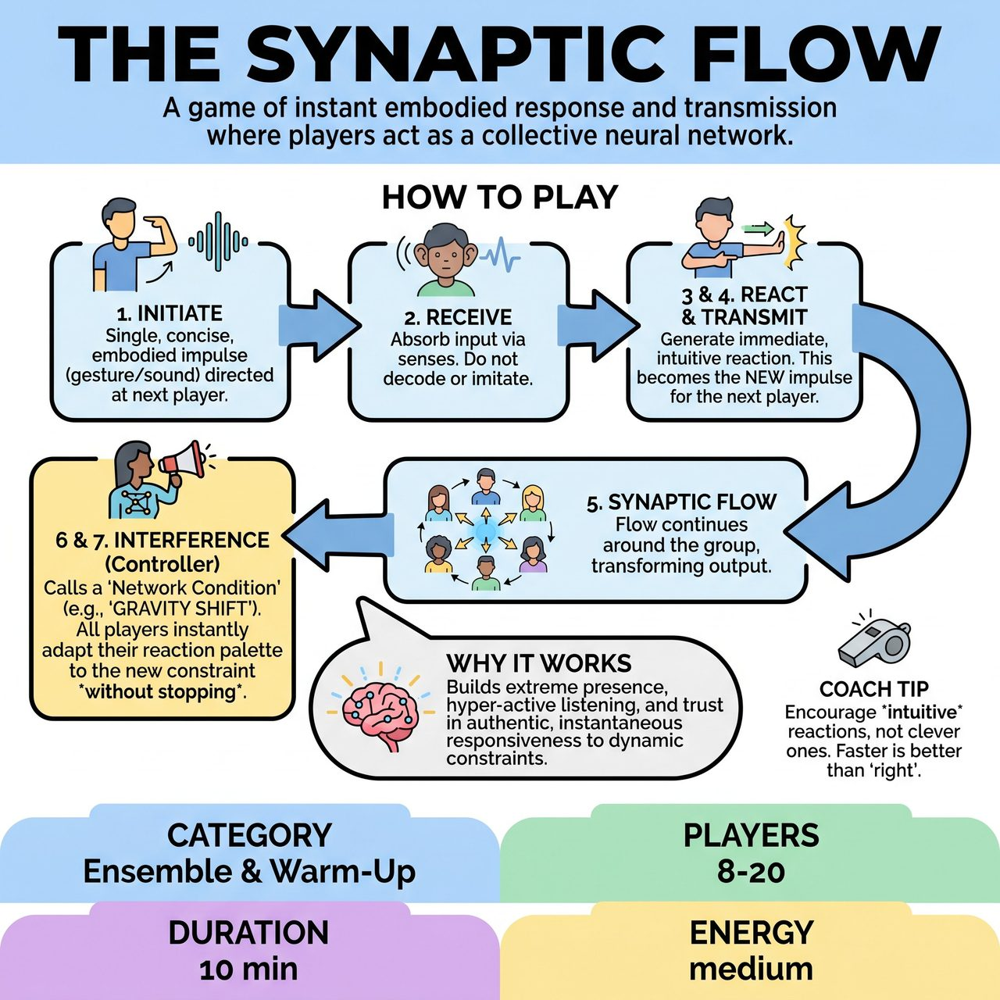

# The Synaptic Flow

{ .game-hero }

> A game of instant embodied response and transmission where players act as a collective neural network.

## Overview
Inspired by neural networks, participants form a collective human network. One player initiates a singular embodied impulse, and subsequent players generate an immediate, intuitive physical or vocal reaction to it, passing their transformed reaction as the new impulse. An 'Interference Controller' dynamically introduces environmental conditions, forcing all players to instantly adapt their responses without breaking the flow.

## Setup
Participants stand in a large, flexible circle or an organically meandering 'network' shape. Each person must be able to clearly perceive the person immediately preceding and succeeding them in the flow direction. Designate an 'Interference Controller' (facilitator or audience member) with a set of pre-determined verbal cues representing 'Network Conditions'.

## How to Play
1. One player initiates a singular, distinct, embodied impulse (a unique gesture, sound, or combination) that is concise and directed at the next player.
2. The receiving player takes in this input directly through their senses without attempting to imitate or decode it.
3. The receiving player generates an immediate, intuitive, and unedited physical and/or vocal reaction to that specific impulse.
4. This new reaction becomes their own entirely new impulse, which they immediately transmit to the next player quickly and decisively.
5. The process continues around the group, forming a continuous 'Synaptic Flow' of transformed outputs.
6. At any moment, the Interference Controller calls out a new Network Condition (e.g., 'GRAVITY SHIFT', 'SILENCE FILTER').
7. All players instantly apply the condition simultaneously, altering their intuitive physical and vocal palette without stopping to discuss or breaking the flow.
8. The flow continues for multiple rounds, allowing the group to observe emergent patterns and spontaneous transformations.

## Coaching Notes
- Point of Concentration (POC): Authentically receive the preceding player's impulse, generate an instant embodied reaction under current conditions, and transmit it as a new impulse without interpretation or pre-planning.
- Remind players to be the living, transforming node within the collective, reacting to NOW as it arrives and transmits.
- Unlike 'Telephone', do not attempt to replicate or imitate the impulse; the goal is a transformative, authentic reaction.
- Ensure initial and subsequent impulses are concise and have a clear 'vector' or direction toward the next player.

## Variations
- GRAVITY SHIFT: All impulses must be made with extreme effort, as if gravity were much heavier, or weightless.
- SILENCE FILTER: All vocal impulses must instantly cease; only physical responses are allowed.
- AMPLIFICATION BURST: All impulses and reactions must be amplified in scale or volume.
- MICRO FOCUS: All impulses must become microscopic, internal, and barely perceptible.
- DELAY LOOP: All reactions must be held for a count of three before transmission.

## Why It Works
It develops extreme presence, hyper-active sensory listening, instantaneous authentic embodied responsiveness, fluid adaptation to dynamic constraints, non-judgmental acceptance of creative output, and deep trust in collective, emergent intelligence.

## Safety & Inclusion
Ensure the playing space is clear of obstacles so players can move freely, especially during amplified or gravity-shifted conditions. Players should respect their own physical boundaries and avoid unwanted physical contact.

