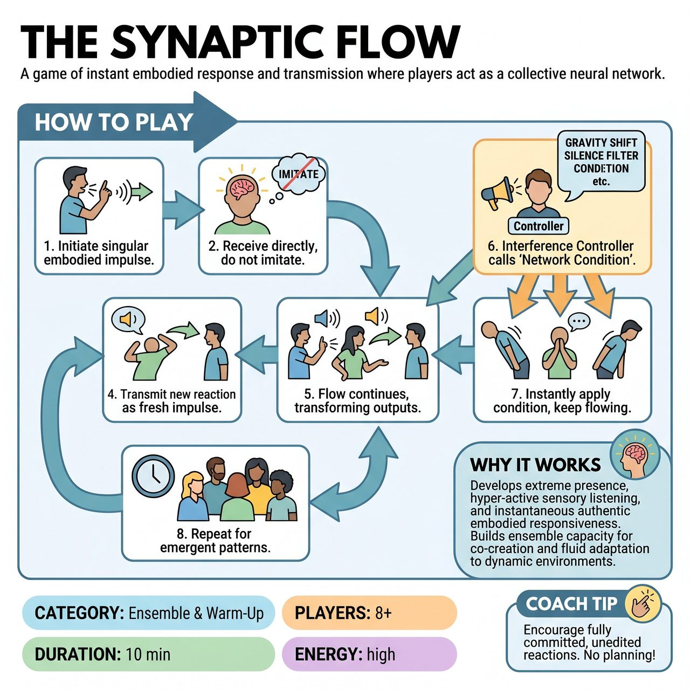

# The Synaptic Flow

{ .game-hero }

> A game of instant embodied response and transmission where players act as a collective neural network.

## Overview
Inspired by neural networks, participants form a collective human network. It begins with one player initiating a singular embodied impulse. Subsequent players do not imitate, but generate an immediate, intuitive physical or vocal reaction, passing their transformed reaction as the new impulse to the next person. An Interference Controller dynamically introduces environmental conditions to force instant adaptation.

## Setup
Participants stand in a large, flexible circle or an organically meandering 'network' shape where each person can clearly perceive the person immediately preceding and succeeding them. Designate an 'Interference Controller' (facilitator or audience member) with a set of cards or pre-determined verbal cues representing 'Network Conditions'.

## How to Play
1. One player initiates a singular, distinct, embodied impulse (a unique physical gesture, a clear sound, or a combination) with a clear 'vector' or direction towards the next player.
2. The receiving player takes in this input directly through their senses without attempting to imitate or decode it.
3. The receiver generates an immediate, intuitive, and unedited physical and/or vocal reaction to that specific impulse.
4. This new reaction becomes their own entirely new impulse, which they immediately transmit to the next player in the sequence quickly and decisively.
5. The process continues around the entire group, forming a continuous 'Synaptic Flow' of transformed outputs.
6. At any moment, the Interference Controller calls out a 'Network Condition' (e.g., 'GRAVITY SHIFT', 'SILENCE FILTER', 'AMPLIFICATION BURST', 'MICRO FOCUS', 'DELAY LOOP').
7. All players instantly apply the new condition simultaneously, subtly altering their intuitive physical and vocal palette without stopping to discuss or breaking the flow.
8. Continue for multiple rounds, allowing the group to focus on the emergent patterns and spontaneous transformations.

## Coaching Notes
- Point of Concentration (POC): To authentically receive the preceding player's immediate impulse, generate an instant, intuitive, embodied reaction under the current environmental conditions, and transmit that reaction as a new impulse to the next player, without interpretation or pre-planning.
- Remind players: 'Be the living, transforming node within the collective, reacting to NOW as it arrives and transmits.'
- Ensure players do not attempt to imitate the previous impulse; the goal is transformative response, not replication.
- The transfer should be quick, decisive, and clear enough to be 'received' by the next player.

## Why It Works
It develops extreme presence, hyper-active sensory listening, and instantaneous authentic embodied responsiveness to ever-changing inputs. It builds an extraordinary ensemble capacity for co-creation, fluid adaptation to dynamic environmental constraints, non-judgmental acceptance, and deep trust in collective, emergent intelligence.

## Safety & Inclusion
Ensure physical impulses respect personal space and physical limitations, especially during 'AMPLIFICATION BURST' or 'GRAVITY SHIFT'. Players should feel empowered to modulate their physical choices to avoid injury and maintain a safe environment.

