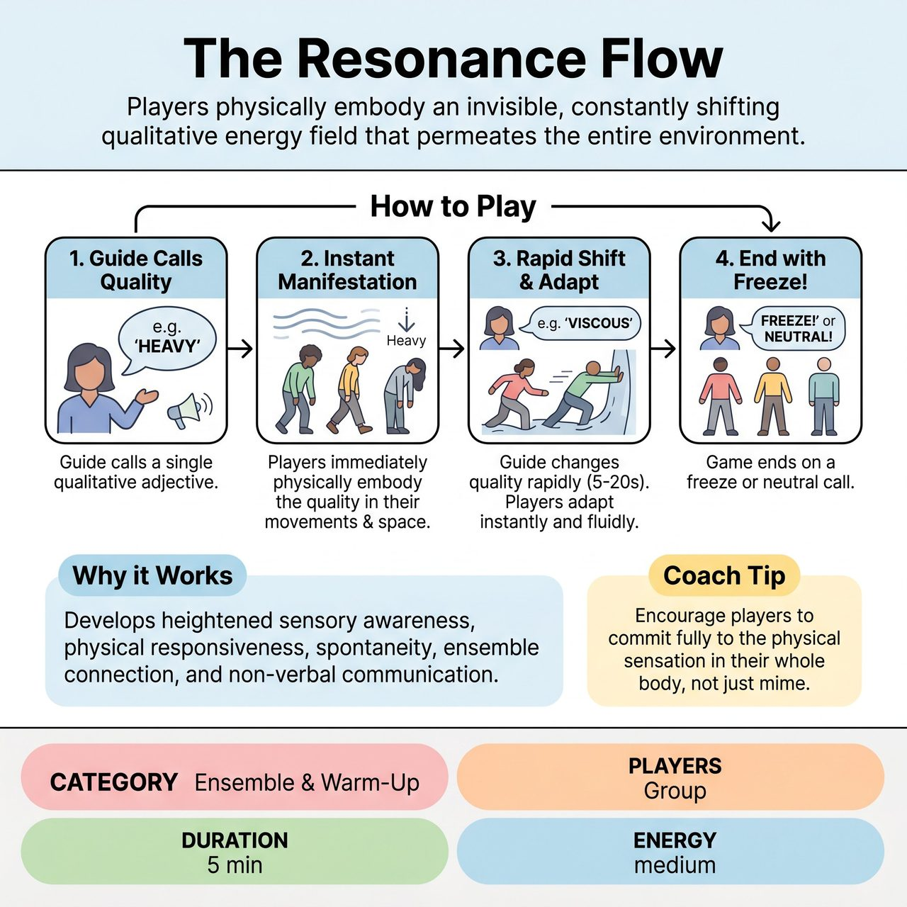

# The Resonance Flow

{ .game-hero }

> Players physically embody an invisible, constantly shifting qualitative energy field that permeates the entire environment.

## Overview
The Resonance Flow is a theatrical game that transforms the 'floor is lava' concept by having players physically embody an invisible, constantly shifting qualitative energy field. A 'Flow Guide' calls out adjectives, and players must instantly and intuitively manifest that quality as if it permeates the entire environment—their own bodies, the space, and their interactions with others. The game cultivates heightened sensory awareness, spontaneous physical responsiveness, and non-verbal communication.

## Setup
Gather players in a spacious, open area. Designate a 'Flow Guide' (initially the facilitator, but this role can rotate among players). Have players begin by moving freely and naturally around the space, gently observing their surroundings and each other.

## How to Play
1. The Flow Guide calls out a single adjective that describes the quality of an unseen, omnipresent 'Resonance Flow' that fills the entire space (e.g., 'Heavy', 'Vibrating', 'Magnetic', 'Brittle').
2. Upon hearing a quality, every player immediately and physically manifests that quality as if the entire environment and their own bodies are completely infused with this invisible flow.
3. The Flow Guide rapidly changes the qualities, calling out a new adjective every 5-20 seconds.
4. Players must instantly and fully adapt their physical state and interactions to the new quality. Transitions should be fluid and immediate, without verbal discussion or intellectual processing.
5. Players interact with each other spontaneously through the lens of the current Resonance Flow (e.g., in a 'Viscous' flow, moving through a crowd might be exceptionally slow and resistant).
6. The game ends when the Flow Guide calls 'Freeze!' or 'Neutral!'.

## Coaching Notes
- Point of Concentration: Fully embody and respond physically to the invisible, constantly shifting qualitative energy that permeates the space.
- Let your body show the invisible quality without needing to name or explain it.
- Emphasize intuitive, spontaneous physical response over intellectual correctness. There is no 'wrong' way to embody a quality.
- Success lies in the full commitment to the physical manifestation and the willingness to let intuition guide the body.
- Focus on sensory experience and authentic reaction, not on performance or demonstration.

## Why It Works
It develops heightened sensory awareness, physical responsiveness, spontaneity, embodiment of abstract concepts, non-verbal communication, ensemble awareness, active listening, and presence. It fosters an immediate, intuitive connection to the environment and fellow players, bypassing intellectual analysis in favor of authentic, physical reaction.

## Safety & Inclusion
Ensure the play space is clear of obstacles and tripping hazards. Remind players to respect physical boundaries and consent during physical interactions, especially when embodying qualities like 'Magnetic' or 'Repulsive'.

