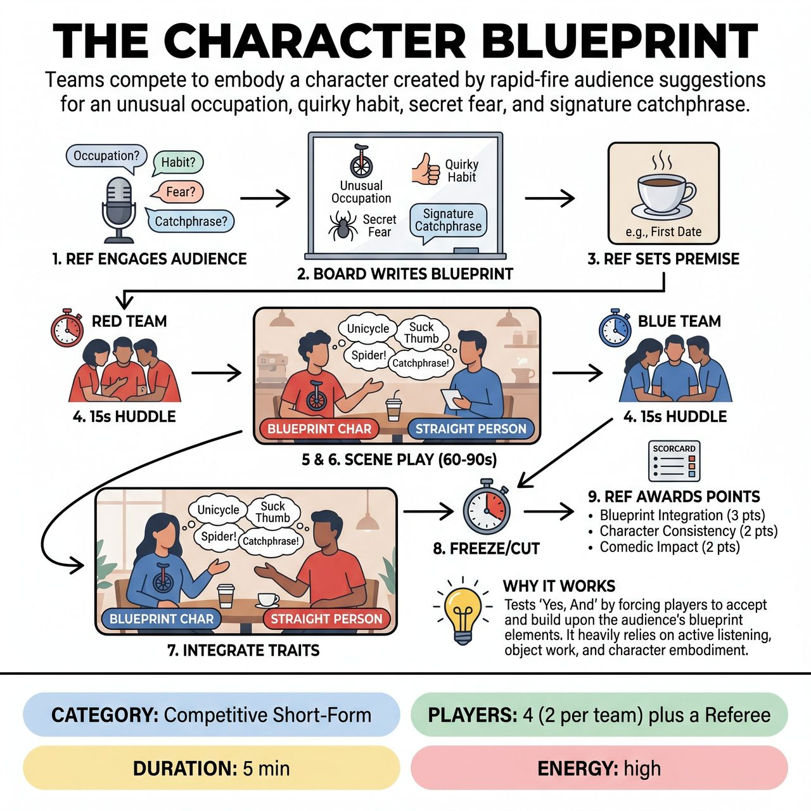

# The Character Blueprint

{ .game-hero }

> Teams compete to embody a character created by rapid-fire audience suggestions for an unusual occupation, quirky habit, secret fear, and signature catchphrase.

## Overview
Teams compete to craft and embody the most compelling, humorous, and consistent character based on a set of unique traits provided by the audience before the scene begins. After a quick huddle, one player from each team performs a scene based on a pre-determined scenario, aiming to consistently integrate all four audience-generated traits. Teams are scored on blueprint integration, character consistency, and comedic impact.

## Setup
Two players from each team (Red and Blue) stand ready at opposite sides of the stage. The Referee stands center stage with a whiteboard or flip chart, ready to solicit and record audience suggestions. The stage is clear, ready for a simple scene.

## How to Play
1. The Referee engages the audience with a rapid-fire series of specific questions to build a unique character profile, asking for: an unusual occupation/pastime, a quirky physical trait/habit, a secret fear/desire, and a signature catchphrase/sound.
2. The Referee quickly writes these four blueprint elements clearly on the board for all to see.
3. The Referee announces a simple, generic scene premise that both teams will play in their turns (e.g., 'A first date' or 'A job interview').
4. Each team gets a lightning-fast 15-second huddle (counted down loudly by the Referee) to quickly discuss how they will integrate all four blueprint elements into their character and the given scene premise.
5. The Referee calls for the first team (e.g., Red Team). One player from the Red Team enters the scene, immediately embodying their character and demonstrating the audience-suggested traits.
6. A player from the opposing team (e.g., Blue Team) enters as the straight person or a contrasting character to play opposite the Blueprint character.
7. The scene plays for approximately 60-90 seconds. The Blueprint character should aim to showcase all four of their established traits naturally and humorously within the scene.
8. The Referee calls 'Freeze!' or 'Cut!' after the time limit or when a clear comedic beat is hit.
9. The process is repeated for the Blue Team, with their chosen player embodying the exact same audience-generated blueprint elements in a scene with a Red Team player.
10. The Referee awards points based on Blueprint Integration (up to 3 points), Character Clarity & Consistency (up to 2 points), Comedic Impact (up to 2 points), and Improv Skills (up to 1 point), deducting 1 point for any fouls. The team with the most points wins.

## Coaching Notes
- Blueprint Curation: The Referee is responsible for soliciting clear, family-friendly suggestions and quickly writing them down, gently guiding the audience if suggestions are too complex or inappropriate.
- Timing: The Referee strictly enforces the 15-second huddle and the 60-90 second scene times to maintain fast pacing.
- Foul Calling - Content Foul & Groaner: Deduct points for blue humor, swearing, or innuendo (Content Foul), or for excessively bad puns that fall flat (Groaner Foul).
- Foul Calling - Trait Trace: Call this unique foul and deduct a point if a player fails to incorporate or demonstrate one of the four audience-suggested blueprint traits after a reasonable opportunity, or if they conspicuously forget one.
- Foul Calling - Blueprint Break: Call this unique foul and deduct a point if a player introduces a new, major character trait that directly contradicts or significantly alters one of the audience's initial blueprint elements.

## Why It Works
The game tests 'Yes, And' by forcing players to accept and build upon the audience's blueprint elements. It heavily relies on active listening to remember all four traits, object work to physicalize habits or occupations, and character embodiment to fully commit to rapid suggestions while maintaining pacing and endowing the scene partner.

## Safety & Inclusion
The game is inherently family-friendly, reinforcing the competitive improv commitment to all-ages humor. The Referee explicitly guides the audience for appropriate responses and has full discretion to reject or re-solicit any inappropriate suggestions. The 'Content Foul' strictly penalizes blue humor, swearing, or innuendo.

