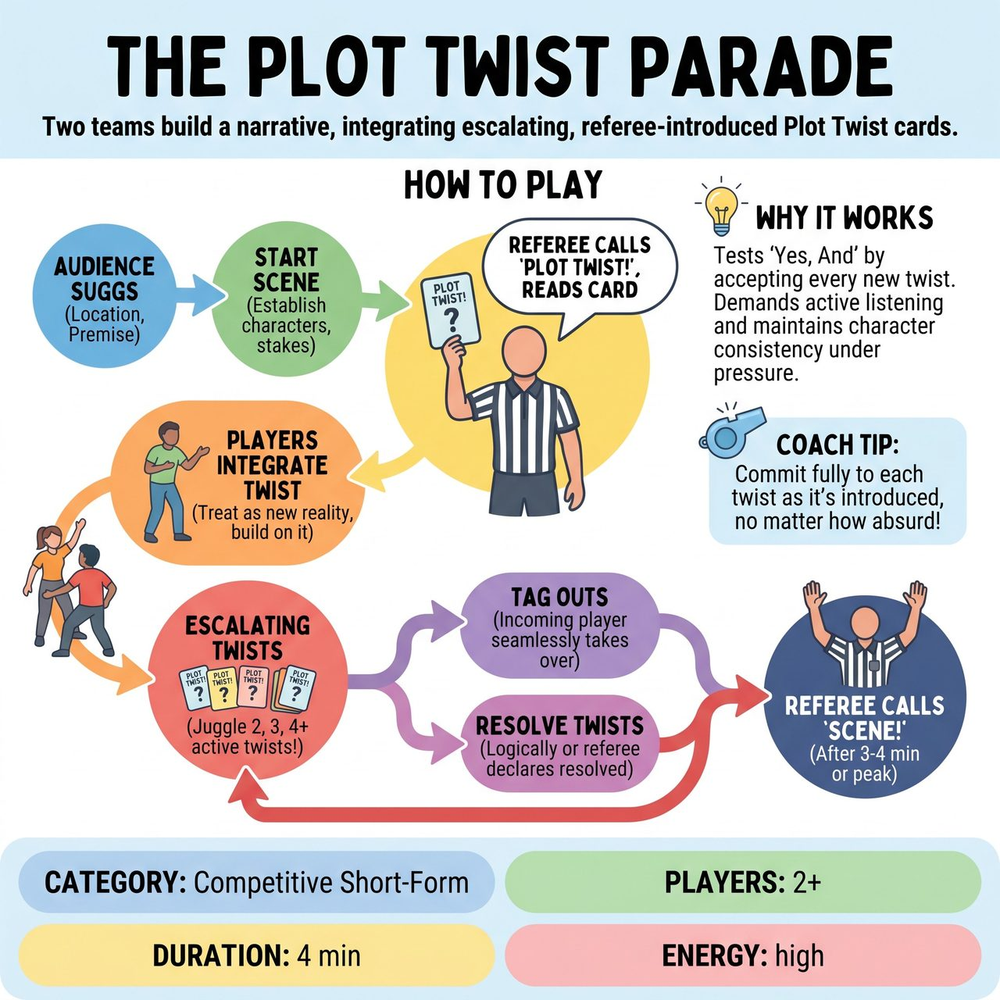

# The Plot Twist Parade

{ .game-hero }

> Two teams collaboratively build a continuous narrative while seamlessly integrating a barrage of escalating, referee-introduced Plot Twist cards.

## Overview
The Plot Twist Parade is a competitive improv game where two teams collaboratively build a continuous narrative, initiated by audience suggestions for a location and premise. A referee periodically introduces escalating 'Plot Twist' cards—such as character endowments or scene modifiers—which players must immediately and organically integrate into the ongoing scene, often while juggling multiple active twists. Teams earn points for clever incorporation, seamless storytelling, problem-solving, and dynamic tag-ins.

## Setup
Two players (one from each team, or sometimes two from one team if the referee chooses) stand on stage, ready to initiate a scene. The referee holds a pre-prepared stack of 'Plot Twist Cards' containing simple, family-friendly complications, endowments, or scene modifiers (e.g., 'You can only speak in questions,' 'The floor is sticky'). The referee also sets up a small designated area near the stage to display 'active' Plot Twist Cards.

## How to Play
1. The referee asks the audience for a Location and a Simple Premise/Activity.
2. The chosen players begin a scene based on the audience's suggestions, establishing characters, relationships, and initial stakes.
3. At opportune moments (typically after 20-30 seconds), the referee dramatically calls out, 'PLOT TWIST!', draws a card, reads it aloud, and places it in the active twist zone.
4. Players must immediately and organically incorporate the new Plot Twist into the ongoing scene, treating it as a new reality or challenge their characters face.
5. As the scene progresses, the referee continues to introduce new Plot Twists, forcing players to juggle 2, 3, or even 4 active twists simultaneously.
6. Players can tag each other out at any time. Any player from either team can tag out an active player by touching them. The incoming player immediately takes the position of the outgoing player and must seamlessly continue the scene, fully incorporating all active Plot Twists.
7. A twist remains active until it is either logically resolved by the players within the scene, or the referee explicitly declares it 'resolved' to reduce complexity.
8. The referee calls 'Scene!' after 3-4 minutes, when a strong comedic or narrative peak has been reached, or if the scene becomes too complex to manage.

## Coaching Notes
- The referee must judiciously choose when to call 'PLOT TWIST!' to maximize comedic effect, challenge players, or prevent a scene from stalling.
- Award positive points: Twist Triumph (2 points for brilliantly incorporating a new twist), Narrative Navigator (1 point for integrating multiple active twists or resolving one), Team Tag-In (1 point for elevating the scene via tag-in), Audience Acclaim (1 point for exceptional brilliance based on audience reaction), and Clean Scene End (1 point for a satisfying conclusion).
- Enforce deductions (Fouls): Clean-Content Foul (-2 points for blue humor/swearing), Groaner Foul (-2 points for excessively bad puns), Twist Ignorer Foul (-1 point for disregarding an active twist), and Plot Loop Foul (-1 point for getting stuck endlessly repeating a joke related to a twist).
- If players trigger a Plot Loop Foul and struggle to progress, the referee can declare a twist 'resolved' to help them move forward.
- Keep a running tally of the score visible to both teams and the audience, declaring the team with the highest score the winner at the end of the round.

## Variations
- Audience-Generated Twists: During a break, the referee invites the audience to write down their own family-friendly 'Plot Twist' ideas on cards to be shuffled into the deck for later rounds.

## Why It Works
It fundamentally tests 'Yes, And' as players must accept and build upon every new twist. It demands active listening to process partner dialogue and referee introductions, while challenging character consistency, object work, and pattern recognition under the pressure of compounding, fast-paced changes.

## Safety & Inclusion
All 'Plot Twist Cards' must be pre-screened and written to be inherently family-friendly, focusing on comedic absurdity rather than suggestive content. The referee must be vigilant with the 'clean-content foul,' ensuring no blue humor, swearing, or innuendo makes its way into the scene, aligning with a clean comedy ethos.

