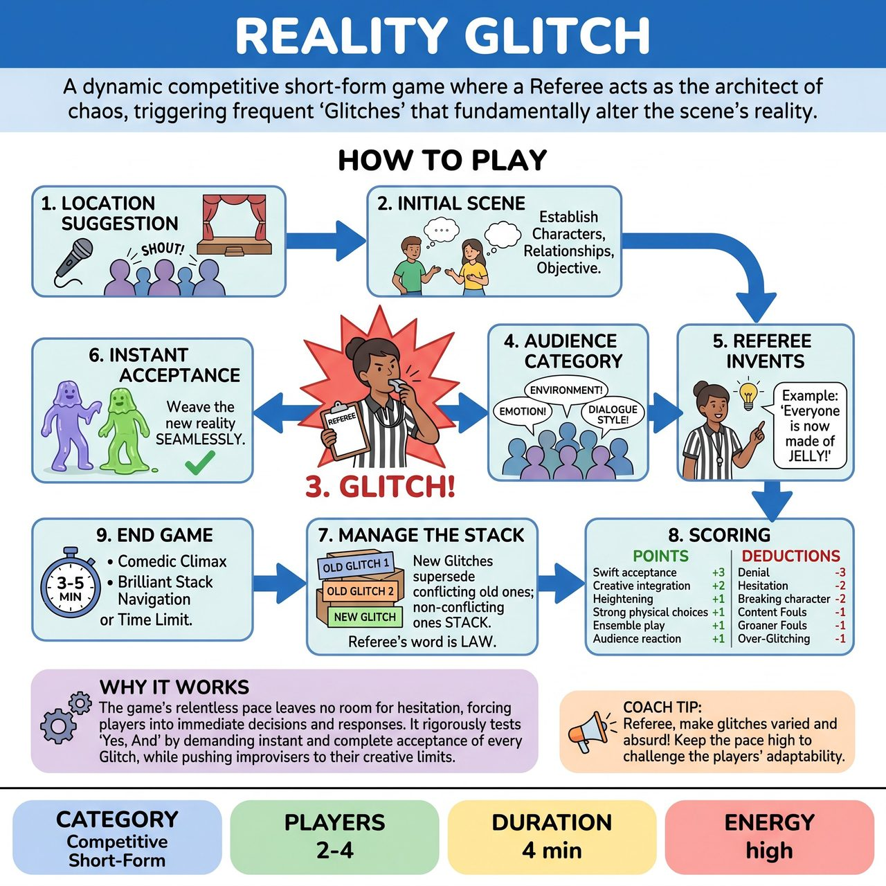

# Reality Glitch

{ .game-hero }

> A dynamic competitive short-form game where a Referee acts as the architect of chaos, triggering frequent 'Glitches' that fundamentally alter the scene's reality.

## Overview
Reality Glitch is a dynamic competitive short-form improv game where a Referee acts as the architect of chaos. After an audience-suggested location establishes the scene, the Referee frequently triggers 'Glitches' by blowing a whistle, prompting the audience for a category, and inventing a specific alteration to the scene's reality. Players must instantly 'Yes, And' these fundamental changes, integrating them seamlessly into the ongoing narrative while managing multiple active glitches simultaneously.

## Setup
Ideally 4 players, typically split into two teams of two. No props are used; all objects and environments are mimed. Use a standard competitive short-form stage layout with a central playing area, 'home' benches, and a visible scoreboard. The Referee needs a rulebook, scoring pen, signature whistle, and optionally hidden 'Glitch Prompt Cards'.

## How to Play
1. The Referee begins by asking the audience for a location.
2. Designated players take the stage and initiate a standard improvised scene based on the location, establishing characters, relationships, and a clear objective.
3. At unpredictable intervals (typically every 20-45 seconds), the Referee dramatically blows their whistle and loudly declares: 'GLITCH!'
4. The Referee immediately points to audience members, inviting them to shout out a 'Glitch Category' (e.g., Emotion, Environment, Physical, Dialogue Style, Relationship, Time/Space, Pop Culture).
5. The Referee selects one category and instantly invents and declares a specific, engaging, and often absurd Glitch that fundamentally alters the scene's reality.
6. Players must instantly accept the new Glitch and weave it seamlessly into the ongoing scene without hesitation or argument.
7. The Referee manages the stack of Glitches: new Glitches supersede conflicting old ones, while non-conflicting old Glitches stack. The Referee's word is law on what is active.
8. The Referee awards points for swift acceptance (+3), creative integration (+2), heightening (+1), strong physical choices (+1), ensemble play (+1), and audience connection (+1).
9. The Referee deducts points for Glitch denial (-3), hesitation (-2), breaking character (-2), Content Fouls (-1), Groaner Fouls (-1), and Over-Glitching (-1).
10. The game concludes when the Referee feels the scene has reached a natural comedic climax, players navigate a challenging stack brilliantly, or upon a 3-5 minute time limit, by calling 'SCENE!'

## Coaching Notes
- Instant 'Yes, And': Players must visibly and verbally (or physically) accept the new reality without question, hesitation, or argument. Any sign of non-acceptance is a serious foul.
- Creative Justification: While simply accepting the Glitch is mandatory, players score additional points for humorously or cleverly justifying why the Glitch is occurring within the scene's established logic.
- Dynamic Skill Oscillation: Glitches force players to constantly switch their primary mode of performance (physicality, emotion, verbal agility), demonstrating a broad range of improvisational talents.
- Contextual Re-framing: Each Glitch actively re-frames the scene's core context, stakes, or the characters' fundamental relationship, moving beyond mere surface-level changes.
- Glitch Management: The Referee should generally aim to keep the number of concurrently active Glitches to a manageable 2-3 to avoid overwhelming the players, implicitly 'fading out' less impactful or older Glitches.

## Variations
- 2 or 3 Player Variation: Instead of the standard 4-player (2v2) setup, the game can be played with 2 or 3 players for a different dynamic.
- Glitch Prompt Cards: The Referee may use a hidden set of pre-written categories or specific glitch ideas to aid in quick inspiration if the audience is slow to suggest categories.

## Why It Works
The game's relentless pace leaves no room for hesitation, forcing players into immediate decisions and responses. It rigorously tests 'Yes, And' by demanding instant and complete acceptance of every Glitch, while pushing improvisers to their limits of adaptability, active listening, and creative ingenuity through constant shifts in physical, emotional, and verbal skills.

## Safety & Inclusion
The Referee serves as the ultimate guardian of family-friendly content, skillfully re-directing or ignoring inappropriate audience suggestions. The 'Content Foul' is explicitly and frequently enforced for any blue humor, swearing, or inappropriate innuendo, ensuring strict adherence to family-friendly core values.

