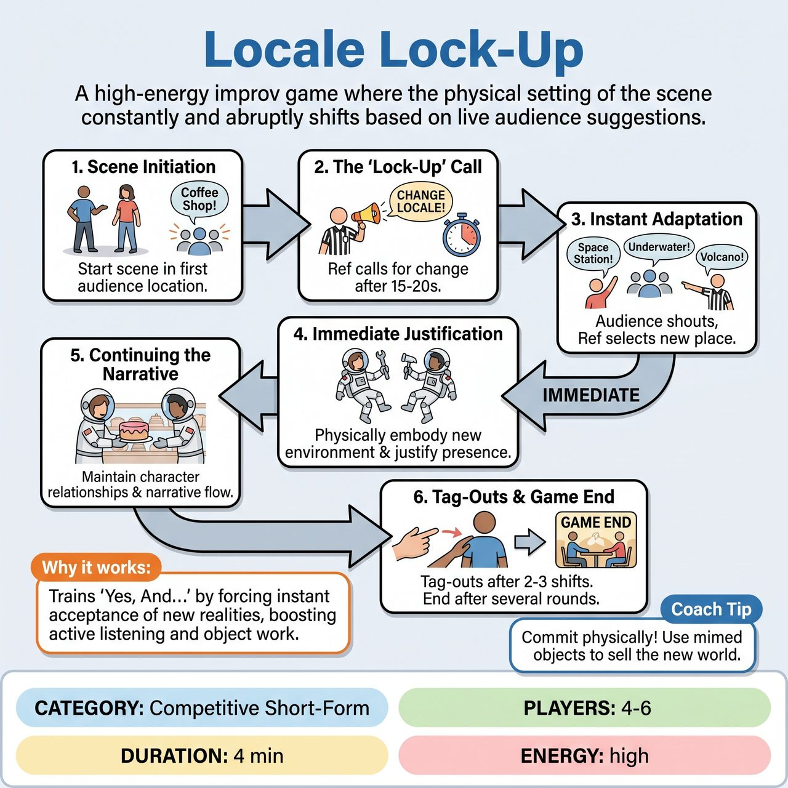

# Locale Lock-Up

{ .game-hero }

> A high-energy improv game where the physical setting of the scene constantly and abruptly shifts based on live audience suggestions.

## Overview
In 'Locale Lock-Up,' two players are thrust into a scene whose physical setting constantly and abruptly changes, dictated by the audience. Players must immediately and physically adapt to the new 'locale,' integrate it into their ongoing scene, and justify their presence within it, all while maintaining their characters and advancing a narrative. It is a high-stakes challenge of physical comedy, quick justification, and environmental 'Yes, And.'

## Setup
4-6 players total (2-3 per team) with two players active on stage at any given time. Standard open stage with no props (all mimed) and no special lighting or sound requirements beyond standard competitive short-form match cues. The audience plays a crucial role by providing continuous suggestions for new locations/environments.

## How to Play
1. Scene Initiation: The referee asks the audience for a location to start the scene. Two players (one from each team) enter the stage and begin an improvised scene based on this initial location, establishing characters and a basic relationship/objective.
2. The 'Lock-Up' Call: After 15-20 seconds, or when the scene has found a good rhythm, the referee shouts, 'CHANGE LOCALE! Audience, give us a new place!'
3. Instant Adaptation: The audience immediately shouts out new locations. The referee chooses the first clear, family-friendly suggestion heard and announces it.
4. Immediate Justification: Players must instantly and physically adapt to the new locale. They must incorporate the environment into their character's actions and dialogue within seconds. There is no explanation of how they moved; they are simply 'locked' into the new space.
5. Continuing the Narrative: Despite the jarring shifts, players must maintain their characters and the overarching relationship/narrative they established.
6. Tag-Outs: After 2-3 locale changes, players can tag out a teammate from their respective teams. The new player enters the scene immediately adapting to the current locale and integrating with the existing scene.
7. Game End: The game continues for several rounds of locale changes and tag-outs, typically 3-5 minutes, culminating in a final 'CHANGE LOCALE!' and a quick resolution or blackout.

## Coaching Notes
- Award points (1-3) for Flawless Locale Adoption, Creative Justification, Strong Physicality/Object Work, Character Consistency, Advancing the Scene, and Audience Management.
- Call a 'Locale Lag Foul' (-1 point) if players fail to immediately adapt physically or verbally to the new locale within 2-3 seconds.
- Call a 'Reality Rift Foul' (-1 point) if players acknowledge the previous locale after a new one has been called, or explicitly question how they got to the new locale.
- Call an 'Environmental Blindness Foul' (-2 points) if players ignore the new locale entirely and continue the scene as if nothing changed.
- Call a 'Wimp Foul' (-1 point) for refusing to make a strong choice or retreating from an initiated action, and a 'Groaner Foul' (-1 point) for obvious, low-effort jokes.

## Why It Works
This game explicitly promotes core improv skills like 'Yes, And...' by forcing players to accept the new reality and build upon it. It develops active listening, object work for creating believable mimed environments, and dynamic pacing. The competitive element pushes players to be inventive, physically expressive, and quick-witted in integrating bizarre environmental shifts.

## Safety & Inclusion
Enforce a 'content foul' (-3 points and potential player ejection) for any inappropriate content to maintain a family-friendly environment. Ensure physical choices and rapid transitions remain physically safe for all players on stage.

