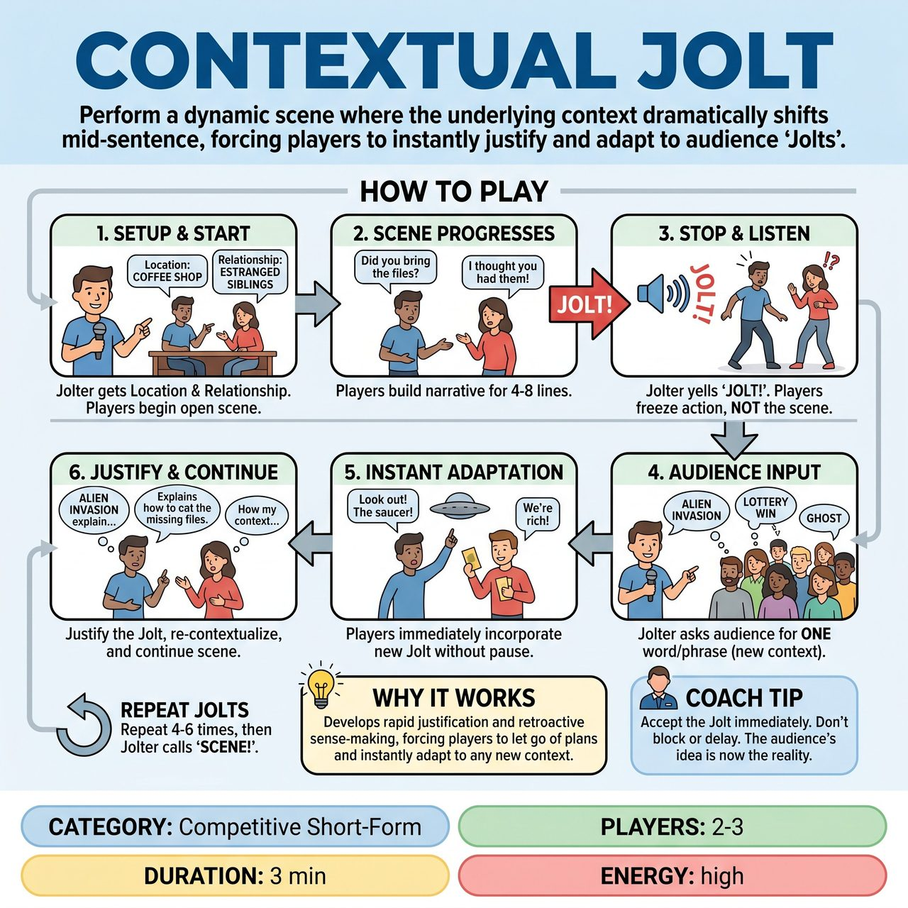

# Contextual Jolt

{ .game-hero }

> Perform a dynamic scene where the underlying context dramatically shifts mid-sentence, forcing players to instantly justify and adapt to audience 'Jolts'.

## Overview
Contextual Jolt is an improvisational game where 2-3 players create a scene based on initial audience suggestions for location and relationship. At any point, a 'Jolter' calls out 'JOLT!', prompting the audience to provide a single word or phrase that drastically changes the scene's underlying context. The improvisers must instantly justify and adapt to this new reality, seamlessly weaving it into their ongoing narrative.

## Setup
2-3 improvisers on a clear, open stage. One additional person, typically the show's host or referee, acts as the 'Jolter'. No props are required.

## How to Play
1. The Jolter takes the stage and asks the audience for a location and a relationship between two characters.
2. Two players enter the stage and immediately begin an open scene based on these suggestions.
3. At any point during the scene (typically after 4-8 lines of dialogue), the Jolter intervenes by loudly calling out 'JOLT!'.
4. Players must immediately freeze their action and listen intently; this is a stop-trigger for the current flow, but not a scene stop.
5. The Jolter turns to the audience and asks for a single word or short phrase representing a new, unexpected, and drastically different context, emotional driver, object, or underlying reality (e.g., 'Secret Agent', 'Time Travel', 'Giant Spider').
6. Without breaking character or pausing for more than a breath, the players must immediately incorporate this new Jolt into the ongoing narrative, physical reality, or emotional subtext.
7. Players must justify the sudden appearance of the Jolt and re-contextualize the current situation, effectively 'rewriting' the preceding moments or redefining the present.
8. The scene continues from this new, jolted reality until the Jolter calls 'JOLT!' again, prompting another audience suggestion and subsequent adaptation.
9. The game continues for 2-4 minutes, or after 4-6 Jolts, until the Jolter calls 'SCENE!' to end the game.

## Coaching Notes
- Quick Adaptation: Challenge players to pivot instantly and seamlessly to the new reality without missing a beat.
- Strong Justification: Encourage players to creatively and logically (or hilariously illogically, but committedly) integrate the Jolt into the existing scene, often by re-interpreting prior dialogue or actions.
- Heightening the Comedy/Drama: Use the Jolt to increase the stakes, introduce absurdity, or deepen character reactions rather than just acknowledging it and moving on.
- Teamwork: Remind players to listen and 'Yes, And' each other's new realities, building a cohesive (if chaotic) narrative together.

## Why It Works
It develops the core improv skills of rapid justification and retroactive sense-making, forcing players to let go of their planned narrative and instantly adapt to a completely new context.

## Safety & Inclusion
The Jolter should act as a filter for audience suggestions to ensure they remain appropriate and safe for the players to physically and emotionally enact. Players should maintain physical safety during sudden shifts in reality.

