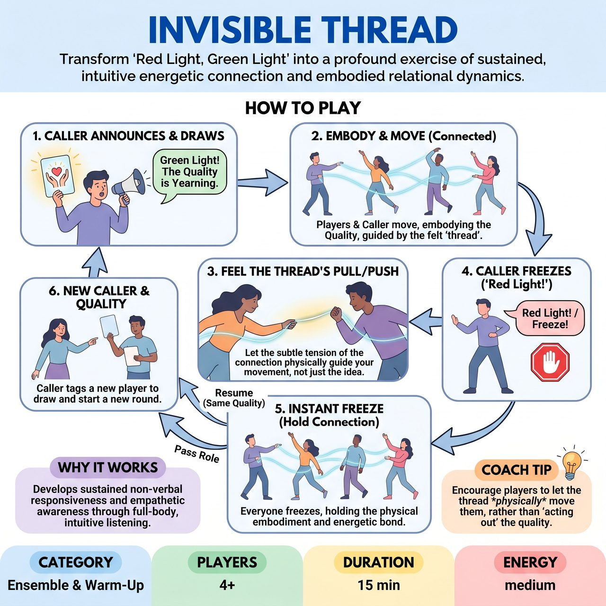

# Invisible Thread

{ .game-hero }

> Transform 'Red Light, Green Light' into a profound exercise of sustained, intuitive energetic connection and embodied relational dynamics.

## Overview
Invisible Thread adapts the classic 'Red Light, Green Light' mechanic to focus on sustained, intuitive energetic connection. Players embody a randomly drawn 'Relational Quality' while maintaining an invisible, felt bond to a dynamic Caller. The game cultivates profound non-verbal responsiveness, empathetic awareness, and a visceral understanding of interpersonal impact.

## Setup
Clear an open playing area so players can spread out. Prepare a set of 'Relational Quality' cards in advance (e.g., 'Yearning', 'Guarding', 'Enticing', 'Shrinking From', 'Demanding', 'Yielding', 'Observing', 'Provoking', 'Receiving', 'Chasing', 'Hesitating'). Designate one player as the initial 'Caller'.

## How to Play
1. The current Caller draws a 'Relational Quality' card and announces it, for example, 'Green Light! The Quality is Yearning.'
2. Upon this announcement, all players, including the Caller, begin to move throughout the space.
3. Movement must not be random; it must be a purely physical and abstract embodiment of the announced Relational Quality in continuous connection to the Caller, without acting out a specific narrative scene.
4. Players must feel an 'invisible, tangible thread' linking them to the Caller, letting its subtle pull or push guide their movement while the Caller also moves and influences the thread.
5. At any moment, the Caller can announce 'Red Light!' or 'Freeze!'
6. All players, including the Caller, must instantly freeze the physical manifestation of their energetic connection and their embodiment of the Relational Quality exactly as it is in that moment.
7. After a brief pause, the Caller can call 'Green Light!' again with the same quality, or pass the Caller role by tagging another player.
8. The new Caller draws a new Relational Quality card, initiating a new round of movement and connection.

## Coaching Notes
- Point of Concentration: Maintain an unbroken, tangible, yet invisible energetic connection with the designated Caller, constantly adjusting your spatial relationship and physical attitude based on their movement.
- Point of Concentration: Continuously embody the specific 'Relational Quality' as you move or freeze, letting that quality permeate your body and inform every subtle shift.
- Where do you feel the connection to the Caller in your body? Is it a pull? A push? A shared hum?
- Let the 'thread' be made of something physical - a strong elastic band, a fragile cobweb, a thick chain... what is its texture?
- Is the quality pulling you towards the Caller, pushing you away, or something else entirely?
- What's the texture of 'Demanding' in your fingers, in your breath, in the soles of your feet?
- Can you embody this quality without telling a story about it? Just be the quality.
- How does the quality change your relationship to the floor, to the air around you, to the edges of the room?
- Don't think about where you're going; let the 'quality' and the 'thread' move you.
- When you freeze, are you holding the quality, or is the quality holding you?

## Why It Works
It develops sustained, intuitive non-verbal responsiveness and empathetic awareness. By demanding extreme presence and active listening with the entire body, it sidesteps intellectual analysis and compels players into an intuitive, non-verbal dialogue. The constant randomization of the Caller and qualities ensures players remain in 'present time' without the pressure of pre-planning, deepening their understanding of embodied communication.

## Safety & Inclusion
Ensure the playing area is clear of obstacles to prevent tripping during movement. Encourage players to respect physical boundaries and move at a pace that feels safe for their bodies, especially when embodying intense relational qualities.

