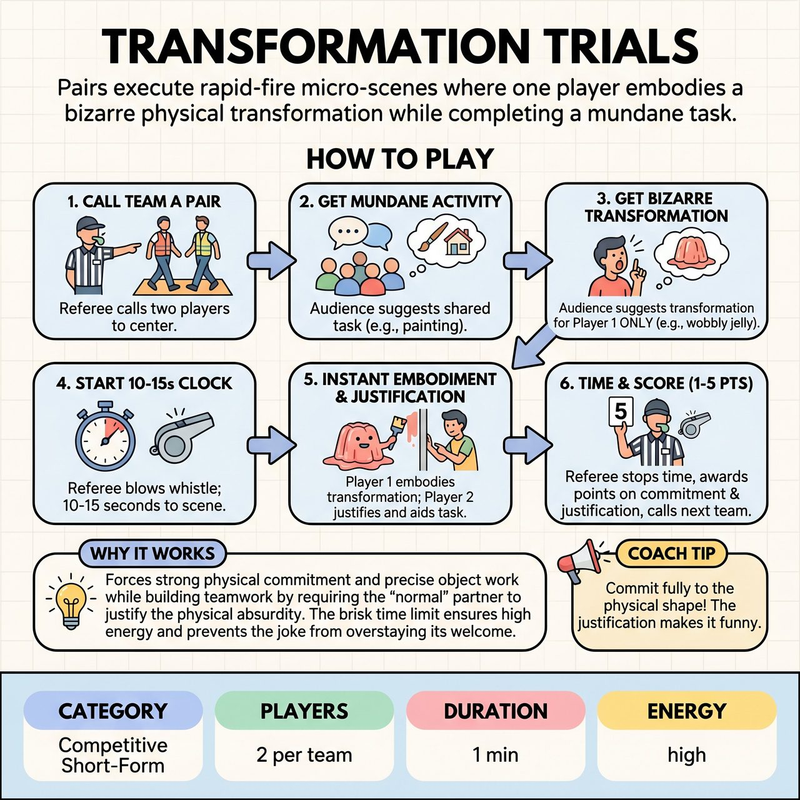

# Transformation Trials

{ .game-hero }

> Pairs execute rapid-fire micro-scenes where one player embodies a bizarre physical transformation while completing a mundane task.

## Overview
A rapid-fire, highly physical competitive short-form game where pairs of players execute a 10-15 second micro-scene. One player is endowed by the audience with a bizarre physical transformation, such as a melting candle or a frantic squirrel. The duo must instantly establish a shared environment and complete a mundane task together, combining strong physical comedy with scene-partner justification.

## Setup
Standard competitive stage. No props required (all object work is mimed). The Referee needs a whistle and a stopwatch or a good internal clock.

## How to Play
1. The Referee calls two players from Team A to the center of the stage.
2. The Referee asks the audience for a mundane, shared two-person activity (e.g., painting a ceiling, robbing a bank, changing a diaper).
3. The Referee then asks the audience for a bizarre physical transformation or state of matter for Player 1 ONLY (e.g., a wobbly bowl of jelly, a rusty robot, a deflating balloon). Player 2 remains a normal human.
4. The Referee blows the whistle to start the clock. The players have exactly 10 to 15 seconds to execute the scene.
5. Player 1 must instantly and fully embody their transformation while attempting the task. Player 2 must treat Player 1's transformation as completely real, justifying it and interacting with them to get the job done.
6. At the 10-15 second mark, before the physical joke wears out, the Referee blows the whistle and calls 'Time!'
7. The Referee awards 1 to 5 points based on physical commitment, clear object work, and how well the normal partner justified the transformation, then calls Team B forward for a brand new task and transformation.

## Coaching Notes
- Keep the scenes strictly to 10-15 seconds to prevent the physical gag from dragging or wearing out.
- Watch for the 'Shapeshifter Slip-Up' foul, which should be called if a player drops their physical endowment mid-scene without justification.
- Call the standard clean-content foul for any inappropriate content.
- Encourage the audience to cheer for the most creative physical choices.
- Remind the 'normal' partner that their job is to ground the scene by treating the absurdity as a real, practical obstacle to their shared task.

## Variations
- Double Trouble: Both players receive different, conflicting physical transformations from the audience (e.g., a deflating balloon and a giant Slinky trying to fold laundry together).
- Transformation Gauntlet: One 'normal' player stays on stage for 3-4 rapid-fire rounds, with new transformed partners tagging in every 10 seconds to help them complete the exact same task.

## Why It Works
It forces strong physical commitment and precise object work while building teamwork by requiring the 'normal' partner to justify the physical absurdity. The brisk time limit ensures high energy and prevents the joke from overstaying its welcome.

## Safety & Inclusion
Crucial: 'Physical commitment' does not mean physical strain or pain. Players should interpret transformations in ways that are safe for their own bodies and mobility levels. Referees must judge the theatrical commitment to the choice, not the athletic exertion, ensuring players are never pressured past their physical limits. Ensure the stage is completely clear of tripping hazards before play begins.

