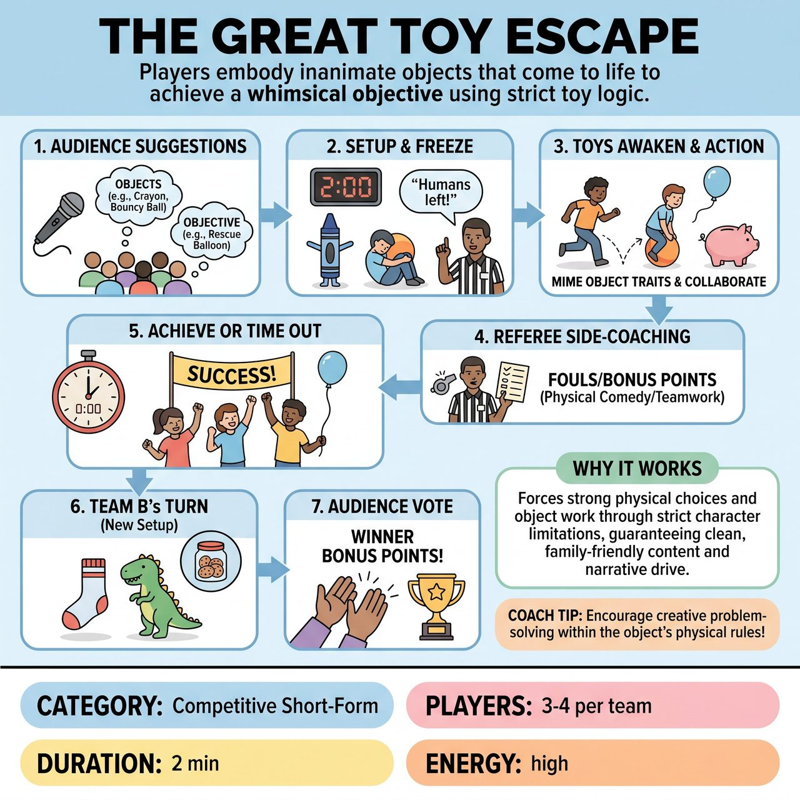

# The Great Toy Escape

{ .game-hero }

> Players embody inanimate objects that come to life to achieve a whimsical objective using strict toy logic.

## Overview
A fast-paced, family-friendly competitive short-form game where a team of players embodies inanimate objects (like a lost sock or a toy dinosaur) that come to life to achieve a whimsical objective (e.g., reaching the cookie jar). Players must convincingly mime their object's physical limitations and collaborate to complete their mission before time runs out. The game inherently guarantees clean content through its 'toy logic' premise, heavily rewarding strong physical choices, object work, and teamwork.

## Setup
Format is a competitive short-form match. Played in two separate rounds: Team A (3-4 players) plays their round, followed by Team B (3-4 players). No props are used; all objects and environments are mimed. The stage must be clear. The Referee stands downstage to manage time, fouls, and suggestions.

## How to Play
1. The Referee calls Team A to the stage and asks the audience for 3 to 4 inanimate objects found in a child's room (e.g., a crayon, a bouncy ball, a piggy bank). Each player is assigned one object.
2. The Referee then asks the audience for a simple, child-like objective for the toys to achieve (e.g., 'rescue the balloon from the ceiling fan', 'turn off the scary nightlight').
3. The Referee sets a 2-minute timer. Team A players take the stage and freeze in positions appropriate for their inanimate objects.
4. The Referee blows the whistle and announces, 'The humans have left the room!' The toys awaken.
5. Players must work together to achieve their objective using only the physical traits and 'toy logic' of their characters. A bouncy ball cannot walk; it must bounce or roll. A sock is floppy and has no rigid structure.
6. The Referee actively side-coaches, calls fouls (stopping the clock briefly to deduct points), and awards bonus points for exceptional physical comedy or teamwork.
7. The scene ends when the objective is achieved or the 2-minute timer sounds.
8. Team B then takes the stage, gets a completely new set of object suggestions and a new objective, and plays their 2-minute round.
9. After both rounds, the audience applauds to vote for the best 'Escape', awarding a 5-point bonus to the winner.

## Coaching Notes
- Award +1 point during the scenes for brilliant physical problem-solving.
- Call the 'Human Behavior Foul' and deduct 1 point if a toy references adult concepts like taxes, mortgages, or existential dread instead of toy concerns.
- Call the 'Broken Toy Foul' and deduct 1 point if a player violates the physical limitations of their object, like a floppy sock suddenly standing rigid or a block flying unaided.
- Encourage players to lean heavily into their physical limitations; the struggle is where the comedy lives.
- Keep the ticking-clock objective at the forefront to drive the narrative forward and prevent the scene from stalling.
- Focusing on one team's cohesive story at a time eliminates staging chaos and makes the game highly watchable.

## Variations
- Relay Escape: Instead of separate rounds, both teams share the same objective. Team A plays for 60 seconds, then the Referee blows the whistle and Team B tags in, taking over the exact same toys and continuing the story seamlessly to completion.
- The Floor is Lava: Add an environmental constraint suggested by the audience (e.g., 'the floor is sticky', 'the room is pitch black') that the toys must navigate while maintaining their object limitations.

## Why It Works
It forces strong physical choices and object work through strict character limitations. The inherent premise guarantees clean, family-friendly content without feeling restrictive, and a clear, ticking-clock objective drives the narrative forward.

## Safety & Inclusion
Physical safety: Since players are embodying awkward objects (flopping, rolling, crawling), ensure the stage is clear of real debris. Players should not attempt dangerous acrobatics to prove their 'toy' nature. Accessibility: 'Physical limitations' can be adapted to any player's mobility level. A player in a wheelchair might play a remote-control car or a rolling desk chair, utilizing their mobility device as part of the object work. Content: The 'Human Behavior Foul' acts as an immediate, in-game safety mechanic to stop any drift into adult or inappropriate themes, keeping the game strictly all-ages.

