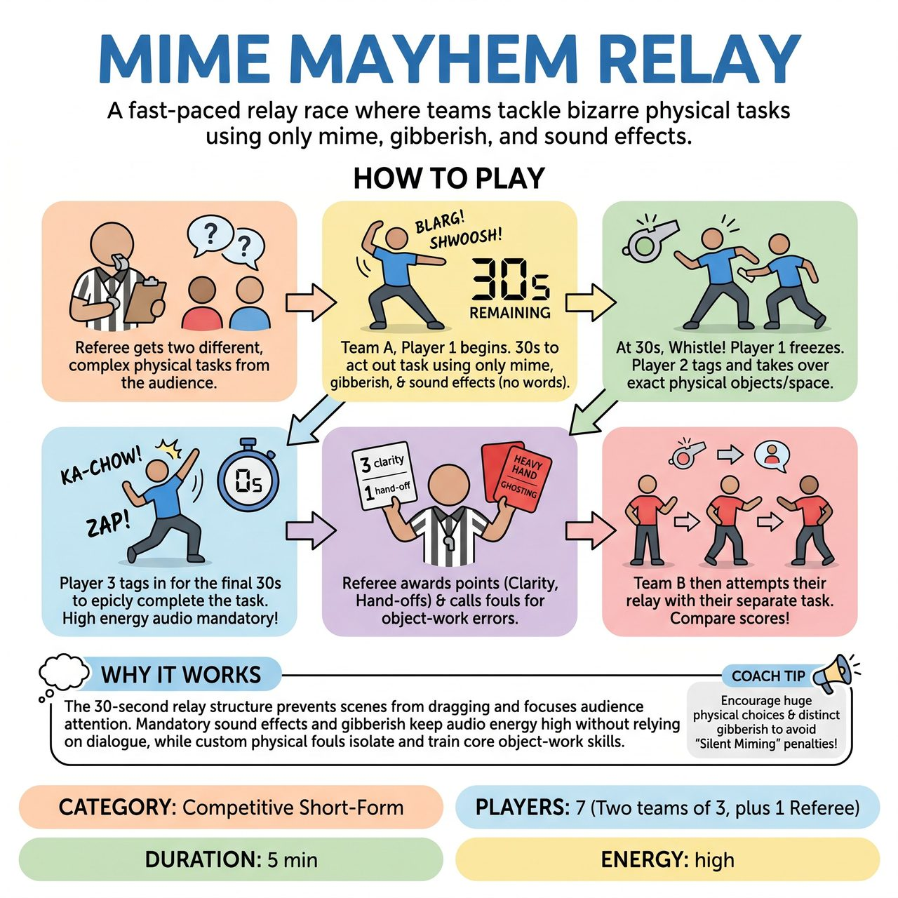

# Mime Mayhem Relay

{ .game-hero }

> A fast-paced relay race where teams tackle bizarre physical tasks using only mime, gibberish, and sound effects.

## Overview
A fast-paced, competitive short-form relay race where teams tackle bizarre physical tasks using only mime, gibberish, and sound effects. By breaking the action into 30-second alternating bursts, the game maintains fierce momentum while a referee enforces unique object-work fouls like 'Heavy Hand' and 'Ghosting' to keep players honest.

## Setup
Two teams of 3 players and one Referee. Ensure there are no actual props or chairs on stage. The audience provides a complex, multi-step physical challenge for each team (e.g., 'Building a time machine out of kitchen appliances' or 'Performing open-heart surgery on a flea').

## How to Play
1. The Referee gets a complex physical task from the audience for Team A, and a different task of equal difficulty for Team B.
2. Team A begins their relay. Player 1 steps up and has exactly 30 seconds to begin the task using only mime, gibberish, and vocalized sound effects (no English words).
3. At the 30-second mark, the Referee blows the whistle. Player 1 freezes, and Player 2 tags in, immediately taking over the exact physical objects and space Player 1 established, continuing the task for another 30 seconds.
4. Player 3 tags in for the final 30 seconds to bring the task to an epic conclusion.
5. To keep audio energy high, players must constantly provide their own sound effects (whirs, clanks, squishes) or gibberish dialogue; silent miming is penalized.
6. The Referee awards points and calls any physical fouls. Teams can earn up to 5 points per relay: 3 for clarity/creativity, 1 for seamless relay hand-offs, and 1 for audience reaction.
7. Team B then attempts their relay with their own suggestion.

## Coaching Notes
- The Referee actively calls custom fouls to keep players honest: 'Heavy Hand' (-1 point) for losing the weight or texture of an object, and 'Ghosting' (-1 point) for walking through or forgetting an established object.
- A 'Mute' foul (-1 point) is called if a player stops making sound effects.
- Encourage the audience to cheer to influence the Referee's scoring.
- Ensure players are immediately taking over the exact physical objects and space the previous player established during hand-offs.

## Variations
- Blind Relay: Players 2 and 3 face upstage and cannot see what the previous player is doing. On the tag, they must adopt the frozen physical posture of the outgoing player and justify it into the ongoing task.
- Foley Artist: One player performs the mime silently while a teammate on the sideline microphone provides all the sound effects and gibberish.

## Why It Works
The 30-second relay structure prevents scenes from dragging and focuses audience attention. Mandatory sound effects and gibberish keep audio energy high without relying on dialogue, while custom physical fouls isolate and train core object-work skills.

## Safety & Inclusion
Ensure the stage is completely clear of real objects or cables, as players will be highly focused on imaginary items. The game accommodates all mobility levels, as the fouls are based on the consistency of the mime (weight, boundaries) rather than the speed or athleticism of the player. If a player has vocal limitations, the Foley Artist variation can be used as the default.

