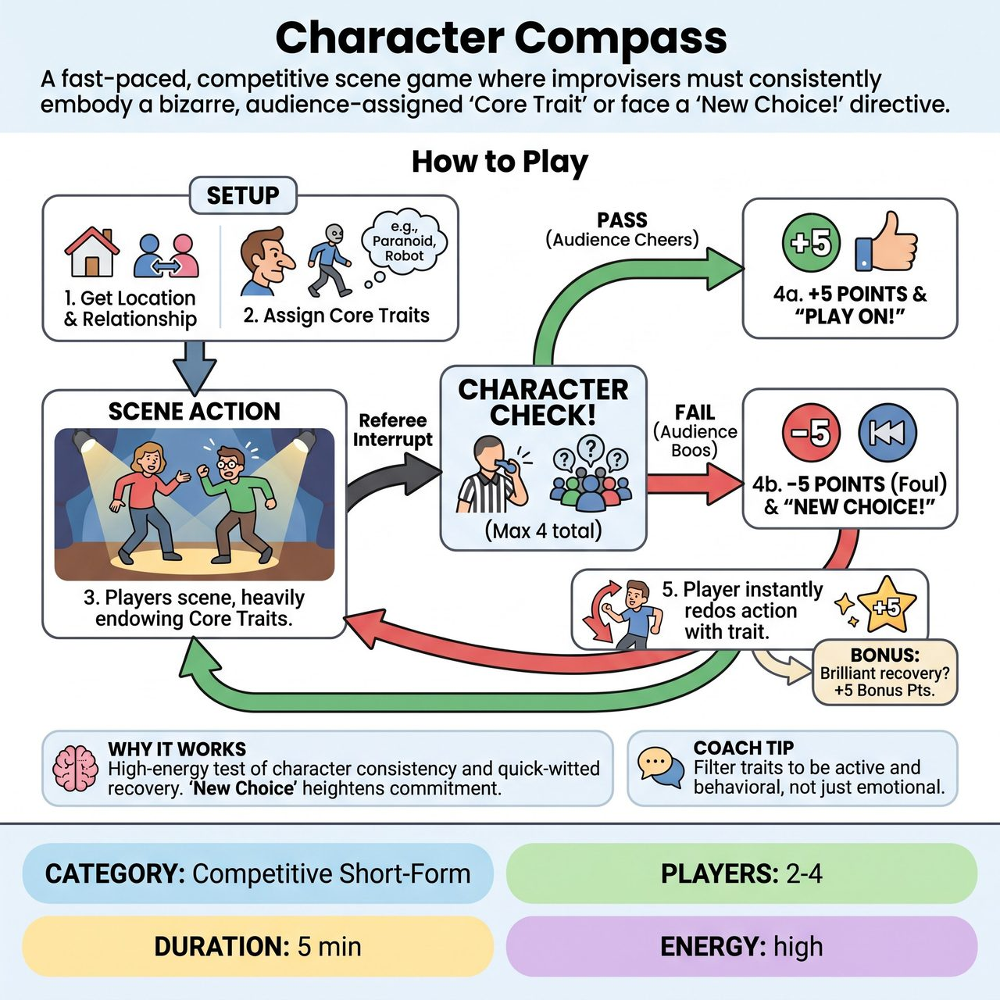

# Character Compass

{ .game-hero }

> A fast-paced, competitive scene game where improvisers must consistently embody a bizarre, audience-assigned 'Core Trait' or face a 'New Choice!' directive.

## Overview
A fast-paced, competitive scene game where improvisers must consistently embody a bizarre, audience-assigned 'Core Trait.' The Referee periodically halts the action for a 'Character Check,' asking the audience to cheer or boo based on the player's commitment to their trait. Passing earns points, while failing triggers an immediate 'New Choice!' directive, forcing the player to instantly redo their last action with exaggerated character commitment.

## Setup
Requires 2 to 4 players (typically 1 or 2 from each competing team) and a Referee equipped with a whistle. The stage is set for a standard open scene. The Referee will need a way to track simple whole-number scores (a whiteboard or digital scoreboard).

## How to Play
1. The Referee gets a location and a relationship from the audience to ground the scene.
2. The Referee asks the audience for a specific, playable 'Core Trait' for each player on stage. The Referee must filter these to ensure they are active and behavioral (e.g., 'Treats everything like it is extremely fragile' or 'Speaks like a 1940s noir detective').
3. The scene begins. Players must advance the narrative while heavily endowing their characters with their assigned Core Traits.
4. At any point where a player makes a strong choice, or conversely, seems to be dropping their character, the Referee blows the whistle and yells, 'Character Check on [Player Name]!'
5. The Referee turns to the audience and asks, 'Audience, are they playing their trait? Cheer for YES, boo for NO!'
6. The Referee makes an instant call based on the crowd's volume. If the audience cheers YES, the Referee awards +5 points to that player's team and yells, 'Play on!'
7. If the audience boos NO, the Referee deducts -5 points (a Character Foul) and yells, 'New Choice!' The offending player must immediately redo their last line or physical action, heightening it to perfectly align with their Core Trait.
8. If a player executes a truly brilliant 'New Choice' recovery that brings the house down, the Referee may award a +5 point bonus.
9. To ensure the scene's narrative can actually develop, the Referee strictly caps the game at a maximum of 4 Character Checks total per scene. Once the cap is reached, the players are allowed to finish the scene's climax uninterrupted.

## Coaching Notes
- Maintain high scene momentum by making instant Referee calls.
- Ensure the 'New Choice' mechanic is applied specifically to character consistency rather than just narrative dialogue.
- Encourage high vocal audience engagement through cheering and booing.
- Keep scoring to simple whole numbers (+5, -5) so it is easy for the audience and Referee to track.
- Enforce the hard cap on interruptions to protect the scene's narrative arc.
- Standard competitive fouls (clean-content foul for inappropriate content, groaner for bad puns) result in a -5 point deduction.

## Variations
- Secret Compass: The players are sent out of the room while the audience assigns their Core Traits. When they return, they must guess their own traits based on how their scene partners treat them and endow them. The Referee awards points when a player successfully guesses and adopts their trait.
- Physical Compass: All assigned traits must be strictly physical restrictions or tics (e.g., 'Cannot bend their elbows,' 'Always moves in slow motion'). This shifts the focus entirely to physical comedy and object work.

## Why It Works
It is a high-energy test of character consistency and quick-witted recovery. The 'New Choice' mechanic is applied specifically to character commitment, forcing players to instantly heighten their behavioral traits while maintaining the narrative.

## Safety & Inclusion
The Referee must strictly filter audience suggestions for Core Traits. Traits must be behavioral quirks or genre tropes, never based on protected classes, mental illnesses, disabilities, or offensive stereotypes. If a Physical Compass variation is played, the Referee must ensure the physical restrictions are safe for the specific improvisers' mobility levels and bodies. The clean-content foul ensures all content remains family-friendly.

