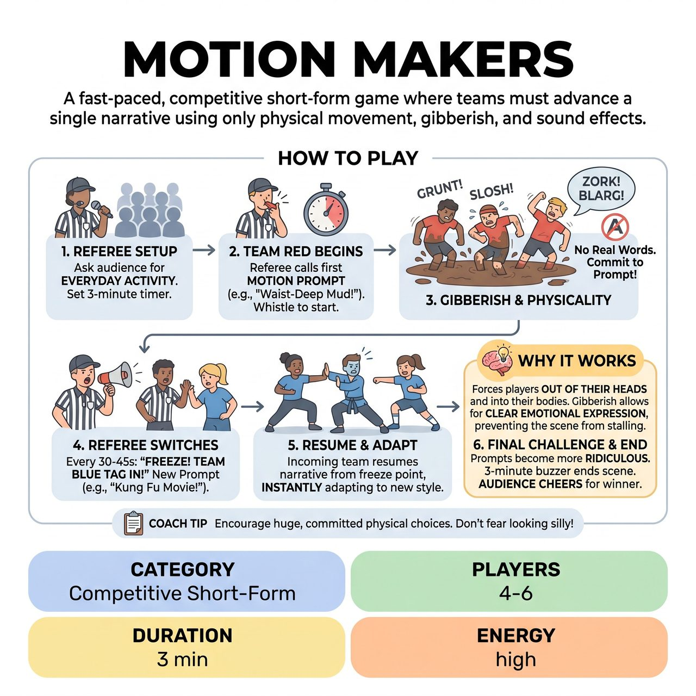

# Motion Makers

{ .game-hero }

> A fast-paced, competitive short-form game where teams must advance a single narrative using only physical movement, gibberish, and sound effects.

## Overview
A fast-paced, competitive short-form game where teams must advance a single narrative using only physical movement, gibberish, and sound effects. A Referee constantly shouts out 'Motion Prompts' that instantly change how the players must move and communicate. Recognizable words are strictly forbidden, forcing players to rely on exaggerated physicality, vocal tone, and visual listening to tell the story.

## Setup
Format: Competitive Short-Form match. Players: 2 teams (e.g., Red and Blue) of 2-3 players each. Props: None. All objects and environments are mimed. Audience Role: Provides a mundane, everyday activity (e.g., 'Baking a cake,' 'Changing a tire') to ground the scene, and votes for the winner at the end.

## How to Play
1. The Referee asks the audience for an everyday, relatable activity or chore to serve as the base scene.
2. The Referee sets a 3-minute timer. Team Red steps forward to begin.
3. The Referee calls out the first Motion Prompt (e.g., 'You are moving through waist-deep mud!') and blows the whistle to start the scene.
4. Players act out the scene using their bodies, non-verbal sound effects, and gibberish. They must fully commit to the physical constraint of the prompt. Any recognizable word in any language is a foul.
5. Every 30-45 seconds, the Referee blows the whistle, calls 'Freeze! Team Blue, tag in!' and immediately gives a new Motion Prompt (e.g., 'Kung Fu Dubbed Movie!').
6. The incoming team must resume the exact same narrative and character objectives where the last team left off, but instantly adapt to the new physical constraint.
7. As the clock ticks down, the Referee should make the prompts increasingly ridiculous, abstract, or physically demanding (e.g., 'Everyone is attached by an invisible 2-foot bungee cord', 'Floor is made of ice').
8. At the 3-minute buzzer, the Referee blows the whistle to end the scene and moves to scoring. The audience cheers for their favorite team, with the loudest applause earning a 3-point bonus.

## Coaching Notes
- The Referee awards 1-3 points to teams for seamless narrative transitions, brilliant physical choices, and hilarious use of gibberish or sound effects.
- Call fouls for 'Word Leak' (saying a real word - minus 1 point), 'Content Foul' (inappropriate content - minus points and an apology), and 'Stalling' (not advancing the narrative or playing charades instead of acting).
- Ensure players use gibberish and sound effects to prevent the scene from stalling into a frustrating game of charades, allowing for clear emotional expression.
- Use dynamic referee control to make instant pacing adjustments and guarantee escalation.

## Variations
- Blind Prompts: The audience writes down physical states, environments, or genres on slips of paper before the show. The Referee pulls them randomly from a bucket to use as the Motion Prompts.
- Emotional Motion: Instead of environmental or stylistic constraints, the prompts are extreme, physicalized emotions (e.g., 'Furious but trying to hide it,' 'Overwhelmingly itchy,' 'Suspicious of everything').

## Why It Works
The high-energy physical comedy forces players out of their heads and into their bodies. Gibberish and sound effects prevent the scene from stalling into a frustrating game of charades, allowing for clear emotional expression. Dynamic referee control allows for instant pacing adjustments and guaranteed escalation.

## Safety & Inclusion
Physical Safety: Players must maintain spatial awareness. Referees must never give prompts that force players into unsafe contortions or require lifting/carrying others. Accessibility: Prompts must avoid ableist tropes entirely (e.g., no 'missing limbs' or mimicking disabilities). Focus on environmental constraints (wind, gravity, mud) or stylistic genres (ballet, slow-mo) so players of all mobilities can interpret the prompt safely in their own bodies. Consent: Players should establish physical boundaries beforehand. Prompts that imply physical connection (e.g., 'Puppet and Puppeteer') should only be used if the cast has explicitly practiced safe, consensual touch.

