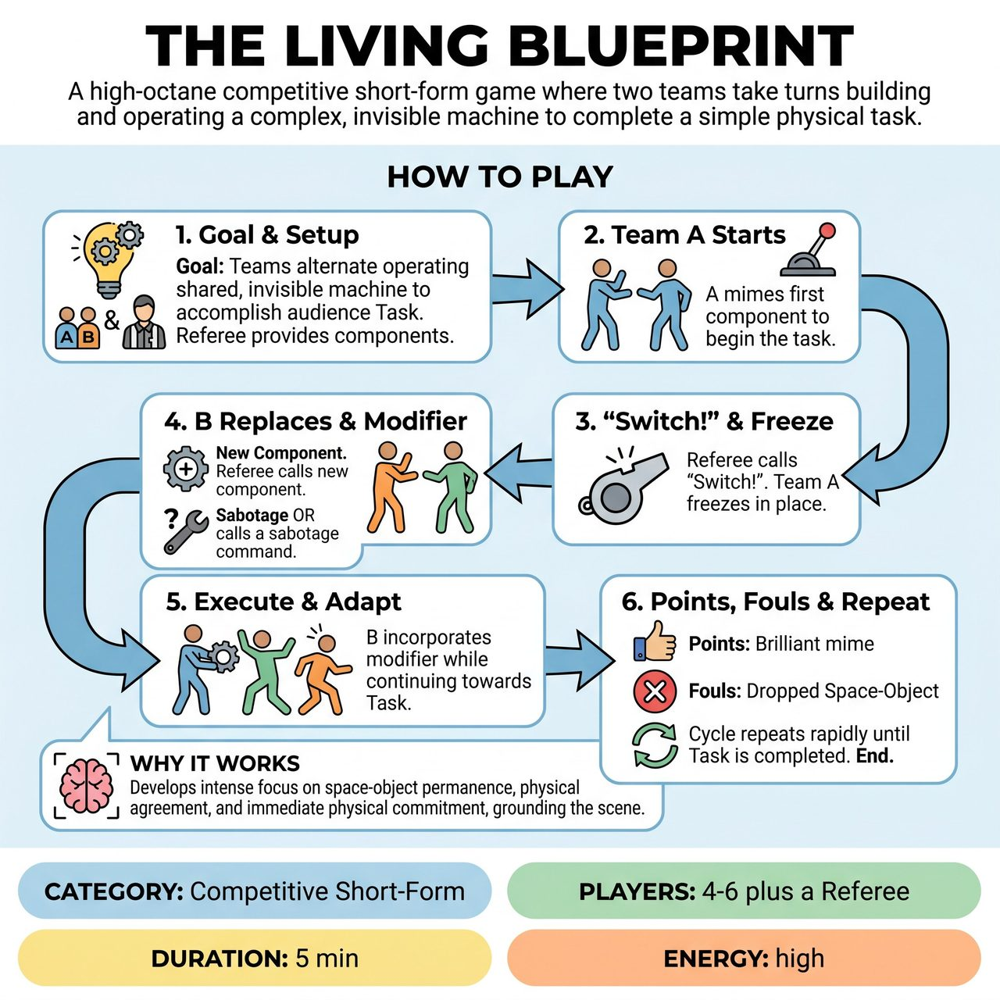

# The Living Blueprint

{ .game-hero }

> A high-octane competitive short-form game where two teams take turns building and operating a complex, invisible machine to complete a simple physical task.

## Overview
Two teams alternate operating a shared, invisible machine to accomplish an audience-provided task. Guided by rapid Switch! calls, players must maintain perfect space-object permanence while adding new components or reacting to sabotage commands.

## Setup
Requires two teams (2-3 players each) and a Referee. No props are used; the stage must be completely clear. Before the game begins, the Referee asks the audience for a simple, mundane physical task (e.g., Bathing an angry cat, Making the perfect pancake). Then, the Referee rapidly gathers a list of 5-6 random Components from the audience (e.g., a rusty crank, a laser pointer, a giant bellows, a disco ball). The Referee writes these down or memorizes them to use during the game.

## How to Play
1. The Goal: Teams alternate operating a shared, invisible machine to accomplish the audience-provided Task.
2. Starting the Machine: Team A takes the stage. The Referee feeds them the first Component from the upfront list. Team A mimes using this component to begin the task, establishing the base size, weight, and sound of the machine.
3. The Switch: After 10-15 seconds of play, the Referee yells Switch! Team A freezes in place. Team B rushes in, physically replacing Team A by taking their exact physical positions and holding the exact invisible objects Team A left behind. Team A retreats to the sidelines.
4. The Modifier: Immediately after a Switch, the gameplay is altered in ONE of two ways. The Referee either calls out a new Component from the upfront list (which Team B must physically attach and integrate into the machine) OR the Referee points to Team A on the sidelines, who yells an Action Command (e.g., It's overheating!, Reverse gear!, It's shrinking!).
5. Execution: Team B must immediately incorporate the new component or react to the command while continuing to work towards the overall Task. The machine grows more absurd, but its physical reality must remain consistent.
6. Fouls & Points: The Referee awards points for brilliant mime and calls Blueprint Breakdown fouls for dropping space-object permanence (e.g., walking through the machine, forgetting a previously added component).
7. Ending: The cycle repeats rapidly until the upfront list of components is exhausted and the Task is hilariously (or disastrously) completed.

## Coaching Notes
- Maintain intense focus on space-object permanence and physical agreement.
- The Switch mechanic forces immediate physical commitment; ensure players take the exact physical positions of the departing team.
- Use the objective-based foul system (Blueprint Breakdown) to actively reinforce core improv fundamentals like not walking through the machine or forgetting components.
- Gathering suggestions upfront preserves a relentless, fast-paced rhythm and eliminates mid-game stalling.
- Keep the grounding physical task in mind to prevent the scene from devolving into formless chaos.
- Award +1 to +3 points for exceptional physical comedy, teamwork, and object work, and deduct points for fouls. Listen to the audience's cheers and groans to help judge the success of the mime.

## Variations
- The Assembly Line (Scaling up): For larger ensembles, instead of swapping whole teams, players tag in one by one on Switch!, gradually building a massive 6-person machine where every player operates a different moving part.
- Silent Blueprint (Advanced): No sound effects are allowed by the active players; the opposing team on the sidelines must provide the Foley sound effects for the active team's machine, requiring intense cross-team listening.

## Why It Works
It develops intense focus on space-object permanence, physical agreement, and immediate physical commitment, while a grounding physical task prevents the scene from devolving into formless chaos.

## Safety & Inclusion
Physical safety is paramount: ensure the stage is completely clear of real obstacles, as players will be rushing in and out rapidly during the Switch! calls. For consent and inclusion, Action Commands must dictate the machine's behavior, not force players into unsafe physical positions. The Referee must immediately veto any command that requires dangerous acrobatics, inappropriate physical contact, or violates the family-friendly tone.

