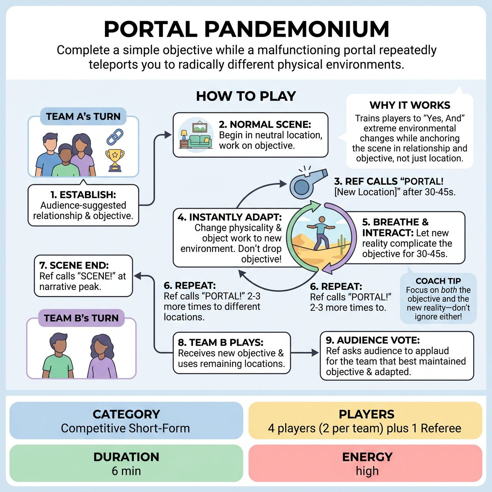

# Portal Pandemonium

{ .game-hero }

> Complete a simple objective while a malfunctioning portal repeatedly teleports you to radically different physical environments.

## Overview
A fast-paced competitive short-form game where players must complete a simple, grounded objective while a 'malfunctioning portal' repeatedly teleports them to radically different physical environments. Players must instantly adapt their physicality and object work to the new location without losing their original characters or goal.

## Setup
Requires a Referee and two players per team. Played in two rounds (Team A, then Team B). Before the game begins, the Referee asks the audience for a list of 5 to 6 wildly different, highly physical locations (e.g., 'the bottom of the ocean,' 'a bouncy castle,' 'a zero-gravity chamber') and memorizes or writes them down. For each round, the Ref gets a simple, relatable objective and relationship from the audience (e.g., 'roommates trying to assemble flat-pack furniture').

## How to Play
1. The Referee invites Team A to the stage and establishes their audience-suggested relationship and objective.
2. The scene begins in a normal, neutral location (like a living room). The players establish their characters and begin actively working on their objective.
3. After 30 to 45 seconds, once the scene is grounded, the Ref blows the whistle and yells, 'PORTAL! [New Location]!' using one of the pre-gathered suggestions (e.g., 'PORTAL! Inside a washing machine!').
4. The players must instantly alter their physicality, voices, and object work to reflect the new environment while continuing to pursue their original objective.
5. The Ref allows the scene to breathe for another 30 to 45 seconds, ensuring the players actually interact with the new physical reality and let it complicate their goal before jumping again.
6. The Ref calls 'PORTAL!' 2 to 3 more times during the scene, firing off the pre-gathered locations without stopping the action.
7. After the final location has been explored and the narrative reaches a peak, the Ref calls 'SCENE!'
8. Team B takes the stage, receives a new objective and relationship, and plays their round using the remaining pre-gathered locations.
9. After both teams have played, the Referee asks the audience to vote by applause for which team best maintained their objective while adapting to the physical environments. The winning team receives 5 points. The Ref may also call standard fouls (e.g., groaner foul, clean-content foul) during play, deducting 1 point per infraction.

## Coaching Notes
- Encourage players to anchor their scene in the relationship and objective rather than just the location.
- Demand immediate, bold physical choices and detailed object work when the portal shifts.
- Pre-gathering locations is crucial as it eliminates dead air and keeps the game's momentum high.
- Ensure players let the new physical reality complicate their goal before the next jump.

## Variations
- Time Portal: Instead of physical locations, the portal jumps the players through different historical eras or time periods (e.g., Prehistoric, Victorian England, 3000 AD), requiring them to adapt their vocabulary and societal norms.
- Genre Portal: The portal shifts the cinematic or theatrical style of the scene (e.g., Film Noir, Western, Soap Opera, Horror) while the objective remains exactly the same.
- Tag-Team Portal: Played with 4 players on stage at once (2 from each team). When 'PORTAL!' is called, the current duo freezes, and the other duo tags in, taking over the exact same characters and objective but in the newly announced location.

## Why It Works
It tests players' ability to 'Yes, And' extreme environmental changes without dropping the narrative thread, forcing them to anchor their scene in relationship and objective rather than just the location.

## Safety & Inclusion
Physical safety is paramount; players must mime extreme environments (like zero gravity or deep sea) without actually throwing themselves to the floor or risking collisions. Referees should ensure stage boundaries are respected when players are 'blinded' or 'floating.' For accessibility, players with limited mobility can emphasize vocal shifts, upper-body object work, or emotional reactions to the new environments rather than full-body acrobatics.

