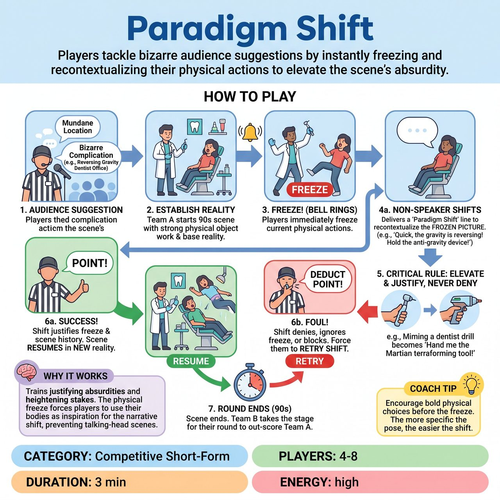

# Paradigm Shift

{ .game-hero }

> Players tackle bizarre audience suggestions by instantly freezing and recontextualizing their physical actions to elevate the scene's absurdity.

## Overview
A fast-paced, competitive short-form game where players tackle bizarre audience suggestions by making bold, reality-redefining choices. Triggered by the Referee's bell, players must instantly freeze and execute a 'Paradigm Shift'—recontextualizing their current physical actions to elevate the scene's absurdity without denying the established reality. Points are awarded live for brilliant justifications, keeping the energy high and the pacing relentless.

## Setup
Competitive short-form match style. 2 to 4 players per team. One Referee to host, trigger shifts, and score. Props: A bell and a whistle/buzzer for the Referee. Open stage.

## How to Play
1. 1. The Referee asks the audience for a mundane location and a bizarre complication (e.g., 'A dentist office, but gravity reverses every 10 seconds').
2. 2. Team A takes the stage and begins a 90-second scene, establishing the base reality and engaging in strong physical object work.
3. 3. At any moment, the Referee rings the bell. The players must immediately freeze their current physical actions.
4. 4. The player who was NOT speaking must deliver the 'Paradigm Shift': a line of dialogue that completely recontextualizes their frozen physical picture, elevating the stakes or justifying the bizarre complication.
5. 5. CRITICAL RULE: A Shift must elevate and justify, never deny. It must build on what exists (e.g., miming a dentist drill becomes 'Hand me the Martian terraforming laser, the red dust is building up!').
6. 6. If the Shift is brilliant and logically justifies the physical freeze and scene history, the Referee announces 'Point!' and the scene instantly resumes in this new heightened reality.
7. 7. If the Shift is a denial, ignores the physical freeze, or blocks a partner, the Referee blows the whistle, calls a foul, deducts a point, and forces them to try a different Shift.
8. 8. The scene ends after 90 seconds. Team B then gets a new suggestion and plays their round, trying to out-score Team A.

## Coaching Notes
- Rely entirely on strong mime and physical choices; the game requires zero props.
- The real-time bell mechanic keeps the pacing fast and eliminates the need for post-scene explanations.
- Ensure players use their bodies as the inspiration for the narrative shift to prevent talking-head scenes.
- Award 1 point in real-time for every successful Paradigm Shift that justifies the reality without denying it, keeping the game moving without stopping for explanations.

## Variations
- Tag-Out Shift: Both teams share the stage for a single 3-minute scene. When the Referee rings the bell, a player from the opposing team tags in, assumes the exact physical position of the person they replaced, and delivers the Paradigm Shift to steal control of the scene.
- Genre Shift: Instead of a bizarre complication, the audience provides 3 distinct movie genres. When the bell rings, the players must execute a Paradigm Shift that logically transitions the scene's reality into the next genre on the list based on their frozen physical positions.

## Why It Works
It explicitly trains players to justify absurdities and heighten stakes rather than denying them. The physical freeze constraint forces players to use their bodies as the inspiration for the narrative shift, preventing talking-head scenes.

## Safety & Inclusion
The Referee enforces a strict clean-content foul for any offensive or non-family-friendly content. The core rule that Shifts must 'elevate and justify' ensures players cannot steamroll or deny their scene partner's identity. Physically, players are reminded that 'bold choices' refer to narrative leaps; all physical freezes must be safe, with feet remaining on the floor and no dangerous stunts.

