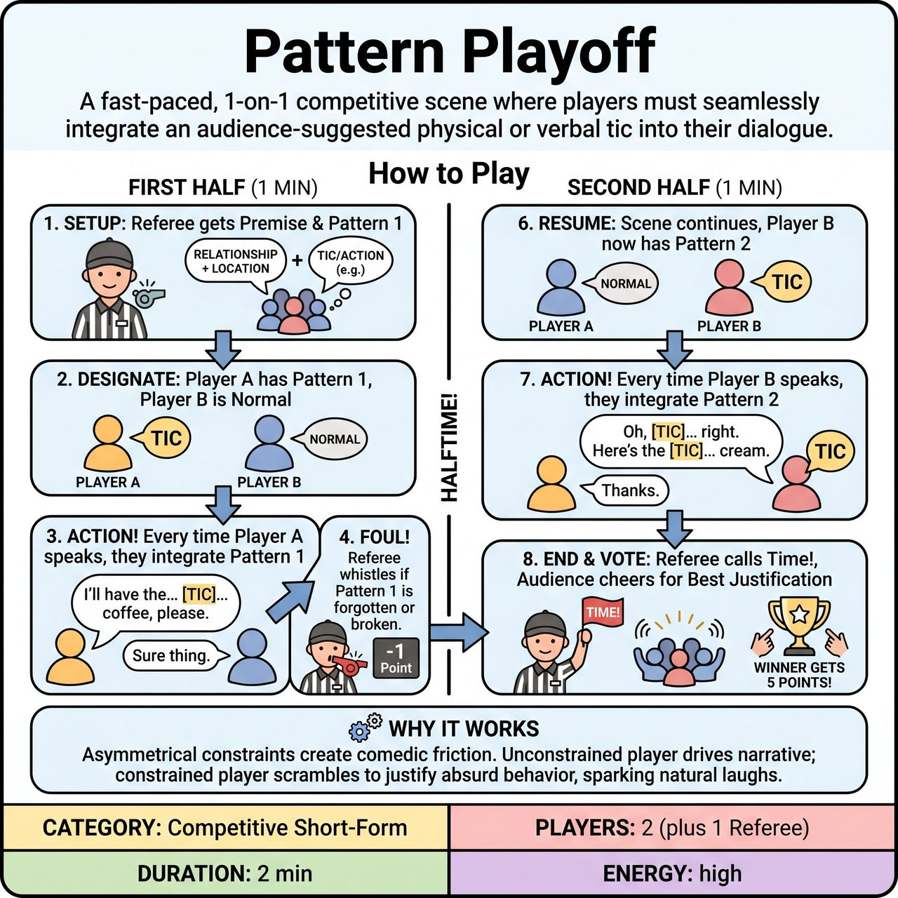

# Pattern Playoff

{ .game-hero }

> A fast-paced, 1-on-1 competitive scene where players must seamlessly integrate an audience-suggested physical or verbal tic into their dialogue.

## Overview
A competitive short-form game played in two halves. One player acts as the 'straight man' while the other must justify a bizarre tic every time they speak. The players switch roles for the second half to ensure both face the comedic constraint.

## Setup
2 players (1 from Team A, 1 from Team B) start center stage. 1 Referee stands to the side to run the game, call fouls, and keep time. No props are used.

## How to Play
1. The Referee asks the audience for a scene premise (e.g., a relationship and a location) and a specific physical action or short verbal tic (the 'Pattern').
2. The Referee designates Player A to take the constraint for the First Half. Player B will play the scene normally without the constraint.
3. The Referee blows the whistle to begin a 1-minute half. Every single time Player A speaks or acts, they MUST seamlessly integrate the Pattern into their character's behavior without breaking the reality of the scene.
4. If Player A forgets the Pattern, executes it poorly, or breaks the fourth wall to acknowledge it, the Referee blows the whistle, calls a 'Pattern Foul', deducts 1 point, and immediately restarts the action.
5. After one minute, the Referee blows the whistle and calls 'Halftime!' The Referee then gets a brand NEW Pattern from the audience.
6. The scene resumes exactly where it left off for the Second Half (1 minute). Now, Player B must integrate the new Pattern every time they speak, while Player A plays normally.
7. At the end of the second half, the Referee calls 'Time!' and asks the audience to cheer for which player justified their pattern best, awarding 5 points to the winner.

## Coaching Notes
- The unconstrained player should use their freedom to set up difficult or absurd situations for the constrained player to navigate.
- Maintain lightning-fast pacing. Do not stop the scene to award positive points; only interrupt to call 'Pattern Fouls' or standard fouls.
- Uninterrupted scene flow allows the narrative and comedic escalation to build naturally without referee interference.
- Ensure players do not break the fourth wall to acknowledge the tic (e.g., 'Why do I keep saying magnificent?'). They must justify it within the reality of the scene.

## Variations
- Double Trouble: Both players are given different patterns at the start of the scene and must integrate them simultaneously for a chaotic, continuous 2-minute scene.
- Escalating Tics: Instead of a single pattern, the Referee pauses the scene every 30 seconds to add a new pattern that the constrained player must stack on top of the previous ones.

## Why It Works
Asymmetrical scene work creates natural comedic friction, giving the unconstrained player the power to drive the narrative while the constrained player scrambles to justify absurd behavior. The 1-on-1 dynamic ensures rapid-fire dialogue and clear focus.

## Safety & Inclusion
The Referee must filter out unsafe physical suggestions (e.g., acrobatics, falling, or touching without consent). The standard content foul applies for offensive content. If a player has mobility limitations, ask for a verbal tic or localized physical gesture that accommodates their abilities.

