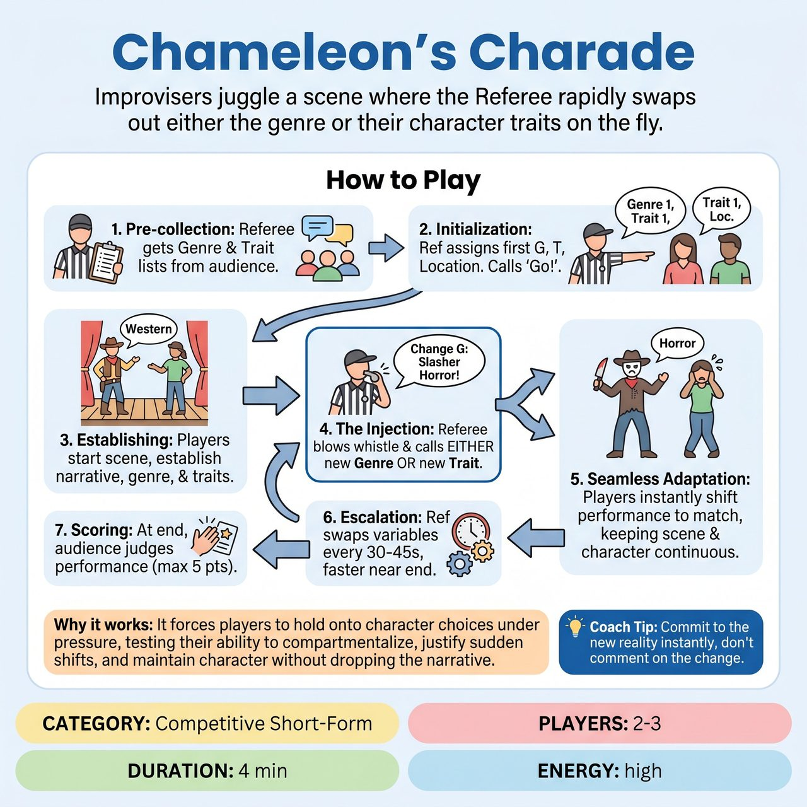

# Chameleon's Charade

{ .game-hero }

> Improvisers juggle a scene where the Referee rapidly swaps out either the genre or their character traits on the fly.

## Overview
A fast-paced competitive short-form game where improvisers perform a scene governed by two independent variables: a Scene Genre and a Character Trait. To keep the action seamless, the Referee pre-collects lists of both from the audience. As the scene unfolds, the Referee injects new genres or traits from the list on the fly, testing the players' ability to compartmentalize and justify sudden shifts.

## Setup
Requires 2 to 3 players from one team, and a Referee. The Referee needs a whiteboard, clipboard, or memory system to track suggestions. Ask the audience for 4-5 distinct Genres (e.g., Sci-Fi, Western, Soap Opera, Noir) and 4-5 Character Traits/Quirks (e.g., overly paranoid, speaks in questions, obsessed with hygiene). No props are required.

## How to Play
1. 1. Pre-collection: The Referee collects the lists of 4-5 Genres and 4-5 Traits from the audience, filtering for variety and appropriateness.
2. 2. Initialization: The Referee assigns the first Genre and the first Trait to the players, gets a mundane location to ground the scene, and calls 'Go!'
3. 3. Establishing the Base: Players begin the scene, clearly establishing the narrative, the current genre's tropes, and their assigned character traits. The Referee allows the scene to breathe and establish a baseline reality for about 45-60 seconds.
4. 4. The Injection: The Referee blows the whistle and calls out EITHER a new Genre OR a new Trait from the pre-collected list (e.g., 'Change Genre: Slasher Horror!').
5. 5. Seamless Adaptation: The players must instantly alter their performance to match the new prompt without stopping the scene, breaking character, or dropping the narrative. If the Genre changes, the Trait must remain intact. If the Trait changes, the Genre remains intact.
6. 6. Escalation: The Referee continues to swap out variables every 30-45 seconds. As the 3-to-4-minute time limit approaches, the Referee increases the frequency of the changes, creating a chaotic, high-energy climax before calling 'Scene!'
7. 7. Scoring: At the end of the game, the Referee asks the audience to judge the team's performance via applause, awarding up to 5 points.

## Coaching Notes
- Pre-collected lists allow the scene to maintain momentum without stopping for new suggestions.
- Watch for players dropping their trait or failing to adopt the new genre immediately; penalize this with a 'Delay of Game' foul.
- Call a 'Groaner' foul for terrible puns.
- Encourage players to justify the sudden shifts within the reality of the scene rather than just playing them as disconnected gimmicks.

## Variations
- Head-to-Head Chameleon: Two teams play back-to-back scenes using the exact same lists of Genres and Traits. The audience votes on which team handled the transitions more seamlessly.
- Split Variables: Player A is assigned the Trait changes, while Player B is assigned the Genre changes. When the Referee calls a change, only the assigned player shifts their reality, forcing the other player to justify their partner's sudden behavioral shift.

## Why It Works
It forces players to hold onto character choices under pressure, testing their ability to compartmentalize, justify sudden shifts, and maintain character without dropping the narrative.

## Safety & Inclusion
The Referee must actively filter audience suggestions during the pre-collection phase to ensure all Character Traits are behavioral, emotional, or vocal quirks (e.g., 'always agrees,' 'speaks like a pirate') rather than physical disabilities, mental illnesses, or harmful stereotypes. A content foul strictly enforces a clean, all-ages environment.

