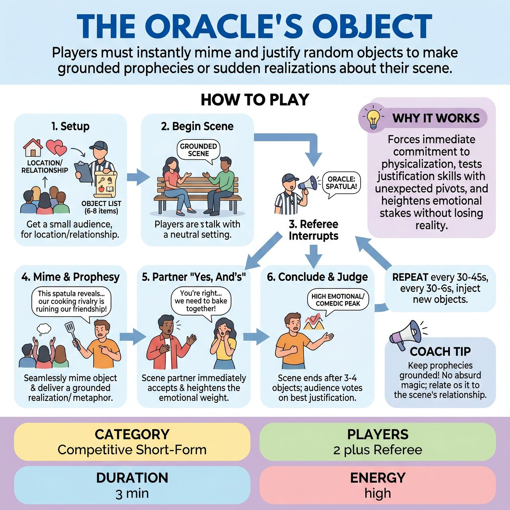

# The Oracle's Object

{ .game-hero }

> Players must instantly mime and justify random objects to make grounded prophecies or sudden realizations about their scene.

## Overview
The Oracle's Object is a fast-paced competitive short-form game where players must instantly justify random objects into their scene. Whenever the Referee shouts an object from a pre-gathered list, a player must mime it and use it to make a grounded prophecy or sudden realization about their relationship or situation. It tests rapid object work, justification, and the ability to pivot a scene's emotional stakes without losing the narrative reality.

## Setup
Two players (one from each opposing team) stand center stage. No physical props are used; everything is mimed. The Referee stands on the sidelines. Before the scene begins, the Referee asks the audience for a starting relationship or location, and then rapidly collects a list of 6 to 8 random, everyday objects from the audience to use during the game.

## How to Play
1. The Referee gets a location or relationship from the audience to start the scene, plus a list of 6-8 random everyday objects.
2. The two players begin a grounded, relationship-based scene.
3. At any point, the Referee shouts 'ORACLE!' followed by one of the pre-gathered objects (e.g., 'ORACLE: SPATULA!').
4. The player who is currently speaking (or about to speak) must seamlessly and immediately mime producing or finding that object in the environment.
5. The player must then use the object to deliver a 'prophecy' or realization. Crucially, this must be a grounded metaphor or an emotional pivot, not an absurd derailment. For example, instead of saying 'This spatula means I will magically turn into a pancake!', the player should say, 'This spatula... it reminds me of how you're always trying to scrape the bottom of the barrel in our marriage.'
6. The scene partner must immediately 'Yes, And' this new emotional or narrative weight, adapting their character's reaction to the realization.
7. The Referee continues to inject objects every 30-45 seconds, forcing the players to continuously justify new items and heighten the scene's stakes.
8. The scene concludes after 3-4 objects have been successfully integrated and justified, usually ending on a high emotional or comedic peak.
9. At the end of the scene, the Referee asks the audience to applaud for the player who best justified their objects and drove the scene forward. The winner's team is awarded 5 points.

## Coaching Notes
- Force immediate commitment to object work and physicalization.
- Ensure the prophecy is a grounded metaphor or emotional pivot, not an absurd derailment.
- The Referee can call standard fouls during play: a clean-content foul (for inappropriate/dirty content), 'Groaner' (for terrible puns), or 'Delay of Game' (if a player hesitates too long to mime or justify the object).
- Maintain high energy and pacing by using the pre-gathered list of objects.

## Variations
- Opponent Oracles: Instead of the Referee calling the objects, players from the opposing teams stand on the sidelines and shout the objects, trying to give the most challenging items at the most inconvenient times.
- The Oracle's Curse: Instead of an emotional realization, the object triggers a specific physical or vocal endowment (e.g., 'This heavy bowling ball makes me realize how much weight I carry on my shoulders') that the player must physically maintain for the rest of the scene.

## Why It Works
It forces immediate commitment to object work and physicalization, guarantees unexpected pivots that test players' justification skills, and develops the ability to heighten emotional stakes without losing the narrative reality.

## Safety & Inclusion
The standard clean-content foul ensures all content remains family-friendly and clean. Because all objects are mimed, there are no physical props to trip over, keeping the stage physically safe. The game is highly accessible and can be played entirely seated or by players with limited mobility, as the core mechanic relies on verbal justification, emotional pivots, and upper-body mime clarity rather than stage movement.

