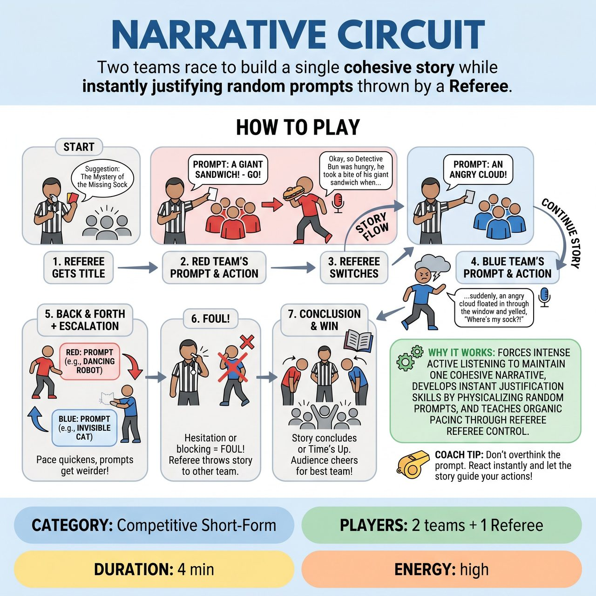

# Narrative Circuit

{ .game-hero }

> Two teams race to build a single cohesive story while instantly justifying random prompts thrown by a Referee.

## Overview
A high-energy, competitive storytelling game where two teams collaborate and compete to build a single, cohesive story. The Referee conducts the narrative back and forth between teams, throwing random 'Circuit Card' prompts (objects, emotions, locations) at players who must instantly justify them while keeping the story moving.

## Setup
Two teams (Red and Blue) line up on opposite sides of the stage. The Referee stands downstage center with a deck of 'Circuit Cards' (or a list of random prompts on a clipboard). These cards contain single, family-friendly prompts categorized into Objects, Emotions, Locations, or Character Traits.

## How to Play
1. The Referee gets a suggestion for a story title or genre from the audience (e.g., 'The Mystery of the Missing Sock').
2. The Referee points to the first player on the Red team, draws a Circuit Card, announces it loudly (e.g., 'Red team, your prompt is A giant sandwich - GO!'), and steps back.
3. The Red player immediately steps forward and begins telling and physically acting out the story, seamlessly incorporating the prompt into the narrative.
4. The Referee lets the player build the narrative for a few sentences. At an organic transition point or cliffhanger, the Referee points to the Blue team, drawing a new card (e.g., 'Blue team, pick it up! Your prompt is Suspicious - GO!').
5. The Blue player must instantly step forward, pick up the story exactly where the Red player left off, and continue the narrative while embodying the new prompt.
6. The Referee continues bouncing the story back and forth between the teams, escalating the pace and the absurdity of the cards as the story reaches its climax.
7. If a player hesitates, blocks the established reality, or fails to incorporate the card, the Referee blows the whistle, calls a foul, and throws the story to the opposing team to fix it.
8. The game ends when the story reaches a natural conclusion or the Referee calls time (usually after 3-4 minutes).
9. At the end of the game, the Referee asks the audience to cheer for the team that best incorporated the prompts and kept the story flowing. The winning team receives 5 points.

## Coaching Notes
- Both teams must build one cohesive story, preventing audience whiplash and forcing intense active listening.
- The Referee controls the organic pacing, allowing scenes to breathe or rapid-firing transitions to build tension.
- Players must immediately physicalize and justify random prompts without breaking the narrative reality.
- The threat of a hesitation foul keeps players on their toes and the energy electric.
- The Referee may award +1 bonus point for an incredible narrative save, or deduct -1 point for a Hesitation or Blocking foul during play.

## Variations
- Genre Circuit: Instead of random objects or emotions, the cards are all different film or literary genres (e.g., Western, Sci-Fi, Noir). Players must instantly shift the style of the story while maintaining the plot.
- Blind Circuit: Players draw their own cards from a bucket as they step forward, meaning even the Referee doesn't know what's coming, adding an extra layer of surprise and chaos.

## Why It Works
It forces intense active listening to maintain a single cohesive narrative, develops instant justification skills by making players physicalize random prompts without breaking reality, and teaches organic pacing through the Referee's control of tension.

## Safety & Inclusion
Ensure all physical choices are safe and respect personal boundaries. Remind players to avoid dangerous acrobatics or running on stage. The Referee should curate the Circuit Cards beforehand to ensure all prompts are family-friendly, accessible, and free of harmful stereotypes. If a player has mobility restrictions, they can perform their segment from a seated position, focusing on vocal variety and upper-body choices.

