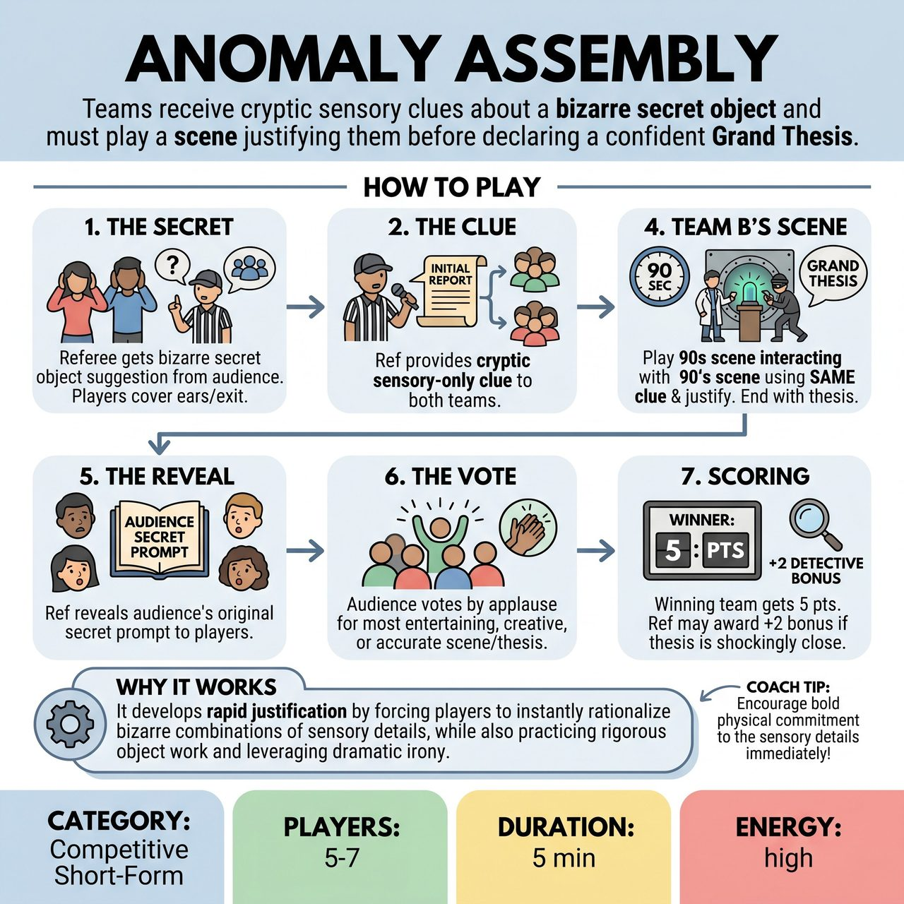

# Anomaly Assembly

{ .game-hero }

> Teams receive cryptic sensory clues about a bizarre secret object and must play a scene justifying them before declaring a confident Grand Thesis.

## Overview
A fast-paced competitive deduction game where the audience and referee share a secret, bizarre object. Teams receive only a cryptic, sensory clue and must play a quick scene justifying those clues, culminating in a confident (and usually hilarious) 'Grand Thesis' of what the object actually is.

## Setup
2 teams (2-3 players each) and 1 Referee. No props; the object is entirely mimed. Standard competitive short-form stage setup (e.g., Red Team on one side, Blue Team on the other, Referee downstage center).

## How to Play
1. 1. The Secret: The Referee asks the players to cover their ears (or step offstage). The Ref then gets a highly specific, bizarre object suggestion from the audience (e.g., 'A toaster that shoots compliments and smells like wet dog').
2. 2. The Clue: The players return. The Ref provides a cryptic, sensory-only 'Initial Report' to both teams. For example: 'Curators, Anomaly Alpha radiates intense heat, emits sudden vocalizations, and possesses a distinct canine odor.'
3. 3. Team A's Scene: Team A gets 90 seconds to play a scene (e.g., scientists in a lab, kids in an attic, thieves in a vault) discovering and interacting with the anomaly. They must physically mime the object, justify all the Ref's clues through Yes-And, and conclude by confidently declaring their 'Grand Thesis' of what the object is.
4. 4. Team B's Scene: Team B gets 90 seconds to play a completely different scene using the exact same clues. They must also interact with the object, justify the clues in a new way, and declare their own unique Grand Thesis.
5. 5. The Reveal: The Referee brings both teams forward and reveals the audience's original, secret prompt to the players.
6. 6. The Vote: The audience votes by applause for the team whose scene and Grand Thesis was the most entertaining, creative, or surprisingly accurate.
7. 7. Scoring: The winning team receives 5 points. The Referee may award a 2-point 'Detective Bonus' if a team's thesis is shockingly close to the actual secret prompt.

## Coaching Notes
- Enforce the 90-second time limit per team to ensure the game stays punchy and avoids dragging.
- Standard short-form fouls apply, such as a clean-content foul for inappropriate content, or a 'Delay of Game' foul if a team ignores the physical clues.
- Encourage rigorous object work: Players must consistently mime the size, weight, and weird properties of the invisible anomaly.
- Lean into the dramatic irony: The audience knows the secret, making the players' blind guesses highly entertaining.

## Variations
- Split-Stage Assembly: Instead of sequential scenes, both teams are on stage at once in their respective 'labs'. The Referee blows a whistle to bounce focus back and forth between Team A and Team B every 20-30 seconds as they escalate their discoveries, ending with back-to-back Grand Theses.
- Expert Panel (Non-Competitive/Warm-up): Played as a single ensemble. Players sit on a panel as 'experts' and take turns stepping forward to interact with the invisible object in the center, building one unified, escalating theory through Yes-And.

## Why It Works
It develops rapid justification by forcing players to instantly rationalize bizarre combinations of sensory details, while also practicing rigorous object work and leveraging dramatic irony.

## Safety & Inclusion
Physical object work must respect players' physical boundaries (e.g., no miming throwing the dangerous anomaly at a scene partner's head in a way that forces an unsafe physical reaction). The Ref strictly enforces family-friendly, all-ages content. For players with mobility restrictions, the 'scale' of the anomaly can be established as small enough to be investigated entirely from a seated position or wheelchair.

