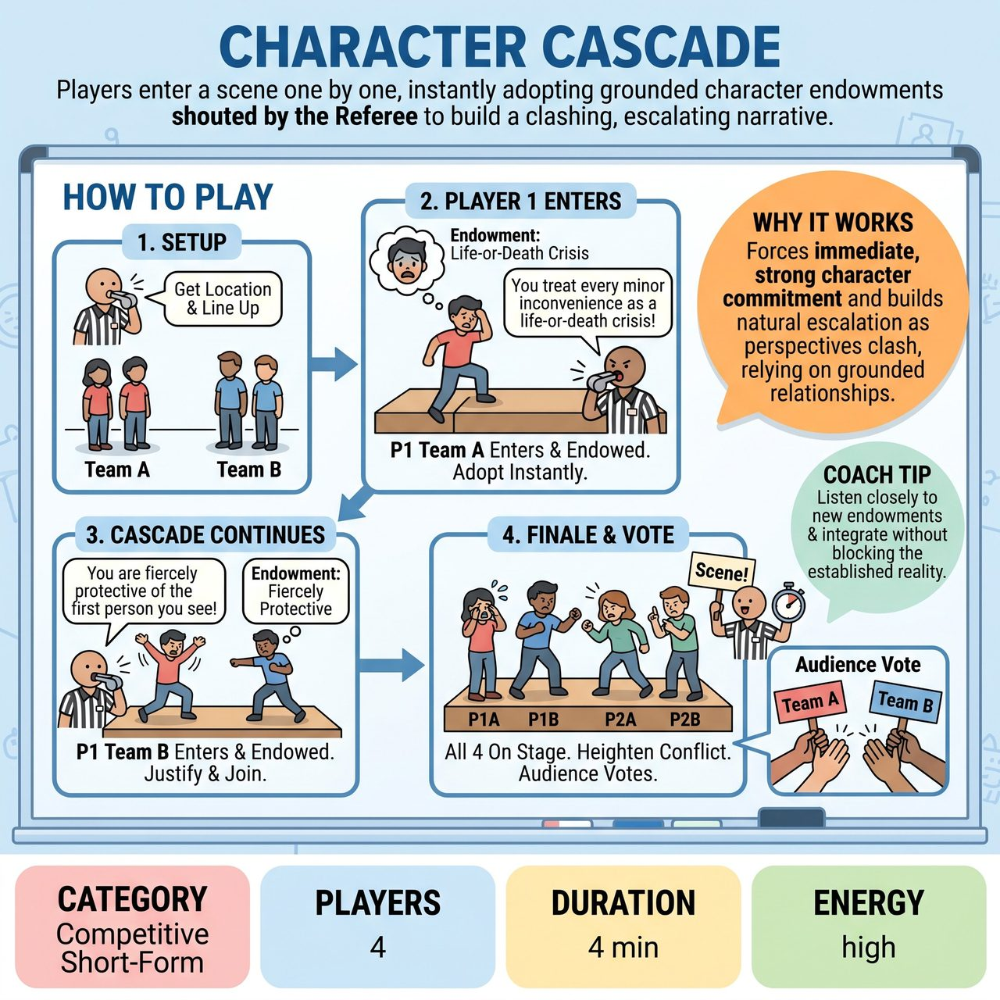

# Character Cascade

{ .game-hero }

> Players enter a scene one by one, instantly adopting grounded character endowments shouted by the Referee to build a clashing, escalating narrative.

## Overview
A fast-paced, competitive short-form game where four players enter a scene one by one. As each player steps on stage, the Referee shouts out a grounded character perspective or relationship endowment. Players must instantly adopt this trait and justify it within the ongoing narrative, competing for the audience's applause.

## Setup
Four players total (two from Team A, two from Team B) line up off-stage. A Referee prepares a mental or written list of grounded, relationship-based or POV endowments (e.g., 'You desperately need Player 1s approval'). The audience provides a mundane location (e.g., a dentist's waiting room, a car wash). No props or specialized stage space are required.

## How to Play
1. The Referee gets a mundane location from the audience and asks the players to line up off-stage.
2. Player 1 from Team A steps onto the stage. The Referee loudly calls out their endowment (e.g., 'You treat every minor inconvenience as a life-or-death crisis').
3. Player 1 initiates the scene in the location, establishing their perspective.
4. After 20 to 30 seconds, the Referee blows the whistle and points to Player 1 from Team B to enter.
5. As they enter, the Referee gives them a new grounded relationship or POV (e.g., 'You are fiercely protective of the first person you see').
6. The entering player must immediately adopt their endowment and justify it within the existing reality of the scene, without breaking the reality established by the first player.
7. This cascade continues every 20 to 30 seconds, alternating teams (Player 2 Team A, then Player 2 Team B), until all four players are on stage.
8. Once all four players are on stage, they have about 60 to 90 seconds to heighten the scene's conflict and relationships. The Referee calls 'Scene!' on a high-energy comedic peak.
9. The Referee asks the audience to applaud for Team A, then Team B, based on which players committed hardest to their endowments and supported the scene best. The winning team gets 5 points.

## Coaching Notes
- Call a delay of game foul if a player stalls instead of immediately committing to their endowment.
- Call a clean-content foul for inappropriate, non-family-friendly content, which loses the offending team points.
- Ensure players focus on grounded relationships and POVs rather than chaotic gimmicks to maintain scene coherence.
- Encourage players to lean into the natural escalation that occurs as the stage populates and perspectives clash.

## Variations
- Solo Team Cascade: Instead of a head-to-head 4-player scene, Team A plays a 3-player scene, then Team B plays a 3-player scene. The audience votes on which team built the better narrative. This is excellent for newer players to avoid cross-team talking over.
- Secret Cascade: Instead of the Referee shouting the endowments, the audience writes down POVs on slips of paper before the show. Players draw a slip and read it aloud right before stepping on stage.

## Why It Works
It forces immediate, strong character commitment upon entering the stage and builds natural escalation as the stage populates and perspectives clash, relying on grounded relationships to ensure scene coherence.

## Safety & Inclusion
Endowments must focus on personality traits, perspectives, or relationships, never physical appearances, stereotypes, accents, or protected classes. Players should respect physical boundaries; endowments like 'fiercely protective' or 'desperate for approval' must be played emotionally and verbally, not through unwanted physical contact. Strict enforcement of clean, all-ages content ensures a safe environment for everyone.

