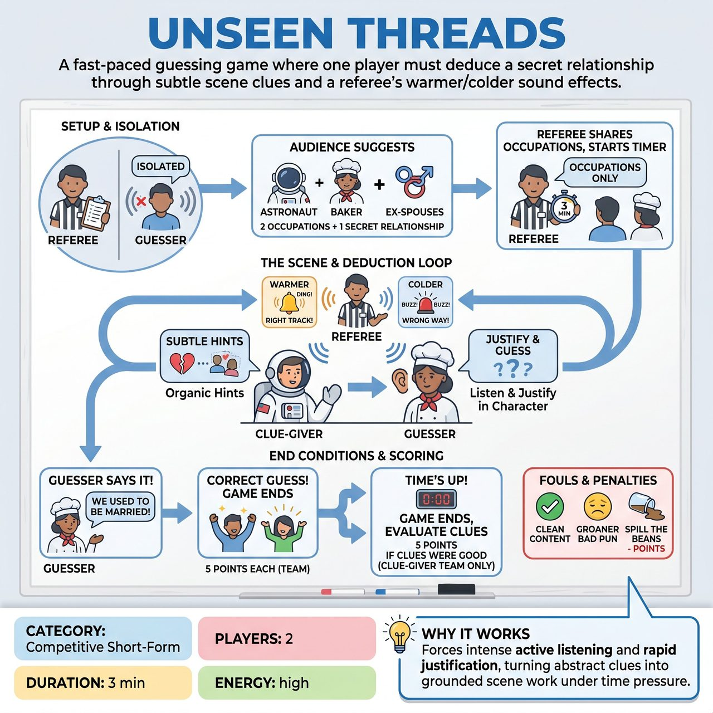

# Unseen Threads

{ .game-hero }

> A fast-paced guessing game where one player must deduce a secret relationship through subtle scene clues and a referee's warmer/colder sound effects.

## Overview
A fast-paced, competitive guessing game where two characters with wildly different occupations share a secret relationship. One player knows the relationship and drops subtle hints, while the other must deduce it through scene work, guided by the referee's warmer/colder sound effects.

## Setup
Two players (one from each team) take the stage. One player (the Guesser) is sent to a soundproof booth or wears noise-canceling headphones. The Referee gets two disparate occupations from the audience (one for each player) and one broad, simple relationship (e.g., Ex-spouses, Childhood rivals, Secret twins). The Guesser returns, knowing only the occupations.

## How to Play
1. The Referee isolates the Guesser so they cannot hear the audience.
2. The Referee asks the audience for two unrelated occupations and one simple relationship.
3. The Guesser returns to the stage. The Referee announces the two occupations to both players and starts a 3-minute timer.
4. The Clue-Giver initiates the scene, playing their occupation while dropping organic hints about the secret relationship.
5. The Guesser must justify these clues within the scene and attempt to guess the relationship by stating it in dialogue (e.g., 'Why are you acting like we used to be married?').
6. The Referee uses a bell ('Ding!') to signal warmer when the Guesser is on the right track or the Clue-Giver drops a great hint, and a buzzer ('Buzz!') to signal colder for incorrect guesses.
7. The game ends immediately when the Guesser explicitly states the correct relationship, or when the 3-minute timer expires.
8. Scoring: Award 5 points to the Guesser's team for correctly identifying the relationship before time runs out, and 5 points to the Clue-Giver's team if the Referee deems their clues clever and organic.
9. Fouls: The Referee calls a clean-content foul for inappropriate content, a 'Groaner' for bad puns, and a 'Spill the Beans Foul' (loss of points) if the Clue-Giver explicitly states the relationship instead of making the Guesser work for it.

## Coaching Notes
- Encourage active listening and justification; the Guesser shouldn't just list guesses, but weave them into the scene's reality.
- The Clue-Giver must balance being helpful with being subtle to avoid the Spill the Beans foul.
- The Referee must be highly attentive, using the bell and buzzer promptly to guide the players without derailing the scene.
- Remind players that despite being on opposing teams, cross-team collaboration is essential to build a successful scene.

## Variations
- Secret History: Instead of a relationship, the secret is a specific, bizarre past event they shared (e.g., 'We got stuck in an elevator for three days').
- Double Blind: Both players have a secret relationship or quirk about the other that they must guess simultaneously, requiring intense multitasking.

## Why It Works
It forces players to practice intense active listening and rapid justification, turning abstract clues into grounded scene work while maintaining cross-team collaboration under the pressure of a ticking clock.

## Safety & Inclusion
Ensure the physical space is safe for the Guesser when they are returning to the stage. The Referee must strictly enforce the clean-content foul to keep relationships family-friendly and consensual. Avoid relationships that rely on harmful stereotypes, non-consensual power dynamics, or inappropriate age gaps.

