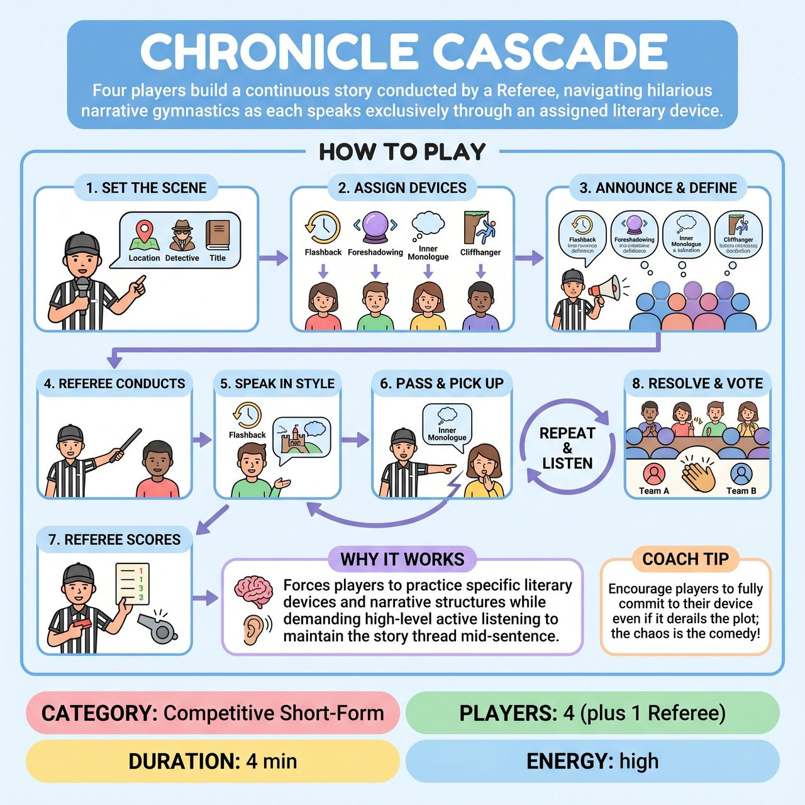

# Chronicle Cascade

{ .game-hero }

> Four players build a continuous story conducted by a Referee, navigating hilarious narrative gymnastics as each speaks exclusively through an assigned literary device.

## Overview
In this fast-paced competitive short-form game, four players (two per team) build a single, continuous story conducted by the Referee. Each player is assigned a specific literary device, like Flashback, Foreshadowing, or Inner Monologue, that they must constantly employ whenever they are speaking. Because the devices are announced publicly, the audience is in on the joke and watches eagerly to see how players navigate their constraints.

## Setup
4 players total (2 from Team A, 2 from Team B) stand in a line facing the audience. The Referee stands downstage center to conduct. Optional but recommended: A whiteboard or large nametags to display each player's assigned literary device to the audience.

## How to Play
1. The Referee gets a story title, location, or protagonist from the audience to serve as the base suggestion.
2. The Referee assigns one distinct literary device to each of the four players. Examples include Flashback, Foreshadowing, Inner Monologue, and Cliffhanger.
3. The Referee publicly announces these devices and briefly defines them so the audience knows exactly what constraint each player is working under.
4. The Referee points to one player to begin the story. That player must immediately start narrating and acting, filtering their contribution through their assigned device.
5. At any moment, the Referee can point to another player. The new player must instantly pick up the story exactly where the last player left off, even mid-sentence or mid-word, while immediately switching to their own literary device.
6. Players must actively listen and 'Yes, And' the established facts, ensuring the story makes sense despite the chaotic shifting of narrative styles.
7. The Referee awards points and calls fouls throughout the scene based on the players' performance.
8. The game ends after 3 to 4 minutes on a strong comedic resolution. The audience's applause at the end determines which team wins the overall game.

## Coaching Notes
- The Referee should award +1 point for a seamless transition that perfectly uses the device, and +2 points for a 'Narrative Breakthrough' where a device hilariously solves a plot hole.
- The Referee should call a -1 point foul for 'Device Dropping' (forgetting to use the constraint), 'Hesitation' (stuttering when pointed at), or 'Narrative Noodle' (contradicting established story facts).
- Public constraints allow the audience to fully appreciate the difficulty and cheer for successes. Ensure the audience clearly understands each device.
- The conducted pointing mechanic eliminates rigid time limits and keeps energy incredibly high. Point frequently and unpredictably to test the players' active listening.
- Remind players to maintain the story thread mid-sentence when pointed to, rather than starting a new thought.

## Variations
- Genre Cascade: Instead of literary devices, assign each player a distinct film or literature genre (e.g., Noir, Sci-Fi, Soap Opera, Western) that they must apply to the base story.
- Organic Tag-Outs: For a less controlled, more advanced version, remove the Referee's conducting. Players must physically tag each other out to take over the story, managing their own pacing and finding the perfect organic moments to inject their devices.

## Why It Works
It forces players to practice specific literary devices and narrative structures while demanding high-level active listening to maintain the story thread mid-sentence.

## Safety & Inclusion
Enforce standard family-friendly boundaries; the Referee should immediately call a foul on any inappropriate content. To ensure accessibility, the Referee should choose literary devices that the players are comfortable with and briefly define them for the audience, ensuring no player feels put on the spot by a vocabulary word they do not know.

